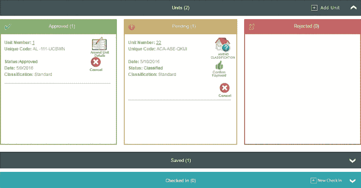

# Airbnb 的监管噩梦可以用更多的技术来解决吗？

> 原文：<https://web.archive.org/web/https://techcrunch.com/2016/07/11/can-the-airbnb-regulatory-nightmare-be-solved-with-more-tech/>

当地政府官员、出租车司机和酒店经营者群起而攻之，试图关闭你的生意？有一个应用程序可以解决这个问题。但解决监管噩梦真的有那么简单吗？

像 Airbnb 和优步这样的共享经济初创公司已经开始捍卫他们的商业模式，起诉市政府，或者在他们不能如愿以偿时完全关闭他们的服务。 [Airbnb 最近起诉旧金山市](https://web.archive.org/web/20230307020121/https://techcrunch.com/2016/06/27/airbnb-sues-san-francisco/)，因为立法要求 Airbnb 将没有在旧金山注册的主机从其平台上移除。

优步和 Lyft 在与监管机构调情时并没有取得多大成功。在选民肯定了奥斯汀市要求基于指纹的背景调查和对上下客地点的严格规定后，两家拼车公司[在奥斯汀](https://web.archive.org/web/20230307020121/https://techcrunch.com/2016/06/21/austin-police-are-now-impounding-drivers-in-the-peer-to-peer-ridesharing-group/)飞走了。

科技公司和地方政府之间的这些斗争已经成为公式化:市政当局做出勇敢的举动，因支持行业巨头而引起全国的关注，公司拒绝妥协。公众很快厌倦了繁重的议会听证会、司法程序、和解和投票。全国上百个城市冲洗重复。

如果公司和政府能合作简化监管过程，而不是持续的监管僵局，会怎么样？一家科技公司希望成为合作平台，让 Airbnb 和旧金山等城市能够搁置分歧。公民软件公司 Accela 表示，它已经与 Airbnb 和优步等公司进行了谈判，以找到一个解决他们政治困境的 SaaS 方案。Accela 认为它拥有解决监管问题的技术，但实施 Accela 的工具需要将公司和政府带到谈判桌前，这可能是一个困难的挑战。

相当长一段时间以来，Accela 一直在枪支和大麻许可等问题上悄悄地扮演着后台角色。在美国 50 个最大的城市中，超过 70%的城市使用其软件来管理许可和开放数据。这家私人公司成立于 1999 年，迄今已筹集了 3 亿美元。

现在，Accela 将注意力转向了共享经济监管。Accela 的首席执行官莫里·布莱克曼认为，要解决技术问题，需要技术解决方案。布莱克曼和他的团队目前正在开发一种产品，这种产品将使市政当局能够接受短期租赁和交通服务等方面的数字许可申请。

> 在政府开始梦想和技术变得现实之前，变化将是最小的。

这种解决方案在理论上很优雅，但尚不清楚布莱克曼是否能够创造出千禧一代会使用、市政当局会接受的东西。旧金山、纽约和其他主要城市通常需要严格的文件记录和注册，房东才能在 Airbnb 上出租房屋。一个高效的未来系统可以让房主从他们的移动设备上传带有时间戳和地理标记的照片和登记文件——但实施这样一个系统可能需要立法改革和技术公司的广泛合作，这些公司往往对他们的数据守口如瓶。

为了让这种系统发挥作用，Airbnb 需要与市政府共享其主机列表，这样它就可以与已经在该市注册的主机列表进行交叉检查。政府需要减少东道主的障碍，允许他们在线申请许可，并允许他们通过 Airbnb 应用程序提交文件。

Airbnb、优步和其他公司也需要有灵活性，因为监管规定通常是根据城市来制定的。“联邦政府不会对此进行监管，”政治战略公司 [Tusk Ventures](https://web.archive.org/web/20230307020121/https://techcrunch.com/2016/07/01/silicon-valleys-favorite-fixer-bradley-tusk/) 的监管事务负责人马修·耶尔(Matthew Yale)说。图斯克为遇到监管障碍的科技公司扮演奥利维亚·波普、巴顿·博格斯和马克·安德森的角色，并与优步和其他大公司合作。

“如果没有一些妥协或努力，我会质疑企业的寿命，”耶鲁补充说。

Accela 希望成为共享经济的后端集成的一部分，并且以前做过这种类型的集成。该公司与 Yelp 合作，将健康检查记录纳入餐厅简介。Accela 还提供了太阳能许可解决方案，使用户能够直接向检查员和公用事业公司提交必要的文件和照片。曾经需要 30 天的过程现在只需要一天。

在共享经济监管发生变化之前，市政当局首先必须降低合规壁垒。申请人不应被要求向多个政府办公室发送实际文件并等待批准。一旦合规可以实现，科技公司必须停止让用户违反已知的法规。实现这一点的最佳方式是将后端 API 与市政监管数据直接集成。

SaaS 引发的社会变革是有先例的。2012 年，大麻在科罗拉多州丹佛市合法化。该市受到了一波零售大麻申请的冲击，这些申请分布在七种许可证上。Accela 估计，通过将信息集中在该公司的平台上，该市在过去五年中节省了 350 万美元。信息共享和现代化的管理系统使该市对申请的响应速度比实施前快了一倍。

北卡罗来纳州阿什维尔是少数几个使用 Accela 管理寄宿家庭的城市之一。这个系统并不完美，但很有效。阿什维尔雇佣了一名执法人员，这是该市准备好并愿意与租房者合作的另一个信号。最先进的测试在迪拜进行。该市的用户可以使用一个门户网站获得监管部门的批准，将他们的房屋列为短期租赁。将过程数字化只能解决部分问题，但可以节省时间，并为狂野西部的共享经济提供可扩展的监管。

变革的最佳催化剂将是像全国城市联盟这样的政府协会会议，市政领导人在会上交流并分享最佳实践。这听起来可能很滑稽，但像这样的峰会确实引发了变化。Accela 拥有巨大的优势，因为该公司已经与城市决策者建立了关系。

> 联邦政府不会对此进行监管。马修·耶尔

几乎可以肯定，控制共享经济所需的时间将比预期的更长。Accela 计划和它的游说者一起一步一步地工作。创业公司理应努力维护用户体验，只要不以牺牲安全为代价。也就是说，扰乱法律比渴望创业的公司想象的要难。

当我们询问 Airbnb 时，该公司承认，一个允许市政当局接受在线短期租赁许可申请的平台的前景很有趣，但决定不做进一步评论。我们联系了优步，但该公司没有回应我们的置评请求。我的投资是未来 6 至 12 个月 Airbnb 和 Accela 的合作。

在解决共享经济的监管问题上，数字许可只能走这么远。在 Airbnb 这样的应用中，任何缺少后端部署的东西都会令人失望。

“不排除这种可能性，我们的技术可以让这成为可能，”Accela 政府关系总监蒂姆·伍德伯里(Tim Woodbury)说。“这是城市和共享经济是否朝着那个方向发展的问题。”

在政府开始梦想和技术变得现实之前，变化将是最小的。