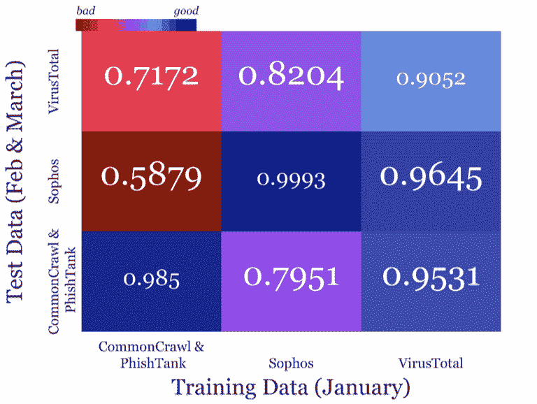
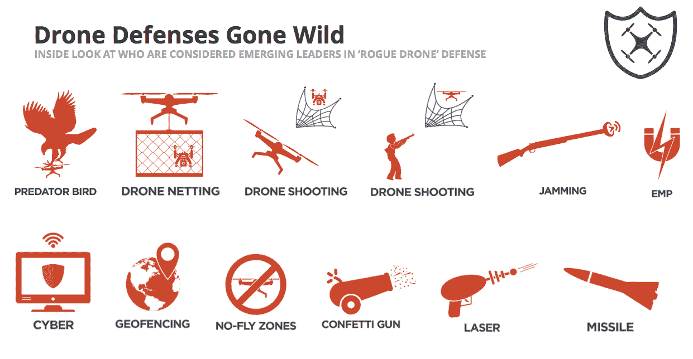

# 安全社区能成长起来吗？

> 原文：<https://web.archive.org/web/https://techcrunch.com/2017/08/17/can-the-security-community-grow-up/>

摩哂陀·拉姆辛哈尼撰稿人

[Mahendra Ramsinghani](https://web.archive.org/web/20221207070308/https://www.linkedin.com/in/mahendraram)

是的创始人

[Secure Octane Investments](www.secureoctane.com)

，投资云基础设施和安全初创公司。不投资的时候，他就忙着写博客，写书。他的第三本书《坚韧的创始人》将于 2022 年出版。

More posts by this contributor

随着时代的变化，安全社区需要适应。

正如[脸书首席信息安全官 Alex Stamos](https://web.archive.org/web/20221207070308/https://www.facebook.com/alex.stamos) 在最近的 BlackHat 2017 主题演讲中指出的那样，我们生活在一个不完美的世界。黑客和创新者需要紧密合作，确保更高的秩序，而不是试图惩罚对方。

其他安全思想领袖也表达了类似的观点。

RSA 前总裁，现任 Tenable Networks 首席执行官的 Amit Yoran 说:“恐惧并不能解决问题。我们需要成为成年人，赢得信任。”

令人耳目一新的是，安全思想领袖正从高层推动文化变革。除了技术创新，我们开始看到销售、多样性和文化的变化。我们在成长，尽管很慢。

**产品创新、垃圾和谎言**

[李萍，](https://web.archive.org/web/20221207070308/https://www.accel.com/team/ping-li)Accel Ventures 的合伙人提醒我，我们仍处于一场漫长游戏的初期阶段。“安全领域发展迅速，我们仍在开发通用术语，即我们业务的通用语言。对系统的可见性、管理补丁、漏洞和安全工作流程仍然是用初级工具完成的，”Lu 说。

像 [Corelight](https://web.archive.org/web/20221207070308/https://www.corelight.com/) (由 Accel 支持) [Awake Networks](https://web.archive.org/web/20221207070308/https://awakesecurity.com/) (由 Greylock Ventures 支持)和 [EastWind Networks](https://web.archive.org/web/20221207070308/https://www.eastwindnetworks.com/) (由 Signal Peak Ventures 支持)这样的新来者正在对流量和威胁的可见性进行创新。在数据安全方面， [ThinAir](https://web.archive.org/web/20221207070308/https://www.thinair.com/) 和 [Onapsis](https://web.archive.org/web/20221207070308/https://www.onapsis.com/) (保护 ERP 系统)已经在市场上开辟了一个有趣的利基市场，而 [Pwnie Express](https://web.archive.org/web/20221207070308/https://www.pwnieexpress.com/) 正在为自己定位，以赢得物联网/ ICS 安全市场。

[Empow Networks](https://web.archive.org/web/20221207070308/https://www.empownetworks.com/) ，一家 2017 年 Gartner 酷派供应商，希望创建一个新颖的抽象层来有效地管理所有安全工具，而 [Demisto](https://web.archive.org/web/20221207070308/https://www.demisto.com/) (我是其投资者)正在为事件响应带来急需的自动化。 [Nyotron](https://web.archive.org/web/20221207070308/https://nyotron.com/) 刚刚筹集了 2100 万美元来重新定义终端安全。随着无人机从一个轻微的麻烦变成一个严重的麻烦，一些安全初创公司，如[空域](https://web.archive.org/web/20221207070308/https://airspace.co/)和[德多恩](https://web.archive.org/web/20221207070308/https://beta.techcrunch.com/2016/05/17/dedrone-raises-10-million-to-detect-aerial-intruders/)已经加入到保护“三维”边界的行列中。

BlackHat 的几位主持人呼吁对营销炒作进行 BS，提供了对技术状态的真实看法。Sophos 的数据科学家 Hillary Sanders 在她的演讲中指出，如果 ML 模型使用次优的训练数据，模型的可靠性将受到质疑，可能导致灾难性的失败。

她基于三个独立的数据源训练模型，发现如果在不同的数据集上测试一个模型，结果会有很大差异(见 3 X 3 矩阵)。换一种说法，如果我在一所学校被训练识别一只猫，如果我转到另一所学校，我识别一只猫的能力会急剧下降。

购买者注意:不要相信 ML 炒作，除非你已经在你自己的数据集上看到了结果。每个供应商将在不同的数据集上训练他们的模型，这可能与您的环境不相关。然后，随着新的恶意软件数据被发现，这些数据会变得陈旧。这个模型可能需要训练，否则可能会开始表现不稳定。我们确实生活在一个不完美的世界里。

给我一些垃圾:ML 训练和测试数据差异(图片提供:希拉里·桑德斯，Sophos 实验室)

在另一个名为“[谎言和该死的谎言](https://web.archive.org/web/20221207070308/https://www.blackhat.com/us-17/briefings.html#lies-and-damn-lies-getting-past-the-hype-of-endpoint-security-solutions)的演讲中，刘烨·吉利亚诺和迈克·斯波尔丁分析了各种终端营销主张，并系统地揭穿了这些主张。他们花了五个月时间深入研究各种终端产品，得出的结论是威胁情报根本不起作用。虽然端点解决方案优于基于签名的检测，但它们并不是灵丹妙药。

谈到无人机安全， [Bishop Fox](https://web.archive.org/web/20221207070308/https://www.bishopfox.com/) ，一家安全咨询公司采用[一种流言终结者的方法](https://web.archive.org/web/20221207070308/https://www.bishopfox.com/news/2017/06/black-hat-usa-2017-arsenal-theater-demo-game-drones/)研究 86 种无人机安全产品。Bishop Fox 的合伙人弗朗西斯·布朗(Francis Brown)展示了“无人机的游戏”，他在其中总结道，解决方案充斥着营销，但其中大多数还不可用。

该研究得出结论，虽然第一代无人机防御解决方案/产品正在部署，但没有“最佳实践”。无人机网、射击、五彩纸屑炮、激光和干扰器都被使用了(包括猎鹰)。小贩们真的疯了。如果正在部署激光、导弹和猎鹰，下一步是什么？

BlackHat + DefCon 可能是世界上唯一一个创造和毁灭的力量在同一个场地运作的会议。建筑商(西装革履)在“简报会”上展示他们的产品，黑客(t 恤)则展示他们如何破坏东西的“武器库”——两者自由交流，互相挑战，并对对方不屑一顾。就像奇怪的半醉部落战舞。而且除非部落的长辈们，像斯塔莫斯和约兰，不在这种幼稚的行为上骂 BS，否则我们永远也长不大。

**市场营销策略的创新:**

黑曜石安全公司的首席技术官本·约翰逊最近从格雷洛克公司筹集了 950 万美元(自从宣布后，已经被“B 轮”兴趣淹没了)。“在证券行业，所有的收入都用来雇佣更多的销售人员，”他说。这是健康的做法吗？作为炭黑的联合创始人，Ben 拜访了 600 多家企业客户，在他目前的职位上，他正在积极探索更多创新的方法来推出产品。事实上，当恐惧推动销售时，创新就更难了。作为一个行业，我们需要寻找一种更好的方式来销售安全产品。然而，缺乏明智的策略。与系统集成商(si)、渠道合作伙伴、增值经销商(var)和托管安全服务提供商(MSSPs)的合作关系是该主题的变体。随着合作伙伴数量的增加，利润和责任也在减少。[维吉尔安全](https://web.archive.org/web/20221207070308/https://virgilsecurity.com/)一家数据安全公司(我是其顾问)建立了一个“开发者至上”的平台，提供无缝构建加密的工具。Virgil 提供其安全平台即服务，GTM 方法在这种情况下会变得非常高效。

**紫雨，文化和多样性**

Alex Stamos 在其 BlackHat 主题演讲中谈到了思想、性别和文化多样性的重要性。他呼吁采取行动，包括在社会框架内负责任地(而不是幼稚地)行事。

新兴市场的许多人将使用 50 美元的手机，而不是 800 美元的 iPhones 我们如何保护这一新的数字公民浪潮？在执法环境中，安全专业人员的角色是什么？我们能学会同情产品制造商、用户和政府吗？

对于安全虚无主义者，斯塔莫斯提醒他们“*不是每个人都想抓你”。*在更基本的层面上， [Cobalt](https://web.archive.org/web/20221207070308/https://cobalt.io/) 的安全战略副总裁卡罗琳·黄(Caroline Wong)介绍了安全专业人士关于黑客办公室政治的指南。“安全团队需要更多地了解业务挑战，而不仅仅是技术。我们应该能够理解资金的流动，而不仅仅是数据，”她指出。

辩论刚刚以公开诚实的方式开始，依我看，文化变化很慢。现在，我们增加了新的颜色——有红队和蓝队。进攻和防守。就像永恒战争中的两面安全。在 BlackHat 2017 上，April Wright 提出了紫色团队的概念，他希望这两个交战的派别应该合作，共同努力。是的——她还提出“安全永远不应该是事后的想法”——对此我们都说阿门！