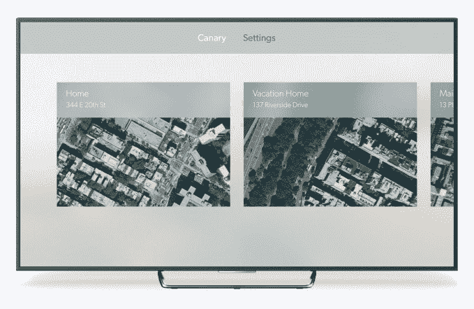
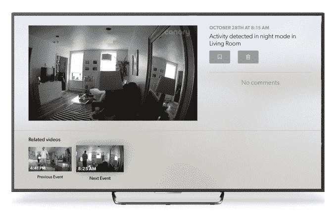
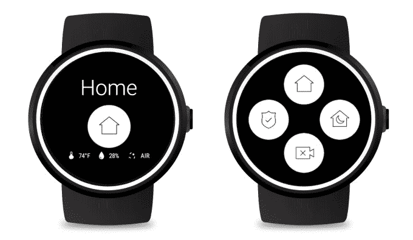

# Canary 的智能安全摄像头现在可以与 Apple TV TechCrunch 配合使用

> 原文：<https://web.archive.org/web/https://techcrunch.com/2016/11/29/canarys-smart-security-camera-now-works-with-apple-tv/>

安全摄像头公司 Canary 今天解决了客户对其产品的少数几个投诉之一:没有一种简单的方法可以在电视大屏幕上观看摄像头的反馈。现在，随着新版 Canary 应用的推出，这种情况发生了变化，该应用增加了对 Apple TV 的支持。这使您可以在电视上观看来自摄像机的实时流，以及观看保存到时间线的录像。

这一增加使得 Canary 更加有用，因为它之前一直专注于将其远程查看功能引入用户的智能手机。当然，当你不在家或在另一个房间时，这很有帮助。但许多人有时希望更被动地跟踪他们相机的反馈——例如，当你盯着在院子里玩耍的孩子时，或者当你举行聚会时，你想看看谁在外面停车。

对于那些只有一个金丝雀设备的人来说，新的 Apple TV 应用程序将直接启动到仪表板视图。在这里，您可以选择观看摄像机的直播或访问您的时间线。对于那些有多个设备的人，该应用程序将允许你使用位置视图在不同的位置之间移动。

要查看特定事件，只需点击缩略图。您也可以轻按 Apple TV 菜单按钮来查看单个条目，然后通过选择适当的按钮来将事件加入书签或从时间线中删除。

每个事件下方的“相关视频”部分将带您进入时间线中的下一个或上一个事件。

对于那些不熟悉的人来说，Canary 制造了一款价格 199 美元的家用安全摄像头，最近它首次推出了一款户外用的无线摄像头，名为 Canary Flex。在 Indiegogo 上起步后，该公司[筹集了超过 4100 万美元的风险投资](https://web.archive.org/web/20230117181156/https://techcrunch.com/2016/09/20/canary-flex/)。除了自己的网站之外，亚马逊、百思买、家得宝、沃尔玛、苹果和威瑞森都在销售它的设备。

该设备的吸引力在于价格和易用性的结合。设置起来并不困难，而且由于其设计简单的移动应用程序，在日常生活中更容易使用。

随着 Apple TV 应用程序的推出，新的 Canary 应用程序(v2.0.2)也将支持平板电脑，包括 Android 和 iPad，以及 Android Wear。

