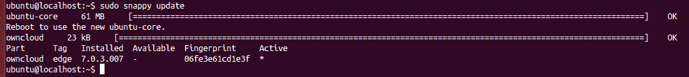

# Canonical 为集装箱农场推出 Ubuntu 核心的“时髦”版本 

> 原文：<https://web.archive.org/web/https://techcrunch.com/2014/12/09/canonical-launches-snappy-edition-of-ubuntu-core-for-container-farms/>

几年前，Ubuntu [推出了](https://web.archive.org/web/20221207014519/http://www.internetnews.com/skerner/2011/03/ubuntu-core-going-after-embedd.html)一款用于嵌入式系统的极简“核心”版操作系统。今天，[发布了](https://web.archive.org/web/20221207014519/http://www.markshuttleworth.com/archives/1434)其新的[“snappy”版本 Ubuntu Core](https://web.archive.org/web/20221207014519/http://www.ubuntu.com/cloud/tools/snappy) 的 alpha 版本，该版本具有专门针对集装箱农场、大型 [Docker](https://web.archive.org/web/20221207014519/http://docker.com/) 部署和平台即服务环境的事务更新。你首先可以在微软 Azure 上看到 Ubuntu Core 的运行(当然，你也可以把它安装在你自己的服务器上)。

“Ubuntu Core 建立在世界上最受欢迎的容器平台上，并通过严格的应用程序隔离提供事务更新，”Ubuntu 和 Canonical 的创始人马克·舒托沃尔斯说。“这是有史以来最小、最安全的 Docker 部署平台，有了 snappy 包，它完全可以扩展到所有形式的容器或服务。”该公司今天的声明称 snappy Ubuntu 是“自我们推出移动计划以来 Ubuntu 的最大革命。”

这个新的核心版本与 Ubuntu 之前的核心版本不同之处在于，它使用了与 Ubuntu 的移动操作系统相同的 Ubuntu [AppArmor 安全系统](https://web.archive.org/web/20221207014519/https://wiki.ubuntu.com/AppArmor)。这可以确保您安装的所有应用程序彼此完全隔离。该公司认为，这将使“在你的云部署上安装来自广泛来源的应用程序更加安全。”毕竟，一个应用程序的问题不太可能对同一系统上运行的其他应用程序产生任何影响。

Ubuntu 还指出，由于这个系统，更新变得更加容易和可靠。在每次更新之前，您的数据会自动备份，如果更新失败，它会简单地回滚到以前的版本，所有数据保持不变。

Ubuntu 显然已经接受了 Docker 和容器化。就在上个月，它发布了自己的 Linux 容器管理程序 [LXD](https://web.archive.org/web/20221207014519/http://www.ubuntu.com/cloud/tools/lxd) 。“我们很高兴看到 Docker 生态系统随着这个令人兴奋的新平台而扩展，”Docker 的首席执行官 Ben Golub 在今天的一份声明中说。“Docker 的事务性应用交付正在塑造现代应用开发和 DevOps 实践，snappy Ubuntu 承诺给操作系统本身带来同样的事务性更新。”

> “微软热爱 Linux。”微软的鲍勃·凯利

Ubuntu 与微软合作，使其 Azure 云计算平台成为第一个支持这一新的 Ubuntu Core alpha 的商业解决方案，这一举动将使许多人感到惊讶。微软热爱 Linux，我们很高兴成为第一家在快速增长的 Azure 云中提供最受欢迎的 Linux 平台之一的新版本的云提供商，微软公司副总裁鲍勃·凯利说。通过提供新的云优化

Ubuntu

Azure 上的核心映像，我们正在扩展我们对 Linux 的一流支持，并实现自由选择，以便各地的开发人员可以更快地创新。"

虽然 Ubuntu 没有宣布任何额外的合作伙伴，但你很快就会在其他平台上发现 Ubuntu Core。