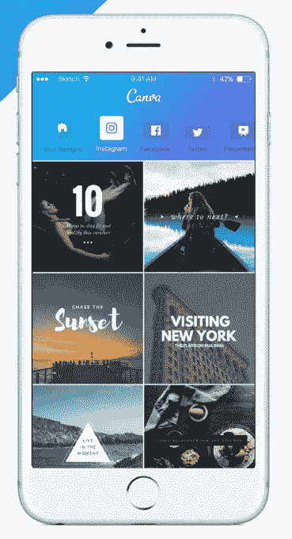
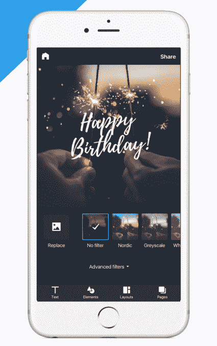
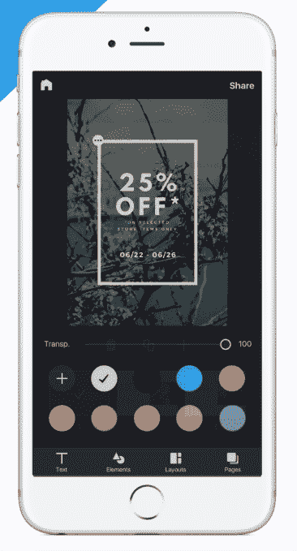

# Canva 通过其新的 iPhone 应用 TechCrunch 为任何人带来专业设计

> 原文：<https://web.archive.org/web/https://techcrunch.com/2016/07/20/canva-brings-professional-design-to-anyone-with-its-new-iphone-app/>

在线设计平台 [Canva](https://web.archive.org/web/20221207183217/http://canva.com/) 让任何人都可以轻松快速地创建专业图形——即使他们没有设计背景——今天随着其首个 iPhone 应用程序的推出，该平台正在扩大其覆盖范围。到目前为止，该公司已经提供了大约三年的网络应用程序，并在 iPad 上提供了一年。随着[推出 iPhone](https://web.archive.org/web/20221207183217/https://about.canva.com/iphone/)，Canva 的受众可能会超越如今通常使用其服务的商业和营销专业人士，变得更受消费者欢迎。

Canva 于 2013 年年中首次推出，是首席执行官 Melanie Perkins 的梦想，他之前的公司涉及一个用于构建学校年鉴布局的系统。她意识到，人们需要简单的工具，让设计更容易进入主流。

Canva 今天提供了一个在线编辑器和一个模板、图形、字体、照片等的库，其中一些可以免费使用，而其他的可能只需一美元，因为它们是一次性使用的。这个平台可以让你设计一系列图片，比如幻灯片、讲义、海报、卡片、拼贴画、邀请函，以及社交媒体帖子、脸书页面等所需的图片。

最重要的是，该系统本身的工作方式非常简单，任何人都可以知道如何将各种部件组合在一起，最终得到一个专业外观的产品，而不必求助于更高级的软件，例如 Photoshop 或 InDesign。

目前，该平台有超过 1000 万人使用，其中包括 5 万名工作订户，这是该公司针对企业的[高级计划。](https://web.archive.org/web/20221207183217/https://beta.techcrunch.com/2015/08/10/now-with-4-million-users-design-platform-canva-launches-to-businesses/#.s2agxy:Bbjy)这些用户包括一些著名的名字，比如 Yelp、Lonely Planet、Hubspot 和 Upworthy。根据 CrunchBase 的数据，该公司迄今为止已经筹集了超过 3000 万美元[。](https://web.archive.org/web/20221207183217/https://www.crunchbase.com/organization/canva#/entity)

虽然 Canva 是作为一种在桌面上使用的在线服务出现的，但对移动设备的需求一直在增长。它的 iPad 应用程序现在已经被下载了 200 万次，超过一半(53%)的移动访问来自苹果设备。与此同时，该公司表示，通过电子邮件和社交媒体与用户互动的约 30%是在 iPhone 上完成的。

结合 iPhone 应用程序一直是用户最需要的产品这一事实，Canva 知道在 iPhone 上推出应用程序将是今年的优先事项。

Canva 联合创始人兼产品负责人 Cam Adams 解释道:“我们看到了桌面电脑在线应用的惊人增长，但我们始终意识到移动设备正在成为人们在线互动的主要方式。“对我们来说，能够在人们用来创建视觉内容的所有设备上使用非常重要，因此发布 iPhone 应用程序是 Canva 实现跨平台愿景的一大飞跃。”

他补充说，在 iPhone 上可用将为不同类型的创作打开平台——一种“更即时、更有语境和更社交化”的创作，他说。

“这对我们目前的目标企业和营销人员来说非常有价值，但对消费者市场来说也是一个巨大的吸引力，他们将能够使用 Canva 来创建一些真正独特的内容，”亚当斯指出。

iPhone 应用程序面临的更大挑战是将 Canva 提供的各种工具带到更小的屏幕上，同时保持简单的体验。

该移动应用程序提供了超过一百万种布局、库存照片和插图，可以使用字体、照片过滤器、图形、贴纸、形状等进行编辑。包括数百种布局，如贺卡、邀请函、社交媒体帖子、销售活动和传单、商业演示、脸书封面、社交媒体图片等。

完成后的作品可以发布到脸书的 Pinterest、Instagram 和 Google+上，或者保存下来发邮件或发短信。

虽然现在有很多应用程序可以在 iPhone 上进行基本的图像编辑，但 Canva 有几个突出的功能，使其更符合“专业”领域。一个是它的实时相机模式，让你拍一张照片，并在你的设计背景中看到相机。这样就很容易拍出完全符合你所选设计的照片。

另一个是它对多页设计的支持，这意味着它可以在旅途中用于更大的项目，如商业演示。

总的来说，最终结果是一款对 Canva 的核心用户群(商业专业人士)有意义的应用程序，但它也可能会蔓延到消费者市场。

iPhone 版 Canva】在 iTunes 上免费提供。