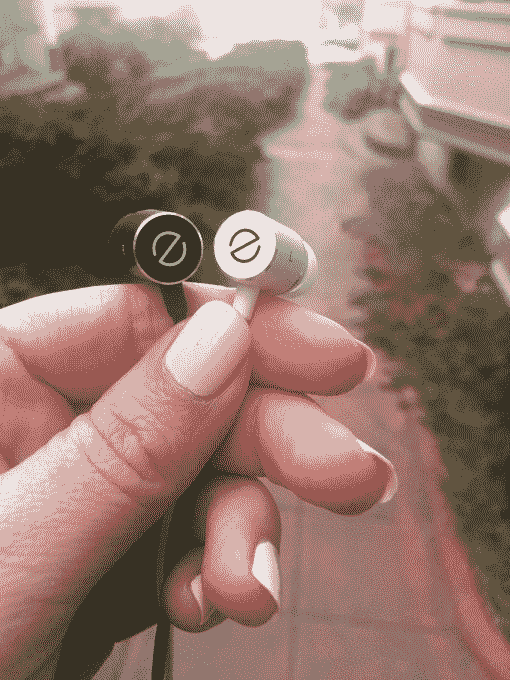
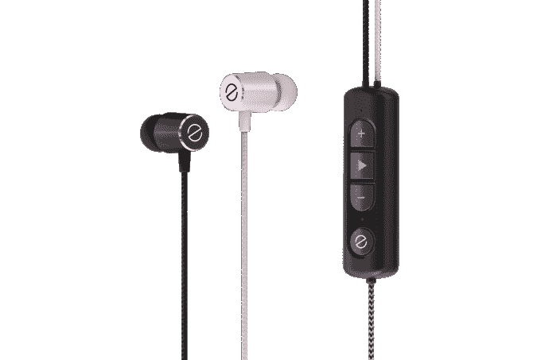

# 亲自动手体验专为您量身定制的价值 99 美元的耳机 

> 原文：<https://web.archive.org/web/https://techcrunch.com/2016/06/28/canyouhearwhatihear/>

# 手握专为您量身定制的价值 99 美元的耳机

德瑞医生可能制造了这个星球上最受欢迎的耳机，但 Beats 很可能被调整到 Dre 喜欢听音乐的方式——重低音。你不是 Dre，你的耳朵，我的耳朵和其他人的耳朵听到的方式略有不同。甚至你的左耳和右耳听不同类型声音的方式也不同。

[Even](https://web.archive.org/web/20221206213706/http://geteven.co/) 是今天发布的一套新耳机，承诺根据你每只耳朵拾取声音的方式，提供独特的听觉体验。

耳机通过一个简短的听力测试获取你听到的方式的“耳纹”,然后适应你左右耳听到的方式。

前作曲家丹尼·阿伦森和他的共同创始人奥弗·拉兹在以色列一起工作时，想出了专门制作耳塞的主意。但他们在这一领域面临着激烈的竞争。

甚至与 Beats 和[等流行耳机制造商、许多](https://web.archive.org/web/20221206213706/http://www.snapdeal.com/product/house-of-marley-emje060bk-little/623638189151?utm_medium=110611313&utm_content=623638189151&utm_medium=cpc&utm_content=623638189151&utm_term=,&campaignid=337147405&adgroupid=27815045005&adposition=1o1&network=g&device=c&targetid=aud-54584633029:pla-92565748165&utm_source=aff_prog&utm_campaign=afts&offer_id=17&aff_id=25500)、[许多](https://web.archive.org/web/20221206213706/https://www.amazon.com/s/ref=nb_sb_noss_1?url=search-alias%3Daps&field-keywords=earphones)其他耳机制造商以及承诺独特听觉体验的初创公司展开竞争。

Nura 是另一家承诺调谐到听众频率的耳机制造商。Nura 通过一个受欢迎的 Kickstarter 活动筹集了近 100 万美元，有近 3，800 名支持者，但尚未发货。

今天，通过直接向消费者销售，甚至打击了它的主要竞争对手。它的价格也更实惠——Nura 的零售价为 399 美元，而 Even 的零售价为 99 美元。

这两者也使用稍微不同的技术来适应听者的耳朵。Nura 使用 OAE(耳声发射)通过麦克风来听从内耳返回的微弱声音。甚至使用基于听众反馈的校准技术。

Even 的虚拟角色 Sarah(我们有很多人)帮助听众在开始时通过测试每个耳朵中不同类型的声音来设置他们。你按下控制按钮上的大“E”表示偶数，Sarah 将开始引导你通过虚拟向导，帮助你确定左右耳的正确设置。你将在每只耳朵里听到八段不同的音乐，一听到音乐就按“E”键，让莎拉知道你的水平。如果你搞砸了或者想要微调，你可以通过点击控制上的“E”按钮来重置偶数耳机。

我甚至开车去亲自测试了一下。下面是我喜欢的:

*   我测试了一副我用来慢跑的旧粉色耳挂式 Beats 耳机和 Even 之间的区别，真的可以分辨出声音的不同。我点了几首本周新歌(怎么了，阿黛尔),就能听到每种乐器的声音，就像置身于环绕声中一样。每一个鼓点、曲柄和电音都伴随着人声清晰地呈现出来。
*   左耳和右耳都有黑色和白色标记，这样你就不用猜哪个耳机放在哪里了。
*   时尚设计，内置控制器，可轻松调节音量、播放、暂停和重新校准。
*   不会缠结的电缆。在任何耳机设计中，高质量的布料而不是相互缠绕的裸露橡胶线都是关键。
*   可调节硅胶耳机尺寸，从小、中、大均可。
*   内置 USB 充电器，电池续航时间长达 9 小时。

**下面是我不喜欢的:**

*   没有过耳选项。我跑步或散步时听音乐最多。即使没有过耳设计，耳机也很容易在慢跑甚至走路时滑出。你可以使用一个剪辑，阿伦森告诉我，这将最终包括在产品中，但它会很高兴看到一个运行设置的设计。
*   当你移动时，那些很棒的无缠结电缆也会发出刺耳的噪音。如果你专注于获得一个好的声音，那就不好了。它用我的衬衫刷的每一声都能在两个耳朵里听到，真的很烦人。
*   为什么连无线耳机都没有？无论如何你都要插上电源。蓝牙连接选项可以解决电缆的噪音问题。

总的来说，我喜欢这家公司的发展方向——更好地倾听。我想看到一个无线选项或比目前的电缆更少刺激性的东西，但总的来说是一副价格合理的耳机。插上电源，打开一首歌，感觉需要继续调节音量，这很糟糕，这取决于正在播放的歌曲或乐器。我喜欢这种想法，只需用一个负担得起的耳机播放音乐并获得高质量的环绕声。

插上电源，打开一首歌，感觉需要继续调节音量，这很糟糕，我喜欢这个想法，只需播放音乐，并在一个负担得起的耳机中获得高质量的环绕声。如果你对自己的听觉体验很挑剔，但又不想付出高昂的代价，我会说这是一个很好的选择，你不必等待制造商来购买。