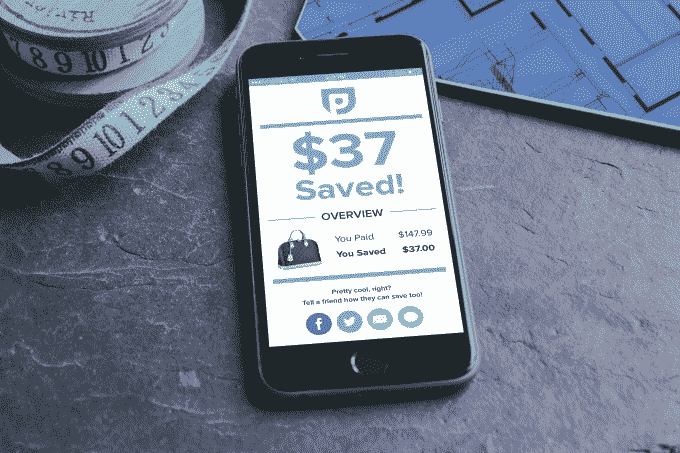

# Capital One 收购在线价格跟踪公司 Paribus 

> 原文：<https://web.archive.org/web/https://techcrunch.com/2016/10/06/capital-one-acquires-online-price-tracker-paribus/>

Capital One 正在金融科技领域进行另一项收购，这一次是收购价格跟踪服务 [Paribus](https://web.archive.org/web/20221209040529/https://paribus.co/) ，该服务帮助在线购物者在所购商品价格下降时获得自动退款。交易条款没有披露，但收购涉及将团队和技术本身带到 Capital One。

[pari bus 在 2015 年纽约科技博客 TechCrunch Disrupt](https://web.archive.org/web/20221209040529/https://beta.techcrunch.com/2015/05/05/paribus-can-save-you-money-when-online-prices-drop/)上推出的初创公司战地，其想法是自动跟踪过去的购物过程，看看购物者是否可以向在线零售商要求退款。许多零售商提供购买后价格匹配，但大多数消费者在完成结账过程后不会费心去观察价格波动。

取而代之的是，Paribus 与你的电子邮件提供商(比如 Gmail、Outlook 或 Yahoo)相结合，扫描你的收件箱，查看网上购物的收据。当它找到一个时，它将在商店的价格匹配声明窗口中观察该商品的价格下降。这项服务与许多在线零售商合作，包括亚马逊、百思买、沃尔玛、塔吉特、布鲁明戴尔、梅西百货、Bonobos、J.Crew、新蛋、好市多、史泰博、美国柯尔百货公司等。

这家初创公司迄今为止已经筹集了 222 万美元的外部资金，并拥有一个 12 人的团队，他们现在都加入了 Capital One。Paribus 创始人 Eric Glyman 和 Karim Atiyeh 将加入 Capital One，担任美国卡业务的高级董事。

“我们对他们的人才水平、他们已经拥有和正在开发的创新技术以及他们为用户提供轻松体验的坚定使命印象深刻，”Capital One 美国卡业务执行副总裁 Emilia Lopez 在谈到该公司决定收购 Paribus 的原因时表示。

“我们现在的重点是将 Paribus 合并到更广泛的 Capital One 家族中，并将 Paribus 产品添加到旨在让人们生活更轻松的更广泛的技术和工具中，如 CreditWise 和 Second Look，”洛佩兹补充道。

Paribus 在交易时拥有超过 70 万用户，联合创始人格利曼表示，该团队对过去一年的方向和增长感到满意，但他不愿透露收入细节。

“像许多像我们这样在一年时间内快速成长的创业公司一样，我们有许多途径，”格利曼说。“我们选择与 Capital One 联手。我们非常高兴能在一家创新技术公司内加大我们的努力，并因共同致力于为消费者打造卓越的技术而充满活力。”

Paribus 不会在收购后关闭，而是将与 Capital One 合作，拓展新的省钱领域。该公司已经在开发一种专注于信用卡价格保护的新产品，因此这似乎是业务的下一步。

此次收购是 one 近年来进行的几笔资本之一，旨在增强其技术人才，并为客户提供更现代化的创新服务。它还收购了像 [Bundle](https://web.archive.org/web/20221209040529/https://beta.techcrunch.com/2012/11/30/capital-one-acquires-bundle-a-data-driven-local-business-directory/) 、[banks](https://web.archive.org/web/20221209040529/https://beta.techcrunch.com/2012/05/07/capital-one-acquires-mobile-savings-startup-bankons-team-moving-to-capital-one-labs/)、 [Adaptive Path、](https://web.archive.org/web/20221209040529/https://beta.techcrunch.com/2014/10/02/adaptive-path-acquired-by-capital-one/)和去年的 [Level Money](https://web.archive.org/web/20221209040529/https://beta.techcrunch.com/2015/01/12/capital-one-acquires-budgeting-app-level-money/) 和 [Monsoon](https://web.archive.org/web/20221209040529/https://beta.techcrunch.com/2015/07/08/capital-one-acquires-oakland-based-design-and-development-firm-monsoon/) 这样的创业公司。