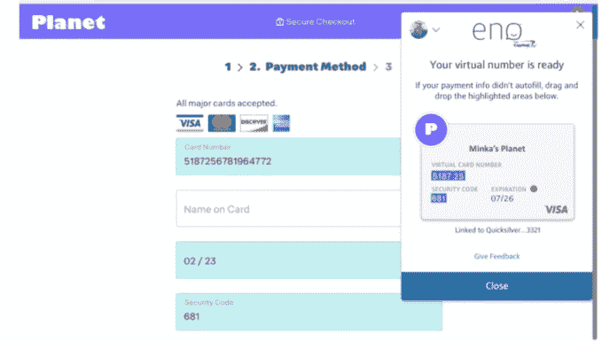
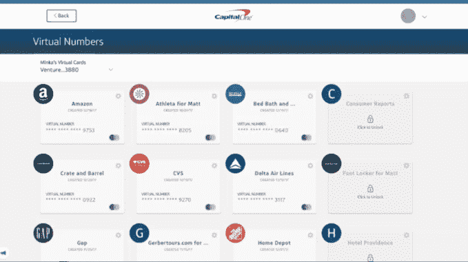

# Capital One 的购物助手 Eno 现在可以在浏览器中分发虚拟卡号 

> 原文：<https://web.archive.org/web/https://techcrunch.com/2018/03/09/capital-ones-shopping-assistant-eno-can-now-dole-out-virtual-card-numbers-in-the-browser/>

Capital One 今天正式推出了一种从网络浏览器使用其虚拟卡号的新方法，以使网上购物更加安全。当然，虚拟卡号并不新鲜——[美国银行](https://web.archive.org/web/20221007222300/https://www.bankofamerica.com/privacy/accounts-cards/shopsafe.go)和[花旗](https://web.archive.org/web/20221007222300/https://www.cardbenefits.citi.com/faq.aspx#VAN)都提供类似的功能，创建一个与你真实账号关联的临时信用卡号，用于网上购物。但 Capital One 对这一功能的实现将方便持卡人。

Capital One 没有要求用户在某种设置屏幕上创建账号，而是使用其智能助手 Eno，通过网络浏览器扩展，使虚拟卡号的创建更容易访问，更快使用。

你可能知道 Eno 是银行的聊天机器人，除了创建卡号之外，它还能做很多事情。你还可以通过手机发送短信 [Eno](https://web.archive.org/web/20221007222300/https://www.capitalone.com/applications/eno/) (227-663)来查看你的余额、跟踪你的购物、支付你的账单等等。

如果你认为虚拟数字已经到达了 Capital One，你并没有完全错。该公司已经在 2017 年 11 月悄悄地推出了虚拟卡号功能，但直到现在才正式宣布这项功能，因为它一直在进行试点测试，还没有广泛提供。

与其他虚拟卡号产品一样，一旦设置和配置了扩展，Capital One 的卡号就可以让您无需使用(甚至定位)您的信用卡帐户信息就可以进行支付。

当你进入一个网站的结帐页面时，这个扩展会立即创建虚拟卡号，然后可以给这些卡号起个昵称，让它们更容易记住。这些号码以后可以在一个在线仪表板上管理，你可以根据需要锁定或解锁它们，或者在不再需要时删除它们。

锁定号码是关闭订阅的一种便捷方式。这是今天许多人都在努力解决的问题——尤其是现在从音乐到视频，甚至应用程序都依赖于订阅模式。

Eno 扩展还会在结账页面上自动填写您的支付信息，并在您返回同一网站时重新显示，以便您快速访问上次在该网站创建的虚拟卡号。

Eno 还会自动更新您的虚拟号码，以映射到您的新塑料卡，如果它曾经被取代。

该公司表示，虚拟号码与你的 Capital One 账户完全集成，因此你将继续获得奖励。

该扩展目前可用于个人卡，以及通过桌面上的谷歌 Chrome 或火狐浏览器。但计划是及时扩展对更多平台的支持。Eno 还将增加更多功能，包括设置交易限额的能力，对特定商户卡设置时间限制，以及创建为一次性使用而设计的虚拟卡。