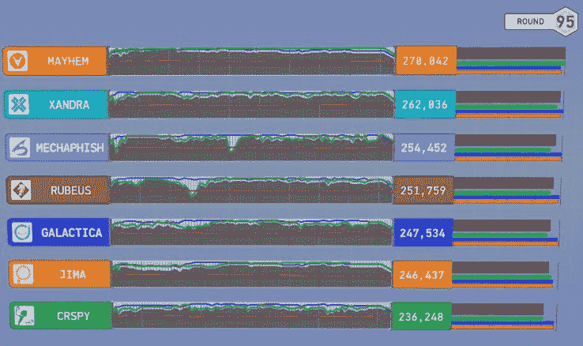

# 卡内基梅隆大学的 Mayhem AI 从 DARPA 的网络大挑战 TechCrunch 中获得 200 万美元

> 原文：<https://web.archive.org/web/https://techcrunch.com/2016/08/05/carnegie-mellons-mayhem-ai-takes-home-2-million-from-darpas-cyber-grand-challenge/>

2016 年 DARPA [网络大挑战](https://web.archive.org/web/20230114194355/https://www.cybergrandchallenge.com/)已经结束，获胜团队——卡内基梅隆大学的 forall secure——将获得 200 万美元的大奖。你说什么——什么是网络大挑战？很高兴你问了！

像国防部 R&D 分部提供的其他挑战一样，CGC 专注于自主性——但最初的大挑战和机器人挑战是关于智能地在现实世界中导航，而这次是关于在充满威胁的互联网中操作。

七支队伍被邀请到拉斯维加斯参加 96 轮的“夺旗”比赛。这是一个经过时间考验的竞争性黑客游戏，在这个游戏中，团队被分配到必须执行特定任务的服务器，同时不断被提供充满错误、安全漏洞和低效的新代码。团队必须保护自己的数据，同时试图访问其他人的数据，这很像现实生活中的 CTF。

这个游戏的不同之处在于游戏中的玩家是完全自主的。正常情况下，人类会查看并修改代码，选择是否攻击以及攻击谁，等等——但对于 CGC 来说，所有这些都必须由系统来完成。

当然，这个想法是要制造出可以自我修补、监视入侵等等的系统，只需要最少的人类互动。很高兴知道你的电脑会自己照顾自己。

经过大约 8 个小时在巴黎酒店舞厅的战斗(一些[亮点](https://web.archive.org/web/20230114194355/https://youtu.be/WEDO2GgL20Q)，胜利者出现了:ForAllSecure 的“Mayhem”，第二名是 TechX 的 Xandra。这两笔奖金分别为 200 万美元和 100 万美元，另外 7 名决赛选手已经分别获得了 75 万美元。

更重要的是，在撰写本文时，Mayhem 是第一个与人类对战的自主 CTF 系统。该团队被邀请参加在邻近的 DEF CON 举行的 CTF 锦标赛，比赛正在进行中。

CGC 项目的负责人麦克·沃克很快就把 Mayhem 扔到了巴士底下。

“我不指望大混乱会有好结果，”他在 DARPA 的新闻发布会上说。“这场比赛是大师赛，这是他们的主场。除了最后一名，这部机器的任何成绩都将令人震惊。”

对于一个刚刚在一个难以置信的复杂的虚拟游戏中获得第一名的冠军人工智能来说，这不是最好的说法，但他可能知道自己在说什么。当我们发现大混乱如何对抗血肉之躯时，我会更新这篇文章。

正如预测的那样，Mayhem 被击败了，尽管它一度领先于其他几支队伍。