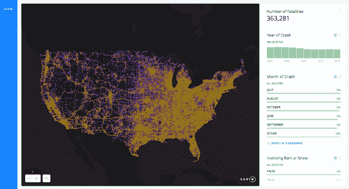
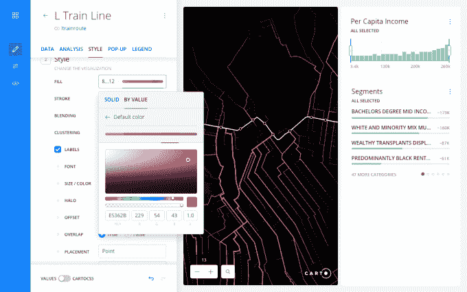

# CARTO 让非专业人士也能看到地理数据的可视化和分析

> 原文：<https://web.archive.org/web/https://techcrunch.com/2016/07/08/carto-makes-geographical-data-visualization-and-analysis-accessible-to-non-specialists/>

2012 年成立于马德里的数据可视化公司 CartoDB 更名为 CARTO，以庆祝其新的分析工具 [CARTO Builder](https://web.archive.org/web/20230124080913/https://carto.com/blog/welcome-to-carto-builder/) ，并强调其试图将其受众从开发人员扩大到商业人士和非编码人员。

过去，CartoDB 曾帮助具有 SQL 知识的数据专家执行位置数据分析。此外，该公司允许数据可视化爱好者(包括没有编码经验的数据记者)从头开始构建交互式地图。现在，该公司旨在为大型组织提供数据分析工具，帮助他们优化商业决策和预测消费者趋势。

“CARTO Builder 可以用于每个行业，但我们的目标是金融服务，帮助他们预测特定领域和电信公司的投资风险，”CARTO 首席执行官哈维尔德·拉·托雷告诉 TechCrunch。

CARTO Builder 是一个基于网络的拖放式分析工具，附带来自公共平台的各种数据表。它与以前的版本不同，因为两个特点:部件和预测功能；它们都不需要使用编码知识。

小部件允许用户通过关注数据集的一个或多个条目来获得数据的即时分析。CARTO Builder 提供了四种类型的小部件:按类别(列中的不同条目)、按直方图(显示一个范围内的数据)、按公式(计算一行中的元素)和按时间序列处理数据的小部件。地图颜色也可以根据我们使用的不同小工具来设置。

例如，假设我们对发现美国所有火车事故的平均成本感兴趣。我们的数据集仅显示所有事故的列表及其单一成本。用户只需在“公式”小工具中选择正确的参数，地图就会立即显示一次火车事故的平均损失。

CARTO 的纽约市业务发展经理杰夫·费尔佐科说:“过去这需要大量的 JavaScript 代码。

CARTO Builder 不需要编码知识，也不需要推断数据中的模式。CARTO Builder 的专家用户仍然可以使用 SQL 来处理他们的数据库，但是非专家用户只需要访问该工具的“分析和预测”部分并选择一些参数。在这个部分中，用户有三个选项:计算点的聚类、检测异常值和聚类，以及预测趋势和波动性。

“由于 CARTO Builder，以前由数据科学家完成的许多工作现在可以更容易地由非数据分析师完成，”Ferzoco 说。

在 CARTO Builder 中获得 10，000 行数据库的分析结果需要大约 1 分 30 秒。Ferzoco 说，分析一个 5000 万行的数据库可能需要 40 分钟到 1 小时。“但我们没有尝试过，所以这不是一个官方数字，”他指出。

德拉托雷补充说，CARTO Builder 的基本版起价为 149 美元/月。“大多数组织将使用企业级服务，起价为每年 1 万美元，”德·拉·托雷说。

该公司表示，他们计划从 7 月 7 日开始逐步完成 CARTO Builder 的推出。