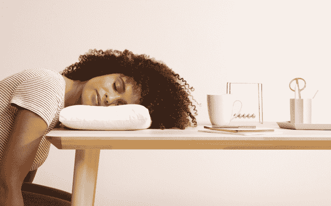
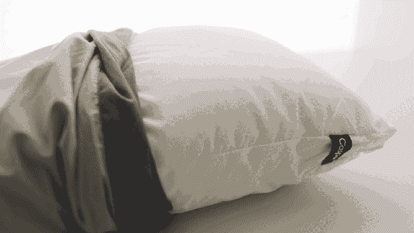

# Casper 推出了一款售价 35 美元的午睡枕头，适合在旅途中睡觉 

> 原文：<https://web.archive.org/web/https://techcrunch.com/2018/06/05/casper-nap-pillow/>

# 卡斯帕推出了一款售价 35 美元的午睡枕头，适合在旅途中睡觉

Casper 今天发布了一款新产品——Casper 午睡枕，一款可以放在包里的小枕头。

虽然这家初创公司仍然以其[床垫](https://web.archive.org/web/20230213024159/https://techcrunch.com/2017/08/15/casper-wave/)而闻名，但它已经扩展到不仅提供[枕头和床单](https://web.archive.org/web/20230213024159/https://www.bizjournals.com/newyork/news/2015/11/17/nyc-mattress-startup-casper-adds-sheets-pillows.html)，还提供[狗床](https://web.archive.org/web/20230213024159/https://techcrunch.com/2016/08/17/you-get-up-with-fleas/)。它还与美国航空公司合作，向高端乘客提供睡眠产品。

“该品牌的长期愿景是帮助人们睡得更好，无论是在你的卧室里，在空气中，还是在任何可能的地方，”联合创始人兼首席运营官尼尔·帕里克说。

但有时在家很难达到推荐的八小时睡眠。正如帕里克所说，“我甚至不睡八个小时，还经营着一家睡眠公司。”因此，午睡枕可以帮助你在“火车、公共汽车、飞机、地铁、海滩”上，甚至在你的办公桌前获得额外的睡眠。

帕里克说，这种旅行枕头是由该公司的研究部门卡斯帕实验室发明的。它基本上是常规 Casper 枕头的缩小版(10.25 英寸×15 英寸)，采用了该公司所谓的“枕头中的枕头设计”——即，将支撑性内层和更蓬松的外层结合在一起。

午睡枕配有枕套和旅行包。事实上，Veanne 带着这个枕头去了[特拉维夫](https://web.archive.org/web/20230213024159/https://techcrunch.com/events/techcrunch-tel-aviv/)，她说它制作精良，提供了像样的支撑，但感觉更像是办公室或家里的儿童尺寸的 Casper 枕头，而不是她希望的旅行枕头。

不过不用担心，她有改进的建议！比如:防止枕头滑入飞机墙壁和靠窗座位之间的吸盘，保护隐私的可拆卸连帽衫([说真的](https://web.archive.org/web/20230213024159/https://www.thegrommet.com/ostrich-pillow-napping-pillow-standard))，以及装 iPhones 和钱包的口袋。

卡斯帕午睡枕头售价 35 美元，目前[有售](https://web.archive.org/web/20230213024159/https://casper.com/nap-pillow/)。

