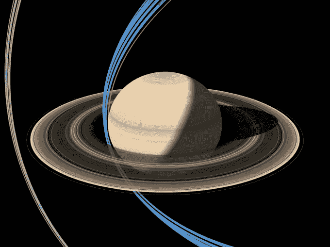

# 卡西尼号成功潜入土星及其光环 

> 原文：<https://web.archive.org/web/https://techcrunch.com/2017/04/27/cassini-successfully-dives-between-saturn-and-its-rings/>

经验丰富的卡西尼号飞船已经完成了一项令人印象深刻的高速操作:以大约每小时 77000 英里的速度穿过土星高层大气和土星环之间的狭窄间隙。

以这样的速度与光环的粒子碰撞可能会使飞船失灵——但是第一次(有史以来)穿越光环是成功的。这是宇宙飞船离太阳系第六颗行星土星最近的一次。

下面蓝色部分显示的是当前计划中的经过，灰色部分显示的是卡西尼早期的环掠轨道:

鸣谢:NASA /加州理工学院喷气推进实验室

执行卡西尼任务的科学家们昨天不得不屏住呼吸一段时间，等待看看飞船是否成功穿越了这个缺口——作为额外的预防措施，他们将碟形天线对准了迎面而来的环粒子的方向，以充当屏蔽，这意味着飞船在环面穿越期间与地球失去了联系。

“我们只能依靠预测，基于我们对土星其他环的经验，我们认为环和土星之间的差距会是什么样的，”卡西尼项目经理美国宇航局喷气推进实验室的厄尔·玉米在一份[声明](https://web.archive.org/web/20221004174716/https://saturn.jpl.nasa.gov/news/3032/nasa-spacecraft-dives-between-saturn-and-its-rings/)中说。“我很高兴地报告，卡西尼号正如我们计划的那样穿过了缺口，并以优异的状态从另一侧出来。”

这个有着 20 年历史的老飞船现在正在发回新的科学和工程数据，这些数据是在穿越期间和接近行星时收集的。科学家们还将使用第一次潜水期间收集的数据来确定他们下次是否需要采取屏蔽预防措施。

美国宇航局表示，卡西尼号在进行机动时，距离土星云顶约 1900 英里，距离土星环最内侧可见边缘约 200 英里。光环和土星大气层顶部之间的间隙大约有 1500 英里宽。

科学家们希望从卡西尼任务的这个组成部分中学到什么？他们正在利用与土星及其光环的近距离接触，对其大气成分和内部结构进行他们所谓的“前所未有的测量”。

鉴于该飞行器比以往任何时候都更接近土星，它能够发回最内层光环和行星大气特征的高分辨率视图——这可能导致新的观察。

美国宇航局已经展示了第一次潜水拍摄的三组未经处理的图片:

鸣谢:美国宇航局/JPL 加州理工学院/空间科学研究所

穿越土星环的卡西尼数据也将使任务科学家能够测量土星的重力和磁场，以研究其内部结构；显示其内部旋转速度；并提供关于巨行星如何形成和如何运作的基本理解。

另一个具体目标是确定环的质量，并估计环系统的年龄和寿命。他们说，确定光环的质量可以反过来揭示光环是如何形成的，也可能揭示所有行星是如何形成的。

卡西尼号将直接采集环粒子的样本，以及土星最内部辐射带和上层大气的样本。

土星和它的环之间的第二次潜水定于 5 月 2 日。他们的目标是在任务结束前总共进行 22 次环潜(因此有了“压轴戏”的绰号)。

在本文的第二张图片中，卡西尼号最后的最后一次俯冲如上图所示，是一条橙色的线。

[https://web.archive.org/web/20221004174716if_/https://www.youtube.com/embed/xrGAQCq9BMU?feature=oembed](https://web.archive.org/web/20221004174716if_/https://www.youtube.com/embed/xrGAQCq9BMU?feature=oembed)

视频

卡西尼号早在 2004 年就抵达了土星，从那以后就一直在发回关于这颗行星及其无数卫星的数据。[例如，本月早些时候](https://web.archive.org/web/20221004174716/https://beta.techcrunch.com/2017/04/13/nasa-finds-evidence-of-life-supporting-conditions-on-saturns-moon-enceladus/)，任务科学家报告发现证据，他们认为氢气来自土星的一颗被冰覆盖的卫星土卫二上的海底喷口，土卫二冰冷的表面下有液态水，他们说这可以提供支持微生物等生命形式所需的能量。

航天器漫长的数据收集日子终于屈指可数了，因为它的燃料正在耗尽。卡西尼号被设定在一个轨道上，这将是它在今年 9 月 15 日进入土星大气层的最后一次单程任务。想法是在行星的高层大气中“安全地处理”宇宙飞船，而不是让它盲目地漂出太阳系。当然，这也为该任务二十年的数据收集画上了一个戏剧性的句号。