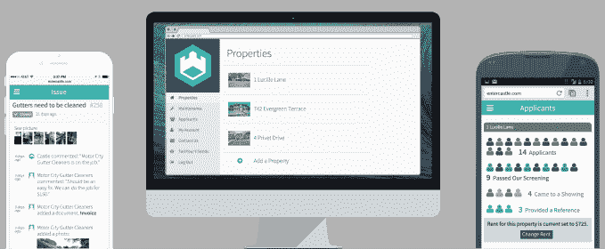

# Castle 是来自未来的物业管理平台 

> 原文：<https://web.archive.org/web/https://techcrunch.com/2016/02/29/castle-is-a-property-management-platform-from-the-future/>

# 城堡是一个来自未来的财产管理平台

在技术、客户服务和透明度方面，物业管理是通常落后于美国经济其他领域的行业之一。

作为 2016 年冬季班的一部分，城堡试图通过其自动化物业管理平台使行业跟上时代。

该网站将物业管理的所有困难部分(如物业列表和营销、租户筛选、租金收取和维护)整合到一个易于使用的界面中，看起来不像是在 20 世纪 90 年代设计的。

但是，Castle 是如何将所有这些服务整合到一个平台中的呢？主要通过技术和按需劳动力的结合。

例如，在一个属性被添加到 Castle 后，这家初创公司会自动在 40 多个上市网站上进行营销。当需要向潜在的租户展示房产时，Castle 有一个随需应变的管家劳动力库，他们是负责现场工作的小时工，如展示房产和交付钥匙。

Castle 还通过其创收方式脱颖而出。虽然大多数现有的物业管理公司收取一定比例的租金，但城堡只收取每月每单位 79 美元的固定费用。

该公司成立于底特律，创始人马克斯·努森鲍姆、斯科特·劳和蒂姆·丁曼在他们的“为美国而冒险”奖学金项目中购买了一栋止赎豪宅。

在这个过程中的某个时候，他们得出结论，他们不能信任他们正在审查的任何一家物业管理公司来监管他们新买的东西，所以 Castle 诞生了。

该平台现在面向底特律的业主，并将很快扩展到美国其他城市。