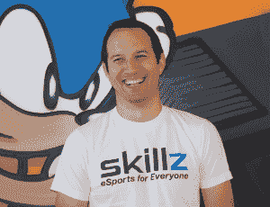

# 随着 Doodle Jump 宣布计划与 Skillz  建立电子竞技联盟，休闲游戏成为职业游戏

> 原文：<https://web.archive.org/web/https://techcrunch.com/2016/07/18/casual-games-go-pro-as-doodle-jump-announces-plans-for-an-e-sports-league-with-skillz/>

一些不是关于 Pokemon Go 的手游新闻怎么样？

利马天空公司首席运营官马特·图雷特茨基表示，该公司已承诺推出一个电子竞技联盟和他们广受欢迎的手机游戏[涂鸦跳跃](https://web.archive.org/web/20230329091458/https://techcrunch.com/2011/03/29/doodle-jump-goes-multiplayer/)的新版本。

七年前成立的 Lima Sky 已经为其涂鸦跳跃游戏在各种平台上积累了 2 亿次独立下载。如今，Doodle Jump 的月活跃用户数达到了 1000 万，可以与《反恐精英:全球攻势》(CS:GO)等顶级电子竞技相媲美。

《CS:GO》或《英雄联盟》和《Dota 2》等沉浸式游戏帮助证明了视频游戏可以由赞助玩家在职业和联盟级别上玩，甚至可以获得大学奖学金。

但嘟嘟跳是最早尝试将自己扩展到新兴电子竞技市场的休闲游戏品牌之一，如果不是 T2 的话。Doodle Jump 上的会话比这些标题中的任何一个都短，平均只有两三分钟。

公司称，Lima Sky [与 Skillz](https://web.archive.org/web/20230329091458/https://techcrunch.com/2016/06/15/skillz-is-the-biggest-e-sports-company-gamers-have-never-heard-of/) 合作开发其新的可用于锦标赛的游戏。

Skillz 的技术就像一个数字裁判，确保技能相似的球员在平等的数字竞技场上比赛。Skillz 为现金投注或奖励游戏提供便利，检查玩家的年龄，处理交易和监管事宜。

Lima Sky 的 Turetzky 说:“我们的游戏一直是关于竞争的，因为人们希望获得最高分，并在排行榜上看到自己的名字……但我们是一家拥有知名品牌的小公司。不想花费我们的资源来构建支持多人游戏的基础设施。”

Turetzky 认为，越来越多的玩各种类型游戏的玩家正在寻求基于技能的匹配，而不仅仅是为了玩朋友和家人。他们希望通过游戏获得奖励和认可，并在 YouTube 和 Twitch 等平台上直播他们的游戏活动。

*Skillz 首席执行官兼创始人 Andrew Paradise*

利马天空的举动是在看到 [Riot Games](https://web.archive.org/web/20230329091458/https://techcrunch.com/2015/12/17/tencent-takes-full-control-of-league-of-legends-creator-riot-games/) 、League of Legends、Valve 等成功之后，像 EA 和 Activision 这样的大型视频游戏发行商在过去两年中创建了电子竞技部门。

Skillz 的首席执行官 Andrew Paradise 表示，Doodle Jump 是他的公司迄今为止合作的第一个“标志性 IP”。

他认为，在电子竞技中加入“捡了就玩”的游戏将会助长玩家对玩家的竞争趋势。

“许多游戏已经变得像线下世界的一些最大的运动一样受欢迎，但没有内置的竞争动力——裁判、在线技术以及记录统计和广播的系统，”天堂说。“我们正在为每个人打造电子竞技。”

这两家公司没有透露新涂鸦跳跃游戏发布的确切日期。不过，Turetzky 证实，Lima Sky 打算在今年年底前发行。