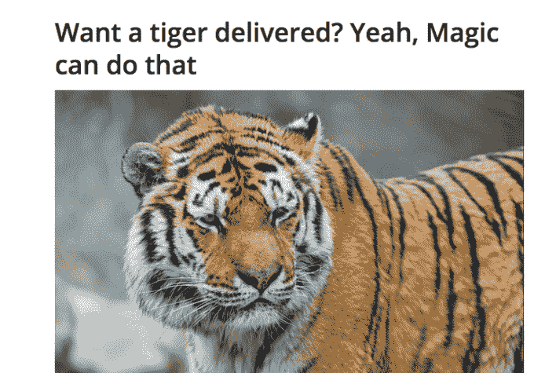
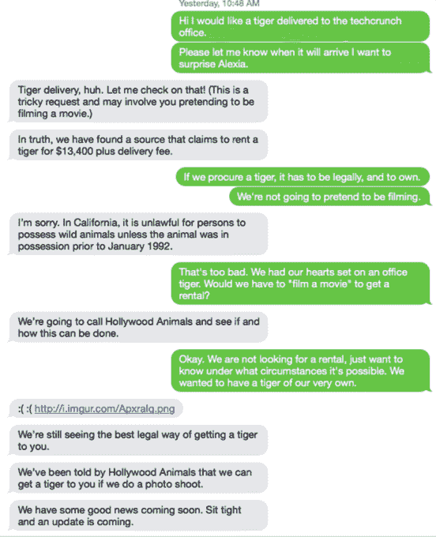
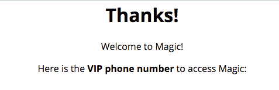
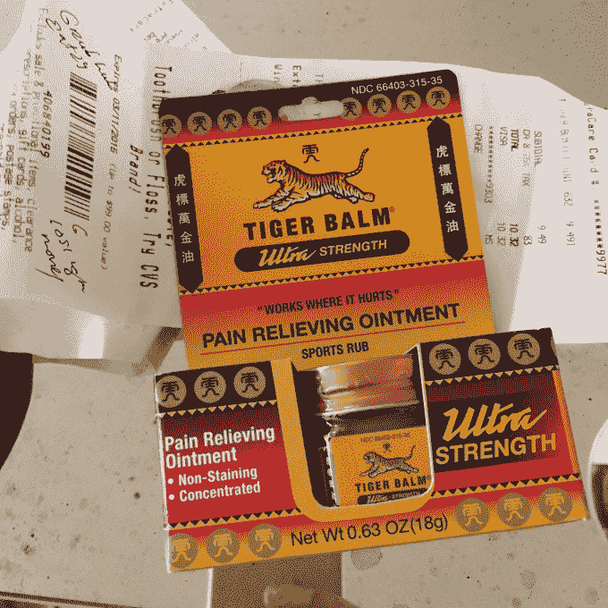

# 不，魔术不能带来一只老虎

> 原文：<https://web.archive.org/web/https://techcrunch.com/2015/02/27/catch-a-tiger-by-the-toe/>

本周早些时候，当 Re/Code 的 Jason Del Rey 试图通过短信获得[鸡肉干酪时，](https://web.archive.org/web/20230328032847/http://recode.net/2015/02/25/i-tried-out-magic-the-new-text-message-concierge-and-it-was-far-from-magical/)我们试图通过短信获得一只老虎。“你想要一只老虎送上门来？只需发短信告知细节，Magic 就会帮你搞定，”阅读 [the VentureBeat 文章](https://web.archive.org/web/20230328032847/http://venturebeat.com/2015/02/23/want-a-tiger-delivered-yeah-magic-can-do-that/)的导语，该文讲述了新兴的按需创业公司 [Magic](https://web.archive.org/web/20230328032847/http://getmagicnow.com/) 。

当我在 YouTube 上花了很多时间看着老虎幼崽在泳池里嬉戏或者在沙发上蹦蹦跳跳的时候，我也在娱乐，甚至在谷歌上搜索老虎的所有权。

你不能只给一个人发短信。尤其是在加利福尼亚，它们是被禁止的。

所以，了解了法律并识破了魔术师的谎言，我们的[主持人瑞安·劳勒](https://web.archive.org/web/20230328032847/https://techcrunch.com/2012/07/02/postmates-courier-for-a-day/)给魔术师发了一条老虎短信，看看魔术师会做什么。他遇到了一个 15K 长的等候名单。我们花了 50 美元去插队，问 Magic 是否能送一只老虎到我们的办公室。

我们被告知，我们可以租一只老虎“拍照”，一个神奇的来源“声称”以 13，400 美元租出一只老虎。嗯……如果你想买衣服，布鲁明戴尔百货公司会让你拍照吗？给你送寿司的神奇努力包括租赁寿司吗？上面是我们对线程所做努力的最新更新。我们还是按兵不动。

也许[万金油](https://web.archive.org/web/20230328032847/http://www.tigerbalm.com/us)比真正的老虎容易？周三下午 3 点 21 分，我向魔术师要了一些万金油，下午 5 点 10 分，也就是 1 小时 50 分钟后，万金油被送到了我在帕洛阿尔托的家。我要花整整 20 分钟步行去 CVS 自己买香膏。

我问给我送香油的人是不是邮局的人，他说是。根据收据，他为香油付了 10.30 美元，在我提醒我的接线员我没有付款后，魔术公司才收了我 10 美元。我猜魔术师刚刚吃掉了 7 美元的邮费。

据我的 Magic 运营商称，所有 Magic 订单中有 9%到 13%是由 Postmates 交付的(Magic 创始人兼首席执行官 Mike Chen 告诉我，该公司尚未计算这一数据)。因此，Snapguide 的创始人丹尼尔·拉弗尔(Daniel Raffel)比较了邮戳和魔法的送达时间(T3)，这有点违背了初衷。例如，Raffel 的魔法午餐订单也是通过 Postmates 交付的，但 Magic 还使用其他按需播放器，如 GrubHub 和 Eat24。

接受订单亏损的模式无法扩展。曾在奥伯林学院(Oberlin College)学习哲学和计算机科学的陈(音)估计，该公司 50%的订单不亏不赚，25%亏损，25%盈利——他说总体上不亏不赚。运营商应该将他们与客户和供应商互动的时间计入神奇费用。“一周后我会给你更好的数字，”他告诉我。

陈还透露，自该服务推出以来，该公司已收到“数十”个老虎请求；老虎的事情已经“变得令人着迷”

“做媒体的时候，出于某种原因，每个人都会问，‘你收到的最疯狂或最奇怪的请求是什么？’”陈说所以我们提到了想要一只老虎的人。但是老虎是非常非常难接生的。不可能让他拥有一只老虎，因为这是违法的。他是想要一张照片，还是想像驯虎员一样互动？我告诉每个人，我们没有交付老虎，但没有人这样写。"

魔法并没有拯救老虎。现在，他们有一名工作人员专门处理 tiger 的请求和其他事情。这让陈很沮丧。

“我不喜欢老虎这个东西，因为它让它看起来像是一项新奇的服务。最糟糕的是名字，魔法。我当时想，“我现在就把它叫做。”我甚至不认为 getmagicnow.com[这个域名是好的。在老虎和它的名字之间，人们谈论它就像“这是真的吗？”](https://web.archive.org/web/20230328032847/http://www.getmagicnow.com/)

“我后悔说了任何关于老虎的话，”陈哀叹道。“这使得需要使用(魔法)的人不出现，而其他人在注册时却想着别的事情。”

陈说，自从他上周四把这项服务发给五个左右的朋友以来，该公司已经处理了 25，000 到 30，000 条信息，有“数千”人注册了 50 美元的 VIP 服务，跳过了现在长达 30，000 人的等候名单。他正在考虑将 VIP 价格提高到 100 美元。

坐落在美国国家航空航天局太空制造[办公室里的 Magic 已经从 5-30 人。风投正在敲他的门。](https://web.archive.org/web/20230328032847/http://www.madeinspace.us/)

周三是陈的 30 岁生日，他在办公室处理服务的扩展问题。Magic 是在他的个人备份服务器上启动的，在许多情况下，不使用它所中介的服务的 API。

他认为魔法会在一年内出现吗？“我真的这么认为。但是会有这么多的炒作吗？我不这么认为。”

当我把这家公司比作 [SendYourEnemiesGlitter](https://web.archive.org/web/20230328032847/https://shipyourenemiesglitter.com/) 时，他回应道:“人们不需要也不想要这种闪光。闪光不是你真正需要或想要的东西。我们满足人们的实际需求，从食品杂货到约会。”

除了在另外两家创业公司工作，陈计划将大部分时间投入到 Magic 上，以建立起这个项目最初应该有的样子。

但是他们会送来一只老虎吗？

“既然老虎是一个‘东西’，也许有人会在一个允许老虎的地区，或者想[合法地]成为一名老虎训练师？也许我只是在幻想…但是，不，我们不会把老虎送给加利福尼亚的人当宠物。这是违法的，”陈承认。

值得一提的是，当我们打电话给位于洛杉矶的[好莱坞动物](https://web.archive.org/web/20230328032847/http://www.hollywoodanimals.com/)时，他们提出以 8000 美元的价格向我们租借一只老虎拍照。如果我们要为一个聚会做这件事，就像谷歌[臭名昭著的 Orkut büyükk ten 据说已经做了](https://web.archive.org/web/20230328032847/http://bits.blogs.nytimes.com/2012/07/22/disruptions-looking-beyond-silicon-valleys-bubble/)一样，价格也是一样的，但是如果我们想和这只老虎一起玩，我们需要 40 个小时的训练。

这比魔术师所说的老虎的价格低了 5000 美元。也许这正是陈希望从中获利的订单类型——古怪的要求，即人们要么太富，要么太懒，或者两者兼而有之，不能自己进行研究。(当被追问时，陈声称 13，400 美元是给前一个老虎收购者的报价。)

当被问及好莱坞动物最近是否接到很多来自旧金山的奇怪电话时，电话中的女子说是的，但不一定是为了老虎。

“你把我们打得很奇怪，”她说。