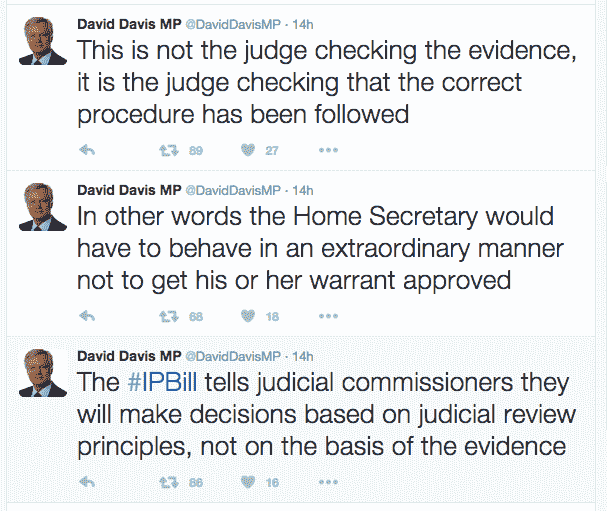

# 根据新的监控法，英国用户的在线活动将被记录

> 原文：<https://web.archive.org/web/http://techcrunch.com/2015/11/04/cementing-uk-surveillance-state/>

英国政府今天公布了一份法案草案，列出了新的监控权力，如果通过成为法律，将允许安全和情报机构更深入地调查英国人的数字活动，要求英国互联网服务提供商记录互联网用户在过去 12 个月访问的所有网站。

根据拟议的新立法，英国人的媒体消费习惯、银行活动、政治倾向、健康问题、性倾向等都有可能从国家授权的互联网活动日志中推断出来。

今天早些时候，内政大臣特蕾莎·梅向议会提交了[调查权力法案](https://web.archive.org/web/20230326054452/https://www.gov.uk/government/uploads/system/uploads/attachment_data/file/473770/Draft_Investigatory_Powers_Bill.pdf)，她表示，政府希望在议会和委员会审查程序后，明年春天提交修订后的法案，目的是在 2016 年底前将最终法案纳入立法。

首相大卫·卡梅伦在 5 月之前在议会发表讲话时表示，在社交媒体时代，需要新的权力来帮助警察和安全部门打击犯罪。

梅接着说，该法案的目的是起草一部新的法律，“巩固和更新我们的调查权力，加强保障措施，建立一个世界领先的监督制度”。

早在五月，政府证实了其立法的意图，以填补执法和安全机构在数字时代[情报收集能力的“能力差距”。它现在正在提交立法，以取代 DRIPA——即现有的“紧急”监控立法，该立法在 2014 年由议会匆忙通过，其中有一个日落条款，意味着它将在 2016 年底到期。](https://web.archive.org/web/20230326054452/https://techcrunch.com/2015/05/27/u-k-government-confirms-push-for-more-comms-data-capture-powers/#.ahvbbe:Ykk2)

DRIPA 因其提供的严苛的数据获取能力而受到批评，也因其在议会仓促通过而受到批评——没有时间进行适当的议会审查。调查权法案至少会得到后者，一个由议员组成的特别委员会将在未来几个月仔细研究其细节。

尽管有人批评严厉的国家监控权力对英国科技行业的潜在寒蝉效应，但在后斯诺登时代，当欧洲机构普遍寻求收回数据保留能力并加强对个人隐私的保护时，英国政府仍在推进巩固和扩大监控国家权力的努力，将大规模监控作为国内情报机构的“正当程序”，并提出批评者所谓的另一个“窥探宪章”。

当然，政府一直在试图扭转局面——例如，声称大规模监控(委婉地称为“大规模收集”)在当今的现代数字时代是“相称和必要的”，并明确表示不寻求禁止加密。尽管任何对加密的禁令都可能无法执行——特别是在没有国际协议的情况下，因为有很多技术是由非英国公司开发和传播的。

在加密问题上，今年早些时候卡梅隆曾[发表评论](https://web.archive.org/web/20230326054452/https://techcrunch.com/2015/01/13/clearly-an-idiot/)被广泛解读为未来保守党多数派政府意图取缔该技术。如果今天的法案草案显然没有寻求明确禁止加密，但梅表示，目前在二级立法中的要求——“那些获得授权令的公司应该采取合理措施，能够以非加密形式回应该授权令”——正在被“带到立法面前”。

因此，一家在端到端加密下运营服务的公司，如果获得授权，却因为无法提供未加密数据而未能提供，这是否被视为违反英国法律，还有待观察。

在这方面，第 189 条第(4)款(c)项似乎也是相关的——因为它规定“相关运营商”的具体义务可以包括:“与解除相关运营商对任何通信或数据实施的电子保护有关的义务”——这似乎意味着要求公司能够在被要求时解除加密。但是，可以被移除的加密当然不是端到端加密(英国政府[最近将这项技术描述为“令人担忧”](https://web.archive.org/web/20230326054452/https://techcrunch.com/2015/10/29/encryption-rhetoric-untangled/))。

“但我们并没有禁止加密，”梅在议会声称。“我们认识到加密在保护个人信息安全方面发挥着重要作用。”

(政府似乎也认识到加密在新立法中可以发挥重要作用，因为新立法被认为比以前更加温和……)

梅继续强调，其他有争议的措施——包括早些时候在 2012 年通过的通信数据法案(也被称为窥探宪章)，未能通过议会——已经被放弃。

“我们今天发布的法案草案不是对 2012 年通信数据法案草案的回归。它将不包括强制英国公司从海外公司获取和保留第三方互联网流量的权力；它不会强迫海外通信服务提供商履行我们在国内保留通信数据的义务，”她说。

尽管如此，要求互联网和电话公司保留用户在整整 12 个月内访问过的网站的数据，仍然是国家监控权力的巨大和侵入性扩张。民权组织“老大哥观察”[将这些数据总结为“我们生活方式的内容和方式”。](https://web.archive.org/web/20230326054452/https://www.bigbrotherwatch.org.uk/media-and-press/reaction-to-the-draft-investigatory-powers-bill/)

May 说，它不是完整的浏览历史，也就是说，它记录了互联网用户的每次点击和访问的页面，而是主要网站 URL 访问的时间戳记录。这当然会产生大量侵入性的英国网络用户的个人历史，或者至少是那些没有通过使用 VPN/代理(如 Tor 浏览器)来保护他们的隐私，或者运行其他模糊技术来搅浑他们的互联网活动的人，来积极寻求避免这种国家强制的搜索网。

该条款在法案中被称为“互联网连接记录”(ICRs)，并可能将其比作“逐项列出的电话账单的现代等价物”。然而，很明显，现在通过数字方式进行的活动比以往任何时候通过语音通话进行的活动都要多得多，所以这种比较有些牵强。

“有些人将这种权力描述为执法部门有权获取人们的全部网络浏览历史。让我说清楚:这是完全错误的，”梅说。“(它)是一个人使用过的每一项通信服务的记录，而不是他们访问过的每一个网页的记录。”

她补充说，执法机构对这些数据的请求将“用于确定某人是否访问过通信网站、非法网站，或者在特定调查过程中，在必要和相称的情况下解析 IP 地址”。"对何时以及如何访问这些数据将有严格的限制."

大量收集英国用户的互联网浏览活动将如何符合欧洲数据保护立法，目前正在起草一项新的数据保护指令，将于今年晚些时候推出，这可能会在用户数据保留方面对 ISP 提出竞争要求，仍有待观察。(当然，前提是英国在明年的全民公投中不投票脱离欧盟。)

正在设立一项新的刑事罪“故意或不顾后果地获取通信数据”，最高可判两年徒刑，目的是阻止滥用这些通信数据。然而，鉴于已经有多少数据泄露是由黑客实施的——例如最近英国 ISP TalkTalk 的[数据泄露，警方逮捕了几名涉嫌参与攻击的青少年——两年监禁的惩罚力度有多大还有待观察。更不用说 ISP 会如何安全地存储这些敏感数据了。](https://web.archive.org/web/20230326054452/http://www.bbc.com/news/uk-34717572)

影子内政大臣安迪·伯纳姆(Andy Burnham)在议会提出了后一点，他指出，内政大臣的介绍性发言提到了约 90%的商业组织如何经历了数据泄露，并继续询问存储英国公民的网站访问数据是否可能因此没有风险——特别询问是否不会因此以“匿名形式”存储这些数据，以保护公众隐私免受黑客攻击。

梅回避了这个问题，只是重申执法部门需要更多的权力来打击网络犯罪。“我认为这很简单，随着犯罪分子转向更多的在线犯罪，我们实际上需要确保我们的执法机构有能力应对这种网络犯罪，”她说。

警方需要授权才能访问 ICR 的数据，而地方议会将被明确禁止访问。但即使有搜查令，与美国和欧洲其他地方赋予警方的权力相比，英国政府允许执法部门访问网络浏览数据的做法仍然是例外。

允许英国警方在没有授权的情况下访问通信元数据的现有规则保持不变。今年早些时候，老大哥观察[公布了通过 FOI](https://web.archive.org/web/20230326054452/https://techcrunch.com/2015/06/01/one-every-two-minutes/) 获得的数据，详细说明了警察部队在这方面的通信数据请求的程度——在 2012 年至 2014 年的三年时间里，英国国内警察部队提出了大约 73.3 万次请求。

关于签署监视令的司法监督——这是独立反恐立法评论家大卫·安德森在他今年夏天的报告中提出的一个重要建议——内政大臣提出了第三种方式，高级部长和法官都参与签署。她将此称为“双锁”，声称它提供了“民主问责和司法问责的保证”。

她说:“现在，在签发搜查令之前，国务卿需要确信某项活动是必要和相称的，但在未来，搜查令只有在得到法官的正式批准后才能生效。”"这将为我们最具侵犯性的调查权力的授权上了一把双重锁."

然而，安德森建议将签署逮捕令的权力从部长手中夺走，并完全移交给司法监督，但这一建议遭到了拒绝——这使得英国与其他“五只眼”盟友和欧洲其他国家仍有一些分歧，在这些国家，法官全权负责授权监控。

[在评论该法案的这一方面时，联合国反恐和人权特别报告员本·埃默森认为，如果法官没有完全授权签署逮捕令，英国将与国际标准脱节。](https://web.archive.org/web/20230326054452/http://www.ohchr.org/FR/NewsEvents/Pages/DisplayNews.aspx?NewsID=16708&LangID=E#sthash.r2g0PoOT.dpuf)

“由独立公正的司法机构事先授权是一项重要的保障。授权法官权衡利害攸关的竞争利益之间的平衡，将使联合王国的立法完全符合国际法的要求，特别是《公民权利和政治权利国际公约》第 17 条的要求。事后司法审查总比完全没有司法审查好，但它不符合将签发搜查令的权力交给独立法官的要求，而这正是它的归属，”他写道。

同样值得注意的是，根据目前的法案草案，高级部长仍然有可能自行签署逮捕令。

梅澄清说，内政大臣有可能授权“紧急逮捕令立即生效”，以避免她的双重封锁造成太多的延误——逮捕令随后由法官小组审查，以确定逮捕令是否应该继续。不过，她补充称，在“大多数情况下”，权证会有双重授权。

该法案草案的另一部分涉及澄清监督权力的监督规则。梅说，一名高级法官将被任命为监督专员。

“我很清楚，我们需要一个显著加强的机制，来管理这些权力的授权和监督。因此，我们将用一个强大和独立的调查权力专员来取代现有的监督。这将是一名高级法官，由一组专家检查员支持，他们拥有有效和明显地让情报机构和执法部门承担责任的权力和资源，”她对议会说。

更广泛地说，该法案试图将大规模监控列为英国安全和情报机构的合法工作方式，这些机构多年来一直在使用这种数字搜索网，这是由于缺乏审查和通过神秘的现有调查立法(如 RIPA 和 1984 年电信法第 94 条)实现的。

警察和安全机构使用黑客攻击(又名“设备干扰”)作为调查工具的能力也体现在法律中。

该法案将“批量数据”称为“发现新目标和识别新威胁的重要工具”。并表示，将为“安全和情报机构可获得的所有大权力”提供“明确的法定框架”，此外还将为“所有这些权力”引入“强大、一致的保护措施”。

在一篇[博客文章](https://web.archive.org/web/20230326054452/https://terrorismlegislationreviewer.independent.gov.uk/putting-parliament-in-charge/)中，政府的独立反恐立法评论者对该法案草案做出回应，称该法案最棒的一点是，英国安全机构的运作终于有了曙光。

安德森写道:“这是第一次，我们有了一项法案，为公众和政治辩论列出了警察和情报机构使用或渴望的调查权力的总和。”

“不是每个人都会对这些权力感到高兴。现在将由议会来决定它们是否合理。这是一个民主国家的应有之义，但目前在世界任何地方都很少如此。无论最终的英国法律内容如何，都不可能再把它描述为不透明、不可理解或误导。”