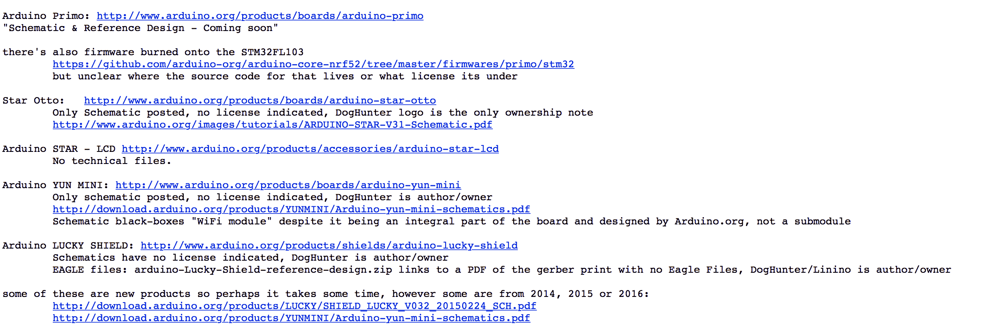

# CEO 争议火星 Arduino 的开放未来

> 原文：<https://web.archive.org/web/https://techcrunch.com/2017/07/26/ceo-controversy-mars-arduinos-open-future/>

随着[创客运动](https://web.archive.org/web/20230323173335/http://makezine.com/2017/06/09/free-arduino/)的主要人物开始公开反对 Arduino AG 的现任总经理 Frederico Musto，通常平静的开源硬件世界的事情正在升温。这位意大利工程师在买断最初五位创始人之一的股份后成为公司的部分所有者，并最终开始运营 Arduino AG，这是一家拥有该项目的商标的控股公司。

现在 Musto 正面临审查，最初是因为[夸大他的学历](https://web.archive.org/web/20230323173335/https://www.wired.com/2017/04/arduinos-new-ceo-federico-musto-may-fabricated-academic-record/)，最终是因为似乎从 Arduino 硬件系列中提取开源许可证、原理图和代码。

当穆斯托与阿达福罗公司的利莫尔·弗里德和菲尔·托伦会面时，怀疑产生了。据弗里德说，他问穆斯托他的麻省理工学院证书，穆斯托缩短了会议。穆斯托已经从他的 LinkedIn 页面上删除了他的高等教育证书，只留下了意大利都灵的一所蒙特梭利幼儿园。

他解释说，他从未正式上过这些学校，但对这些说法不屑一顾。

“那是 25 年前的事了。我是一名访问学生。多亏了 Olivetti 的奖学金，我在 NYU 呆了三个月，在麻省理工呆了两个学期，”他说。弗里德对《连线》表示，穆斯托的学位膨胀是有害的，尤其是作为一名从事科技行业的女性。

“当你去麻省理工学院时，总会有人抱怨他们不得不降低你的标准，”她说。“毕业后，你会一直被问到，你是否真的足够聪明，能够获得资格证书。这有点疯狂，这个家伙竟然没有被询问就走了这么远。”

由于 Musto 父亲 Paolo 的帮助，Fried 和 Torrone 一直致力于揭露意大利法院中潜在的偏袒行为，以及与签署他的博士文件有关的欺诈行为。此外，Musto 承诺推出的用于支持开源项目的 Arduino Foundation 尚未实现。

绝大多数的争议在于 Musto 和 Arduino 基金会是否会确保 Arduino 保持开源。“这些产品是开源的吗？”托伦在 T2 的一篇邮件列表中写道。"如果是，那么开放源码文件在哪里？"

他说，大多数都失踪了。

在开源硬件的平等主义世界里，混淆是最大的背叛。在知识产权和公司的范围内，硬件是很难制造的，但在开源领域，这要困难得多。但这并没有阻止无数的制造商去尝试，并经常获得成功。在他们眼里，像穆斯托这样的人往坏里说是个骗子，往好里说是个装地毯的人。最终，它让 Arduino 的命运——更重要的是，Arduino 的大众支持——处于一片令人不安的乌云之中。

或者也许这一切都只是为了钱。

Adafruit 和其他专注于制造商的卖家销售甚至制造许多 Arduino 产品，Musto 怀疑这可能是他们攻击的原因。Musto 还认为，制造商运动正在收缩，特别是考虑到英特尔撤回对 Arduino 的一些支持。

“正如我提到的，如果我做任何事情来改变 Arduino 的 DNA，看起来我就是疯了。Arduino 是开源和开放硬件的，它将继续开源和开放硬件，句号，”他说。“创客运动在某种程度上正在减少，每个人都在担心我们如何保护自己的投资。增加市场份额的唯一途径就是合作。”

“我相信这只是钱的问题，”他说。