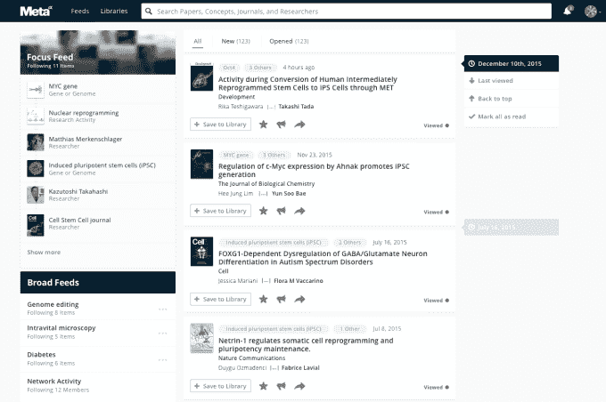
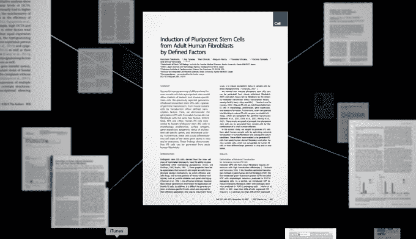

# Chan Zuckerberg 计划收购并将释放科学搜索引擎 Meta 

> 原文：<https://web.archive.org/web/https://techcrunch.com/2017/01/23/chan-zuckerberg-initiative-meta/>

马克·扎克伯格和陈慧娴的 450 亿美元的慈善组织正在进行第一次收购，以便让科学家更容易搜索、阅读和整理超过 2600 万篇科学研究论文。 [Chan Zuckerberg Initiative](https://web.archive.org/web/20230130100805/https://chanzuckerberg.com/) 正在收购 [Meta](https://web.archive.org/web/20230130100805/http://meta.com/) ，这是一家人工智能研究搜索引擎初创公司，在改进产品后，将在几个月内向所有人免费提供其工具。

Meta 可以帮助科学家找到与他们自己的项目相关的最新论文，同时帮助资助组织与研究人员合作，并确定投资或影响的高潜力领域。Meta 的特别之处在于，它的人工智能可以识别论文之间的作者和引用，因此它可以显示最重要的研究，而不仅仅是搜索引擎优化最好的研究。它还提供对 18，000 种期刊和文献来源的免费全文访问。

Meta 联合创始人兼首席执行官 Sam Molyneux [写道](https://web.archive.org/web/20230130100805/https://www.facebook.com/notes/sam-molyneux/meta-the-chan-zuckerberg-initiative-unlocking-scientific-knowledge/1429809013718811)“展望未来，我们的目的不是从 Meta 的数据和能力中获利；相反，我们的目标是确保这些药品能够尽快送到各个领域最需要的人手中，造福世界。”

CZI 没有透露收购这家总部位于多伦多的初创公司的技术和团队的任何条款，该公司成立于 2010 年，由投资者提供了 750 万美元的资金，包括 Rho Canada Ventures 和 HIGHLINEvc。这家初创公司以前向一些用户收取订阅费或定制解决方案费，但现在整个 Meta 产品将是免费的。不过，这项收购需要一段时间才能完成。

科学总裁柯里·巴格曼和陈·扎克伯格倡议的技术总裁布莱恩·平克顿解释了如何使用 Meta，他们写道:

> 这种平台的潜力几乎是无限的:研究人员可以使用 Meta 来帮助识别理解冠状动脉疾病的新兴技术；一个研究生可以看到两种不同的疾病激活相同的免疫防御途径；临床医生可以更快找到正在研究最有希望的寨卡疗法的科学家。从长远来看，它可以扩展到其他知识领域:例如，它可以帮助教育者跟上发展科学的步伐，以更好地了解儿童是如何学习的。

此次收购与 CZI 投资 30 亿美元治疗 T2 所有疾病的计划一致。它已经在三藩市建立了[生物中心](https://web.archive.org/web/20230130100805/https://czbiohub.org/)，该中心将主持和资助医学研究。9 月份宣布的 Chan Zuckerberg 科学部门的目标之一是为医学专家建立工具和技术，并将他们聚集在一起，建立一个更大的科学进步运动。

在这种情况下，因为 Meta 已经确立了自己在研究聚合领域的领导者地位，所以收购该公司并分发其工具比开发新东西更有意义。扎克伯格和他妻子的组织也对初创公司进行了投资，作为 CZI 教育推动计划的一部分，包括为非洲工程师准备技术工作的 T2 安德拉和印度视频学习平台 T4 Byju 的 T5。

通过将 Meta 带出商业空间，重新聚焦并最大化其价值，CZI 可以为更广泛的社区解决科学界最大的问题之一。简而言之，对于任何一个科学家甚至整个团队来说，都有太多的研究需要跟上。仅生物医学一项，每天就有 2000-4000 篇论文发表，然而很难在这些论文中进行搜索，也很难找出哪些是最著名的。

Meta，[原名 Sciencescape](https://web.archive.org/web/20230130100805/https://techcrunch.com/2014/01/15/sciencescape-2-5-million/) ，索引 PubMed 等文件的整个储存库，并在网上爬行，为作者识别和建立档案，同时分析谁引用或链接了什么。这实际上是科学的 Google PageRank，让发现相关论文和优先阅读变得简单。它甚至可以提供与你之前的搜索相关的最新发表的研究的更新。以下是它如何帮助研究社区的不同部分:

*   科学家可以找到他们研究领域的最新数据和分析，确定他们不需要重复的已经完成的实验，并找到新的研究机会
*   像大学和基金会这样的资助组织可以与作者取得联系，以支持他们未来的工作，或者发现哪里正在取得突破的趋势，这样他们就可以正确地引导资源
*   **学生们**可以抛弃依靠精确术语匹配和搜索引擎优化来对结果进行排名的肤浅的谷歌搜索，转而寻找与他们的研究最相关的论文，这些论文来自经常被引用的知名科学家
*   学校可以确保他们的课程是最新的，并为最有发展潜力的科学领域培养学生

最初宣布时，CZI 的灵活有限责任公司地位受到了批评，因为它偏离了慈善机构的传统结构。但是，收购像 Meta 这样的盈利性公司或将赚来的钱重新用于其事业的能力正是扎克伯格选择以这种方式建立慈善机构的原因。

莫利纽克斯写道:“帮助科学家将产生良性循环，因为他们开发新的工具，反过来为更快的进步提供更多的机会。”“Chan Zuckerberg Initiative 对这种“元”效应的认识就是为什么元可以成为难题的关键部分”。

Chan Zuckerberg Initiative 知道，即使这个家族拥有巨额财富，也无法资助科学的每一个方面。但是，如果它能够提供可扩展的工具，通过将创造者从追逐利润中解放出来，使每个科学家更加有效，CZI 就可以成为人类的一个支点。