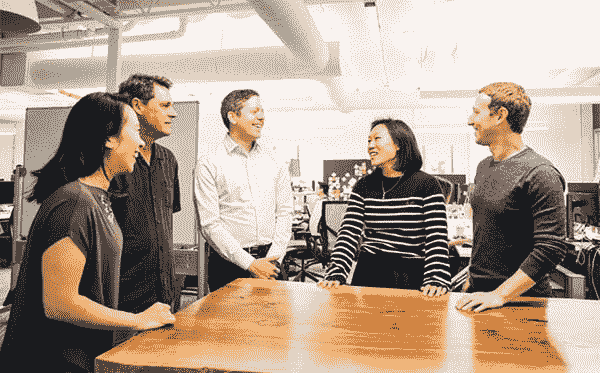

# 陈·扎克伯格倡议雇佣捐赠技术，而不仅仅是金钱

> 原文：<https://web.archive.org/web/https://techcrunch.com/2018/06/20/chan-zuckerberg-technology/>

# 陈·扎克伯格倡议雇佣捐赠技术，而不仅仅是金钱

细胞图谱。阅读科学论文的人工智能。个性化学习软件。马克·扎克伯格和陈慧娴的 450 亿美元慈善组织希望建立能够大规模发挥作用的技术，而不仅仅是试图用现金淹没问题。成立两年半后，CZI 终于充实了其技术领导团队。

今天，CZI 宣布聘请乔纳森·戈德曼担任数据主管。在将初创公司 Level Up Analytics 出售给 Intuit 后，他曾担任该公司的数据科学和分析总监。在那之前，他在斯坦福大学获得了物理学博士学位，现在他是可汗学院的董事。菲尔·斯穆特被任命为 CZI 的工程主管。他是微软 OneDrive 和 SharePoint 的工程副总裁，之前负责 Hotmail 和 Outlook。

CZI 的科技领导团队及其创始人(左起):桑德拉·黄流、菲尔·斯穆特、乔纳森·戈德曼、陈慧娴、马克·扎克伯格

他们将与 CZI 的产品负责人桑德拉·黄流一起，处理可以改善医学、研究和教育的大型技术产品，桑德拉·曾担任该公司的临时技术负责人。批评者质疑扎克伯格家族的慈善事业是否已经将其资金用于可能比仅仅需要资金更复杂的问题。但科技是扎克伯格所做的，陈作为医生和教师的经验可以将他们的影响集中在最关键的地方。

当被问及高盛和斯穆特将应对的挑战时，CZI 的一位发言人告诉我，“弄清楚如何在慈善事业中创造一种强大的技术文化，这在以前还没有真正做到过。即使没有常规的市场指标，我们也要保持严谨的工作态度。”

例如，其人类细胞图谱的数据协调平台可以帮助医生以新的细节水平绘制我们的生物学，从而有助于对抗疾病。元工具使用人工智能来分析和优先考虑研究论文，因此科学家不会错过重要的新发现。CZI 还支持 Summit Learning Platform，这是一个让教师为不同学习风格的学生提供个性化教学的工具，这些学生从擅长单独阅读的学生到喜欢小组项目的学生。

“我们将工程师、数据科学家和产品经理与基准科学家、教育家和政策倡导者放在一起。翻译这些不同的语言有时可能具有挑战性，但我们都知道这些努力带来的突破将是非常值得的，”一位发言人总结道。