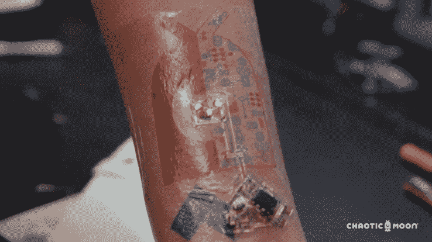

# 混沌之月探索用于医学和军事的生物识别纹身

> 原文：<https://web.archive.org/web/https://techcrunch.com/2015/11/23/chaotic-moon-explores-biometric-tattoos-for-medicine-and-the-military/>

可穿戴设备的未来可能会印在你的皮肤上。总部位于德克萨斯州奥斯汀的软件设计和开发公司 Chaotic Moon 正在开发一种由组件和导电涂料制成的高科技纹身，以创建基本上将你变成电子人的电路，从你的身体收集健康和其他生物数据。

混沌月亮的纹身套件目前处于雏形阶段，但首席执行官本·拉姆告诉我，它将能够收集和上传健康和信息数据，就像 Jawbone 或 Apple Watch 一样，并将其发送给医务人员——甚至可能是军队。

“这是新的可穿戴设备，”拉姆告诉 TechCrunch。“可穿戴设备的未来是生物可穿戴设备。”

“这不是像 Fitbit 一样可以轻易移除的东西。它可以在防弹衣下面，直接在皮肤上收集数据并报告回来，”Lamm 谈到军事应用时说。

https://youtube.com/watch?v=9iFuTaqD4fM

纹身是暂时的，可以洗掉，很像一个临时的时尚纹身。根据混沌月亮的说法，tatt 将有能力监测体温，并根据通过蓝牙或基于位置的低频网状网络(如 Jott 或 Firechat 等应用程序所用的网络)上传的汗水，心率和水合程度信息来检测某人是否有压力。

混沌月亮最出名的是喷火无人机和比特币盈利健身追踪器，但拉姆说纹身项目是他的工作室有史以来最令人兴奋的项目之一。

拉姆说:“我们可以在混沌月球做很多很酷的事情，但我们认为它有军事应用，健康应用，并且有各种各样的机会。”

他还提到在音乐会上使用纹身进行位置跟踪，或者在游乐园跟踪你的孩子。

军事用途的一些吸引力可能包括潜在的探测空气中的毒物、士兵体内的病原体或识别他们何时受伤或受到压力的技术。

“这是一个生态友好、非侵入性的平台使用，基本上将你变成一个人体电路板。”

生物识别纹身很有前途，但并不新颖。赛博朋克，或者他们有时被称为研磨机，形成了一种奇怪而迷人的亚文化，这些人喜欢用技术植入来操纵他们的身体。

虽然很多研磨者文化集中在切开自己，通过手术安装磁铁，RFID 芯片和其他用于生物黑客目的的组件，但在生物识别纹身的主题上也有一些小的波动。

蒂姆·坎农是一家在人体内植入开源 RFID 芯片的初创公司 grind house Wetware 的负责人，他说他很熟悉这个概念。

“是的，我已经看到了一些坚持 NFC 的东西，”坎农在脸书的一次交流中告诉我这个想法。他听说过一些较小的机构在研究生物识别纹身技术，但还不是很严重。他还提到试图创造一种更永久的生物识别纹身，用于持续监控和跟踪，但目前这种墨水被认为对人类不安全。

虽然永久跟踪墨水无疑会带来一系列问题，但跟踪人类的机会即使是暂时的，也可能带来新的隐私和医疗法规。根据 Lamm 的说法，混沌月亮只是创造产品，并将把这一切留给购买或实施该技术的人。

他告诉 TechCrunch 说:“归根结底，有各种各样的公司，如手机公司、制药公司和医疗设备公司，都在通过这些流程工作。”“对我们来说，我们试图围绕‘嘿，你身上已经有了这些类型的数据收集组件’展开对话。”很多时候，它们很大，很笨重，而且会有局限性。现在，我们正着眼于改变和发展这些其他类型的导电墨水。"

就这一点而言，已经有大量的设备可以放在他们的身上来监控活动和上传生物数据。据报道，美国政府已经在与 DARPA 的合作项目中探索了永久性植入的研磨机路径。

Lamm 认为临时是收集数据的更好途径。纹身套件可能会更便宜，比切开士兵的伤口更少侵入性，比今天的可穿戴设备更少烦人，因为人们可以戴上它们，继续他们的一天，而不需要记住充电和戴上它。

拉姆不能说出名字，但他说混沌月亮已经在与一些战略合作伙伴进行谈判，以将这一概念推向市场。

拉姆说:“我们把这看作是人体电路板，把人体看作是我们可以在其上建造的平台。”

他还提到，虽然技术纹身目前只是一个原型，但他的工作室的重点是为客户提供下一波技术。拉蒙对第三方合作伙伴将这些纹身尽快推向市场的前景充满希望。