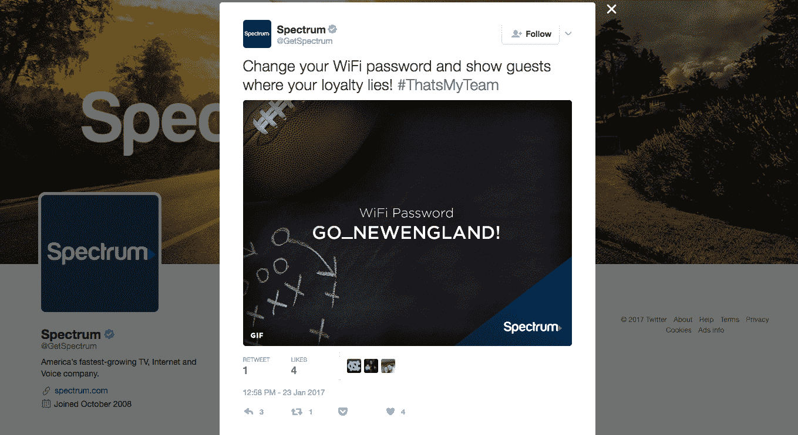

# 宪章频谱推文可怕的 Wi-Fi 安全建议

> 原文：<https://web.archive.org/web/https://techcrunch.com/2017/01/23/charter-spectrum-tweets-terrible-wifi-security-advice/>

# 宪章频谱推文可怕的 Wi-Fi 安全建议

超级碗两周后就要开始了。爱国者队对猎鹰队。而且 Charter Communication 的频谱服务要你改 wifi 密码支持你喜欢的球队！

不要那样做。

https://twitter.com/GetSpectrum/status/823590638952349701

不要把 wifi 密码改成 GO_ATLANTA 或者 GO_NEWENGLAND。这是个糟糕的建议。像往常一样，使用唯一的密码，如果一群陌生人出现在你的超级碗派对上，在比赛结束后更改密码，或者更好的是，启用大多数路由器中的访客 SSID。想表达对自己喜欢的球队的支持？挂个横幅或者写在脸上。

Wi-Fi 安全对个人隐私至关重要，美国第二大有线电视和互联网提供商建议客户将 Wi-Fi 密码更改为两个选项中的一个，从而将这一点抛之脑后。有没有想过加入邻居的网络？在超级碗期间试试。

