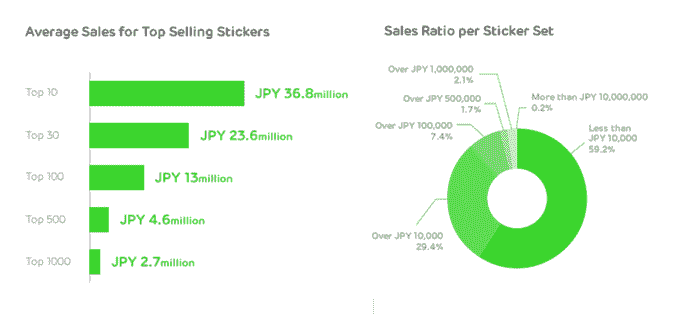

# 聊天应用 Line 的用户生成贴纸计划在头六个月净赚 3000 万美元 

> 原文：<https://web.archive.org/web/https://techcrunch.com/2014/11/26/chat-app-lines-user-generated-sticker-program-nets-30m-in-its-first-six-months/>

# 聊天应用 Line 的用户生成贴纸项目在头 6 个月就净赚了 3000 万美元

贴纸不仅仅是美化了的表情符号，它们是大生意你不知道吗？虽然游戏占据了聊天应用 Line 收入的最大份额，但自 2013 年以来，[每月从贴纸中赚取 1000 万美元，今年早些时候，它开始允许用户制作和出售自己的贴纸。](https://web.archive.org/web/20230129225411/http://thenextweb.com/asia/2013/08/21/japanese-messaging-company-line-makes-over-10-million-per-month-from-selling-stickers/)

其用户生成的[创作者市场于 4 月](https://web.archive.org/web/20230129225411/https://techcrunch.com/2014/04/17/line-creators-market/)开放， [Line 现已披露](https://web.archive.org/web/20230129225411/http://linecorp.com/en/pr/news/en/2014/881)在市场运营的前六个月，它售出了超过 3000 万美元(35.9 亿英镑)来自独立“创作者”的贴纸。这是对其现有的特许贴纸业务的一个很好的补充。

该收入数字的一半(减去苹果和谷歌的应用商店削减)归 [Line](https://web.archive.org/web/20230129225411/http://line.me/) 所有，而另一半归贴纸背后的艺术家所有。(当你考虑谁提供发行版时，这并不是一笔不公平的交易。)

Line 说，总共有近 3600 万个贴纸包从创作者市场被购买，这是来自 270，000 个创作者的总数。

很难知道普通的贴纸制造商过得有多好。Line 表示，前十名用户生成的贴纸集的平均销售额为 31 万美元(每位艺术家的收入超过 12 万美元)，而前 1000 名的平均销售额为 2.3 万美元(因此税后收入为 9000 美元以上)。Line 还声称，41%的 Creators Market 贴纸至少赚了 85 美元，这是一个相当微不足道的金额，表明——像应用商店一样——Line 的贴纸众包包含大量火鸡，或者至少带有发现问题。

当然，许多创作者将从未见过如此高的回报，但潜在的回报无疑对设计师很有吸引力，他们被接触 Line 超过 5 亿注册用户的机会所吸引，其中 1.7 亿人每月使用这项服务..

除了帮助设计师赚钱，创作者市场也是 Line 从众多其他通讯应用中脱颖而出的潜在优势。是的，它在日本、台湾、泰国和亚洲其他地区有很强的影响力，但它正在欧洲、拉丁美洲和美国努力推进——增加 25 万名免费制作内容的新艺术家增加了它已经在特许贴纸和主要家庭品牌和[娱乐公司](https://web.archive.org/web/20230129225411/http://www.linkinpark.com/news/231683)的大量投资。

此外，这也是另一个货币化流。创作者市场六个月的总收入超过 1，000 万美元并不是一个大数目，但它比市场第一个月营业后的 5，000 万日元(147 万美元)销售额有所增加。 [Line 报告称，2014 年第三季度收入 1.92 亿美元](https://web.archive.org/web/20230129225411/https://techcrunch.com/2014/10/29/chat-app-lines-revenue-doubles-year-on-year-to-reach-192-million-in-q3-2014/)，同比增长一倍，当你考虑到聊天应用的盈利有多棘手时，每一点都很重要。