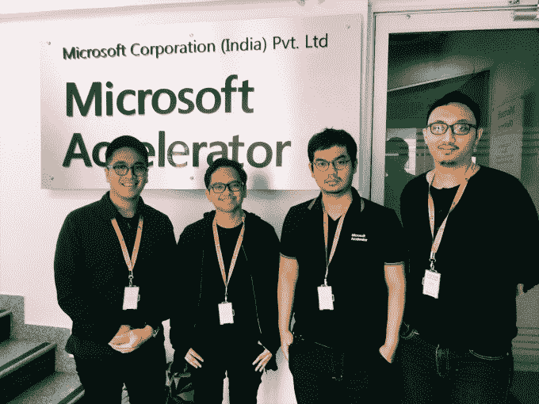

# 尽管全球起步缓慢，但 Chatbot 初创公司创始人看到了东南亚的潜力 

> 原文：<https://web.archive.org/web/https://techcrunch.com/2017/09/06/chatbot-startup-founder-sees-southeast-asia-potential/>

到目前为止，聊天机器人可能还没有给人留下深刻印象，但这项技术的影响在国际市场上仍然有很大的潜力，在这些市场上，移动通讯多年来一直是主流。

这是一家初创公司的观点，该公司正在努力将机器人的好处纳入印度尼西亚的主流，印度尼西亚是世界第四人口大国，也是东南亚不断增长的地区中最大的经济体。

近年来，脸书、推特和 Instagram 等社交网络在印尼被公认为全球热点，Line、Kakao、黑莓 BBM 和 WhatsApp 等即时通讯应用在印尼 2.6 亿人口中也是热门选择。

[总部位于雅加达的初创公司 Kata.ai](https://web.archive.org/web/20230205194125/http://kata.ai/) 最近筹集了 300 万美元，它表示，许多行业和领域都有巨大的潜力利用聊天文化来促进他们的业务和客户关系。它运营一个平台，让品牌和公司使用当地的巴哈萨印尼语操作聊天机器人，而不是使用英语，因为英语说得并不流利。

母公司 YesBoss Group 的首席执行官 Irzan Raditya 表示:“我们正在帮助品牌提供更好的参与度、销售产品和开辟新的创收渠道。“Chat 已经在印度尼西亚站稳了脚跟，但现在我们希望揭开人工智能的神秘面纱，并向服务不足的市场开放其他技术。”

目前，Kata.ai 在许多聊天平台上运营，包括 Facebook Messenger、Line、Telegram、Slack 和 BBM(在印尼仍然很受欢迎)，以及 Twitter 和 Skype。

世界上最受欢迎的消息应用 WhatsApp 是一个明显的缺席者，因为该公司尚未开放其平台。然而，随着[本周宣布计划很快将商业服务](https://web.archive.org/web/20230205194125/https://techcrunch.com/2017/09/05/whatsapp-business-app/)整合到应用程序中，这种情况可能很快就会改变。

YesBoss Group 最初是一项个人助理服务，但当 Raditya 注意到唯一的解决方案是全球性的(因此是英语的)时，它转向了聊天机器人，这在印度尼西亚等市场只能产生有限的影响。然后，他开始着手创建第一个本地机器人平台。

> 拉迪亚和他的团队完成了微软在印度的加速器项目

移动运营商 Telkomsel 是这家初创公司目前最受关注的客户之一，它利用自己的平台为自己的聊天机器人提供支持，让客户为自己的余额充值、更换套餐和查看其他信息。该公司计划利用这笔新资金——由台湾的跨太平洋技术基金牵头——通过建立自己的内部销售团队来推动业务发展。核心技术本身需要发展，因此这轮融资的很大一部分将用于雇佣所需的人工智能和大数据人才。

在印度尼西亚，这是一个艰难的问题，尽管人口众多，但缺乏技术人才，特别是在人工智能和聊天机器人相关领域有经验的人。不过，就目前而言，拉迪亚没有考虑开设海外办事处来吸引人才，相反，他正在当地寻找那些愿意移居(或返回)印度尼西亚的人。

同样，也没有立即扩张的计划，但他暗示 Kata.ai 服务将于明年某个时候在东南亚的新市场推出。[但预计印尼将占该地区快速增长的互联网经济](https://web.archive.org/web/20230205194125/https://techcrunch.com/2016/05/24/report-southeast-asias-internet-economy-to-grow-to-200b-by-2025/)的一半，这家初创公司至少是从零开始的。