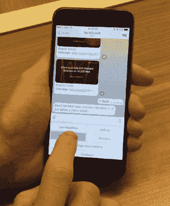
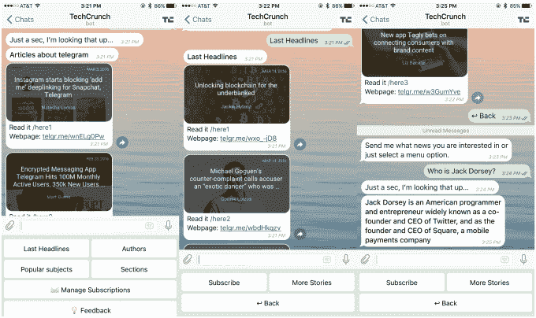

# Chatfuel 让出版商和任何人都可以为消息应用程序开发机器人

> 原文：<https://web.archive.org/web/https://techcrunch.com/2016/03/18/chatfuel-lets-publishers-and-anyone-build-bots-for-messaging-apps/>

聊天机器人是今年最热门的科技话题之一。受亚洲趋势的启发，像 [Telegram](https://web.archive.org/web/20230323015516/https://techcrunch.com/2015/06/24/telegrams-new-platform-lets-developers-create-smart-message-bots-with-multiple-uses/) 和 [Kik](https://web.archive.org/web/20230323015516/https://techcrunch.com/2014/11/06/kik-introduces-promoted-chats-to-let-brands-on-its-messaging-app-and-finally-make-money/) 这样的通讯应用已经采用了机器人——来自出版商和品牌等第三方合作伙伴的自动账户——在聊天体验中为用户提供新闻、娱乐和其他信息。

脸书似乎观察到了这些发展。[我们报道了](https://web.archive.org/web/20230323015516/https://techcrunch.com/2016/01/05/facebook-messenger-bots/)这家社交网络巨头正准备很快向第三方机器人开放其 Messenger，而[甚至有一款来自 Quartz 的新闻应用](https://web.archive.org/web/20230323015516/https://techcrunch.com/2016/02/11/quartzy-news-app/)——采用机器人风格来发布当天的重要头条。

聊天已经成为智能手机世界的中心，所以机器人被用来以一种方便和迷人的方式传递信息是有道理的。但是，品牌或媒体公司如何开始创建一个机器人呢？这就是目前正在接受 Y Combinator 投资的 Chatfuel 公司希望取得成功的地方。

该公司目前主要专注于 Telegram，这是唯一一款向所有人开放其机器人的聊天应用。它为[福布斯](https://web.archive.org/web/20230323015516/https://telegram.me/forbesbot)和 [TechCrunch](https://web.archive.org/web/20230323015516/https://telegram.me/techcrunchbot) — [嘿，那是我们](https://web.archive.org/web/20230323015516/https://techcrunch.com/2016/03/15/check-out-the-new-ai-powered-techcrunch-news-bot-on-telegram-messenger/)！—但是，除了专注于媒体，它还有一个任何人都可以使用的自助服务平台。到目前为止，它已经被用于制造超过 120，000 个机器人，为超过 500 万用户服务。

它不仅仅是简单地向用户发送信息的基本机器人，而是基于向用户提供两种响应。Chatfuel 更智能一点。它的机器人提供新闻，让用户缩小话题范围，甚至只是就新闻中的物品或人物提问。

[下面是 TechCrunch 机器人的工作方式](https://web.archive.org/web/20230323015516/https://techcrunch.com/2016/03/15/check-out-the-new-ai-powered-techcrunch-news-bot-on-telegram-messenger/)，例如:

> 这个机器人的目标是帮助你掌握你最关心的话题和故事。你可以订阅网站的不同主题、作者或版块，机器人会从 TechCrunch 向你发送你最感兴趣的新闻文章。例如，我订阅了关于 Twitter、Instagram、脸书和 Snapchat 的新闻。

Chatfuel 由俄罗斯企业家 Dmitrii Dumik 和 Artem Ptashnik 于去年创立。该公司在莫斯科和旧金山有 12 名员工，并获得了俄罗斯互联网公司 Yandex 的支持，Yandex 是“俄罗斯的谷歌”，它领导了最近的一轮融资。

“如果你看看移动应用程序，它最初只是一个简单的概念，今天已经演变成复杂的东西，”杜米克在接受采访时告诉 TechCrunch。“现在，信使比社交网络更重要。

“(出版商)可以通过网络或应用程序与用户互动。(他们会)消费内容然后离开，没有办法跟他们跟进，而让用户安装应用程序很贵，很少有人安装应用程序——分发被打破了。”

杜米克认为，机器人可以提供更具吸引力的体验，并可能发展成为与今天的移动应用程序一样重要的应用程序——只是对用户来说更方便、更轻便。

今年 2 月，Yandex 领导了 Chatfuel 的一轮未披露的融资，包括来自 Y Combinator 和天使投资人[前谷歌/YouTube 的诺姆·洛温斯基](https://web.archive.org/web/20230323015516/https://www.linkedin.com/in/noaml)的参与。其他支持者包括 500 Startups、骑士基金会和天使[安德烈·多罗尼切夫](https://web.archive.org/web/20230323015516/https://www.linkedin.com/in/doronichev)(谷歌的虚拟现实)和[杰克·莱文](https://web.archive.org/web/20230323015516/https://www.linkedin.com/in/yjlevin)，他们都是在 2015 年 1 月 Chatfuel(最初称为 Paquebot)推出之前投资的。

它的聊天机器人可能仅限于 Telegram，但 Dumik——在被创业热潮吸引之前，他曾在俄罗斯的宝洁公司呆过一段时间——乐观地认为 Chatfuel 的业务范围将很快显著扩大。

“Facebook Messenger 是驱动力，”他说，针对[脸书即将向第三方机器人开放其聊天应用](https://web.archive.org/web/20230323015516/https://techcrunch.com/2016/01/05/facebook-messenger-bots/)的传言。

“当它开放时，其他人将不得不跟随，即使他们不想，其他人也将不得不跟随，因为这将有助于他们留住观众。”

Dumik 说，虽然机器人和信息领域有很大的潜力，但游戏规则和操作仍有待定义。

“机器人不像应用程序，现在还不清楚这种特殊的用例应该如何完成，”他解释道。

“令人兴奋的是，你必须创造一种前所未有的用户体验——一个按照不同规则运行的新平台。我们有很酷的技术可以使用，我们如何弄清楚如何把它们放在一起，让它们一起工作？”杜米克补充道。

还来的是赚钱。目前，Chatfuel 没有将其服务货币化，也没有立即实现的计划。目前的主要目标是增加它的合作伙伴，让为其机器人提供动力的人工智能更加智能，并等待其他平台的开放。

Chatfuel 最近筹集了资金，随着 Y Combinator 的演示日将于明年到来，这家初创公司不像其他许多公司那样打算筹集资金。然而，它正在寻找能够为其业务的未来提供战略价值的投资者。Chatfuel 最近一直在大举招聘，最引人注目的是引进了 Andrii Iaroshevskyi，他在 Yandex 工作了五年，负责图像搜索，它愿意增加更多高素质的人才来推动业务。