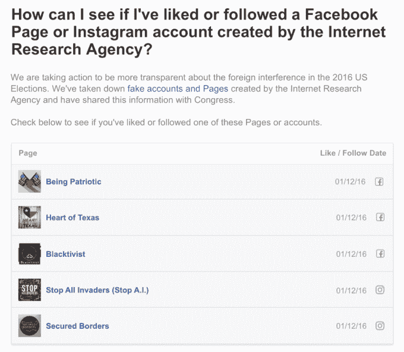

# 现在查看你是否喜欢脸书 TechCrunch 上的任何俄罗斯巨魔账户

> 原文：<https://web.archive.org/web/https://techcrunch.com/2017/12/22/check-now-to-see-if-you-liked-any-russian-troll-accounts-on-facebook/>

# 现在看看你是否喜欢脸书上的俄罗斯巨魔账户

今年秋天，越来越多的人估计俄罗斯支持的巨魔账户接触到了多少人——最近一次统计接近 1 . 5 亿。现在这个社交网络终于发布了它[上个月承诺的工具](https://web.archive.org/web/20230206173620/https://techcrunch.com/2017/11/22/russian-trolls/)，允许用户查看他们是否喜欢或关注了[在粗略尝试大规模操纵期间放在网上的许多页面或内容片段](https://web.archive.org/web/20230206173620/https://techcrunch.com/gallery/here-are-15-of-the-russian-bought-ads-aimed-at-influencing-the-election/)。

脸书并没有在屋顶上大声宣传这种工具的可用性，而是等到圣诞节前的星期五，一个传统的公司宁愿不被注意的物品垃圾场，然后将这种工具深深地贴在帮助页面上。干得好，脸书！

值得称赞的是，这个工具使用起来非常简单。进入这个页面，它会显示你可能喜欢或关注过的俄罗斯互联网研究机构创建的账户。如果你登录你的 Instagram 账户，它也会显示这些信息。

如果你跟踪了一些可疑的账户，它会是这样的:

 如果盒子是空的，那并不意味着你没有接触到所讨论的内容，只是你没有参与其中。你可能仍然是幸运的 1.46 亿人中的一员。毫无疑问，脸书可以告诉你是否是这样，但直接告诉人们的光学效果很差——每个人都会截图并贴上标题“WTF！”或者“OMG 脸书坏了！”

我们期待其他大公司提供类似的工具，这些公司已经在其平台上发现了干预选举的企图。