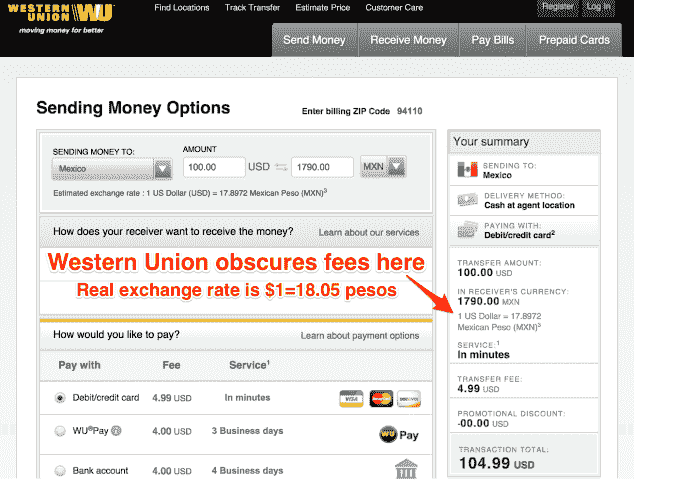
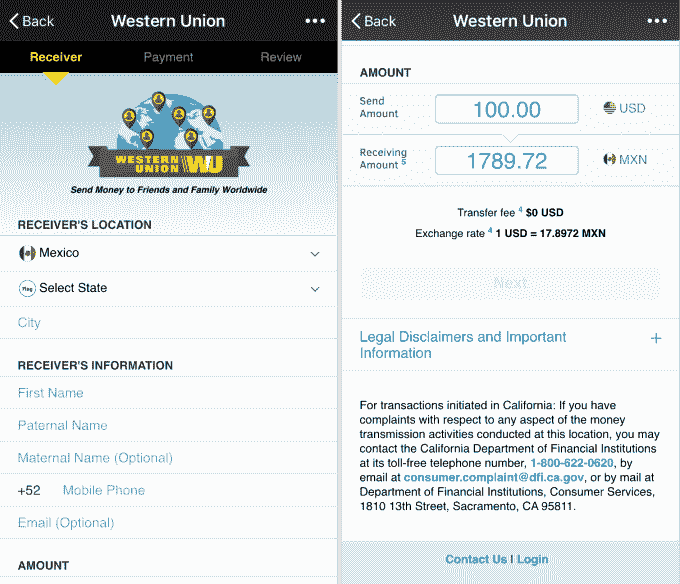

# 西联汇款为聊天应用带来资金转移和棘手的费用

> 原文：<https://web.archive.org/web/https://techcrunch.com/2016/02/04/check-the-exchange-rate/>

汇款一直是见不得人的行当。农民工需要把他们赚的钱寄回家给家人，但受到印刷费的打击，因此从另一方流出的现金比他们想象的要少。汇款公司通过保持自己制定的汇率和实际汇率之间的差额赚取额外收入。

西联汇款公司是最著名的汇款公司，在世界各地拥有 50 万个实体网点。但像 TransferWise、Azimo 和 WorldRemit 这样的科技初创公司正在瞄准这项业务。他们希望通过提高便利性和降低费用来吸引西联汇款、速汇金和其他老派汇款提供商的客户。

因此，由于与大型通讯应用的合作，西联汇款正在走向数字化。去年 10 月，它推出了[西联通](https://web.archive.org/web/20230306013812/https://techcrunch.com/2015/10/26/western-union-offers-new-money-transfer-product-for-social-media-and-messaging-companies/)系统，随后与微信合作发送高达 100 美元的汇款。

现在，它与拥有超过 6.64 亿“唯一”用户的 [Viber](https://web.archive.org/web/20230306013812/http://www.viber.com/en/) 合作，尽管还不清楚这意味着什么。这种整合允许人们以 3.99 美元加上汇率费的价格发送高达 100 美元的汇款，他们发送的 499 美元限额越高，固定费用就越高。

用户添加他们的借记卡、信用卡或银行账户，选择他们汇款的目的地，收款人可以在西联汇款的地点提取现金，或者将现金转移到移动钱包或银行账户。西联汇款的安全服务器保存着金融信息，所以不太可能被黑客攻击。

但就像所有西联汇款一样，细节决定成败。星号和一些法律要求的小字通知用户“* *西联也从货币兑换中赚钱。”本质上，它告诉你它捏造的汇率是多少，而不是真实的汇率是多少。西联银行将差价收入囊中。

所以当你往墨西哥汇款时，上面显示汇率是 1 美元= 17.8972 墨西哥比索。但是如果顾客简单地谷歌一下，他们会发现实际汇率是 1 美元= 18.17 墨西哥比索。这是家庭在固定费用之外损失的额外的 1.5%，西联汇款更为预付。

我问 Western Union 的战略伙伴关系负责人 Sonika Chandra，为什么该公司不超出其法律要求，只显示 Western Union 制定的真实标准汇率。她说“我们采取一切可能的措施来确保顾客理解费用”，并声称“我们能塞进小屏幕的信息就这么多。”

但是空间很大。西联汇款没有提供 Viber 体验的截图，但在微信上，似乎有足够的空间在所有字段中输入支付信息和法律免责声明，以添加一行实际的标准汇率。钱德拉坚持说“这不是不透明的问题。”我不同意。

西联汇款向 Viber 或微信提供一部分提成，以换取他们带来客户。当被问到时，西联汇款一如既往地拒绝透露它提供的收入分成是多少。

或许有一天，西联汇款将探索在国家之间进行相反方向的匹配转账，或者使用区块链以更低的费用转移资金，这可能有助于客户节省资金。关于它是否正在进行这样的实验，一位西联代表告诉我“目前没有——并不是说这在未来不可能成为一种选择。”

目前，就像冰山一样，只有西联汇款的部分费用是可以立即看到的。