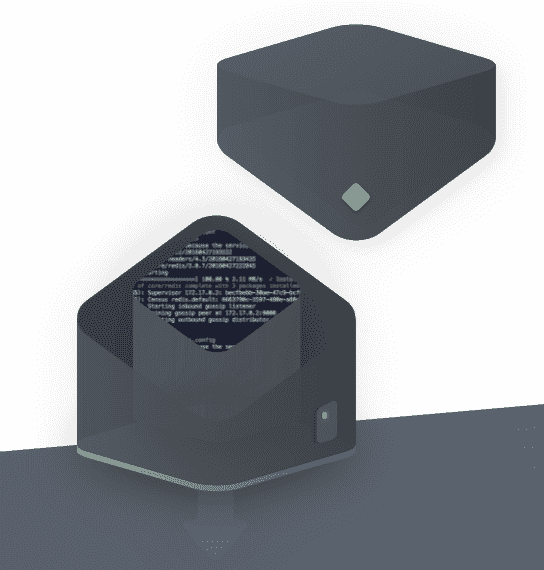
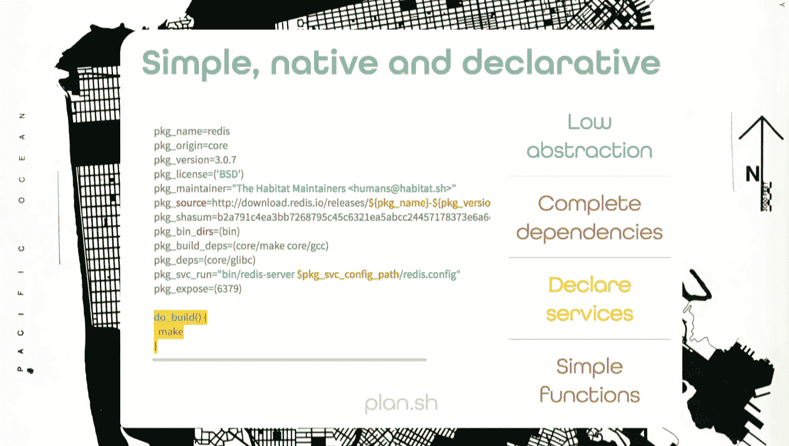

# Chef 的新栖息地项目希望使应用程序独立于基础架构

> 原文：<https://web.archive.org/web/https://techcrunch.com/2016/06/14/chefs-new-habitat-project-wants-to-make-applications-infrastructure-independent/>

# Chef 的新栖息地项目希望使应用程序独立于基础设施

[Chef](https://web.archive.org/web/20230304081602/https://www.chef.io/) 今天发布了 [Habitat](https://web.archive.org/web/20230304081602/https://www.habitat.sh/about/why-habitat/) ，这是一个新的开源项目，允许开发者打包他们的应用程序，并在各种基础设施上运行。

Habitat 本质上是将应用程序包装到它们自己的轻量级运行时环境中，然后允许你在任何环境中运行它们，从裸机服务器到虚拟机、Docker 容器(以及它们各自的容器管理服务)和像 Cloud Foundry 这样的 PaaS 系统。

 “我们必须让应用摆脱对基础设施的依赖，才能真正实现 DevOps 的承诺，”Chef 联合创始人兼首席技术官 Adam Jacob 今天在一份声明中表示。“世界上有如此多的开源软件需要编写，我们非常高兴将 Habitat 发布到野外。我们相信，以应用为中心的自动化可以给现代开发团队带来他们真正想要的东西——构建新的应用，而不是在管道中瞎折腾。”

Chef 团队认为，今天的解决方案往往过于狭隘地集中于企业，其中“大多数企业中存在的责任的深度孤岛驱使我们专门为一个或另一个孤岛设计软件。”另一方面，像谷歌或脸书这样的网络规模的公司从零开始建立自己的平台(他们的业务往往正是这个平台)，这是大多数公司做不到的。

然后，Habitat 试图从应用程序的角度解决如何最好地构建、部署和管理应用程序的问题。您不需要定义基础设施，而是定义应用程序需要运行的内容，并从那里获取。Habitat“主管”将为您要部署的环境处理部署、升级和安全策略。

Chef 团队指出，将遗留应用程序移植到 Habitat 也应该非常简单。

Habitat 的承诺听起来也有点像我们长期以来听到的关于容器的承诺。Chef 认为，Habitat 改善了集装箱体验，降低了生产中管理集装箱的复杂性。不过，在某种程度上，这个项目也感觉像是 Chef 对容器的反应，这至少部分威胁到了它的核心业务。不出所料，Habitat 也可以很好地使用 Chef 现有的 DevOps 工具。

如果你有兴趣尝试一下 Habitat，Chef 提供了一套教程(T1)和互动演示(T3)。

