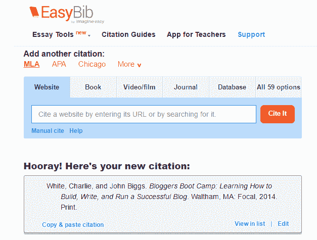

# 齐格网收购了 EasyBib、BibMe 和 Citation Machine TechCrunch 背后的公司 Imagine Easy Solutions

> 原文：<https://web.archive.org/web/https://techcrunch.com/2016/05/02/chegg-acquires-imagine-easy-solutions-the-company-behind-easybib-bibme-and-citation-machine/>

# 齐格网收购了 EasyBib、BibMe 和 Citation Machine 背后的公司 Imagine Easy Solutions

在线教科书服务公司 Chegg 今天宣布以 4200 万美元收购了 T2 的 Imagine Easy Solutions。

想象容易是[在线书目和研究工具如](https://web.archive.org/web/20230119160414/http://www.imagineeasy.com/about-us/) [EasyBib](https://web.archive.org/web/20230119160414/http://www.easybib.com/) (这也是它的第一个产品)和类似工具如[引文机](https://web.archive.org/web/20230119160414/http://www.citationmachine.net/)、 [BibMe](https://web.archive.org/web/20230119160414/http://www.bibme.org/) 和[为我举个例子](https://web.archive.org/web/20230119160414/https://www.citethisforme.com/)，其中大部分是它在过去几年收购的。Imagine Easy 还通过其 [Imagine Easy Academy](https://web.archive.org/web/20230119160414/http://www.imagineeasy.com/academy/) 和 [Imagine Easy Scholar](https://web.archive.org/web/20230119160414/http://www.imagineeasy.com/scholar/) 产品提供教学工具，帮助学生培养阅读和写作技能。

Chegg 将支付 2500 万美元的预付款和 1700 万美元的延期付款——在接下来的三年里，根据团队是否达到目标，还有 1800 万美元的潜在付款。

Chegg 告诉我，在过去的 12 个月里，Imagine Easy 的书目和研究工具驱动了大约 2.4 亿次会话，仅 EasyBib 在 2016 年 3 月就有超过 700 万独立用户。总的来说，所有这些服务已经帮助学生处理了超过 14 亿个参考书目条目。

Imagine Easy 的商业模式是基于订阅费和网站在线广告收入的混合。

Chegg 使在线购买、租赁和销售教科书和电子教科书变得很容易。但是迟早，一些讨厌的教授(或者，现在，更可能是助教或[兼职](https://web.archive.org/web/20230119160414/http://www.chicagoreader.com/Bleader/archives/2016/04/25/being-adjunct-college-professor-can-be-awful))会要求你做一些研究，并根据你所学写一篇论文。更糟糕的是，你可能还得附上参考书目。令人欣慰的是，像 [EasyBib](https://web.archive.org/web/20230119160414/http://www.easybib.com/) 这样的工具让这变得相当容易，所以你真的不用再担心芝加哥式、APA 式和 MLA 式书目之间的区别了。

虽然这些工具显然是 Imagine Easy 最明显的服务，但 Chegg 今天指出，该公司教授写作技能的工具也是获得这项服务的一个重要原因。

“我们知道写作是当今学生最大的痛点之一，大约四分之一的大学新生被要求参加写作补习班，雇主认为不到 30%的应届毕业生具备良好的书面沟通能力，”Chegg 董事长兼首席执行官 Dan Rosensweig 在今天的公告中说。“无法在大学水平上写作是学生最终会辍学的主要指标，这种情况对学生和学校都有不利影响。通过这次收购，Chegg 现在有能力为数百万每天依赖写作帮助的学生提供服务，特别是那些需要参加写作补习班的学生。”