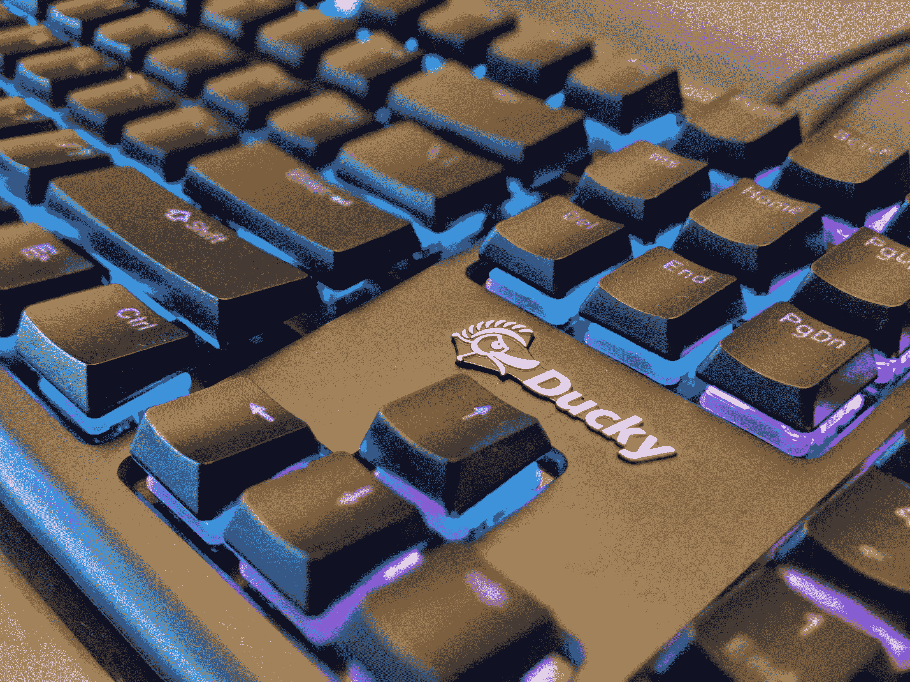
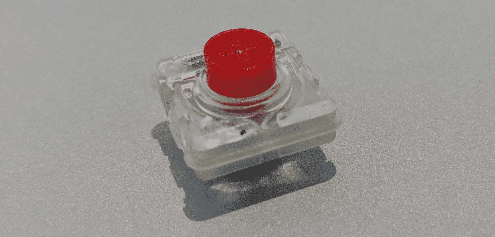

# Cherry 新推出的低姿态开关可能有助于为更多笔记本电脑带来机械键盘 

> 原文：<https://web.archive.org/web/https://techcrunch.com/2018/01/12/cherrys-new-low-profile-switches-may-help-bring-mechanical-keyboards-to-more-laptops/>

# Cherry 新的低姿态开关可能有助于为更多的笔记本电脑带来机械键盘

你可能对键盘键帽下面的开关想得不多，但是有一大群[发烧友](https://web.archive.org/web/20221205135322/https://www.youtube.com/watch?v=hUN93Xz-7pg)真的真的很在乎。对于这些用户来说，Cherry 的各种 [MX 品牌开关](https://web.archive.org/web/20221205135322/http://cherryamericas.com/product/mx-series-2/)在某种程度上是一种标准。因为它们包括许多机械部件，不过，你不会在超过[几台笔记本电脑](https://web.archive.org/web/20221205135322/http://www.tomshardware.co.uk/g00/new-mechanical-switches-laptops-slim-keyboards,news-54667.html?i10c.encReferrer=aHR0cHM6Ly93d3cuZ29vZ2xlLmNvbS8%3D&i10c.ua=1)上看到很多笔记本电脑一样薄的机械键盘或机械键盘。

然而，趋势显然是朝着超薄键盘发展 Cherry 也没有忽略这一点。因此，在本周的 CES 上，该公司推出了一个全新的键盘开关系列，它可能足够小，足以为更多的笔记本电脑(或至少更多的小众游戏笔记本电脑)带来机械键盘和更薄的键盘。这些新开关是 Cherry MX RGB 开关的低调版本，这种开关具有彩色 led，特别受游戏玩家欢迎。该公司告诉我，如果成功，它还将推出其他 MX 交换机的更薄版本。

正如 Cherry 的工程师告诉我的那样，该公司看到了很多对低调开关的兴趣。新的键盘仍然允许 3 毫米的行程，在上面有一个 1 毫米薄的键帽，你可以用这些来制造一个非常薄的机械键盘。然而，Cherry 绝对不想改变的是许多发烧友只需一次按压就能察觉到的“Cherry 感觉”。不过，与此同时，该公司也希望确保能够在这些新交换机上进行一些创新。除其他外，这包括改善溢出和尘埃保护。

Cherry 表示，这些开关的额定按键次数至少为 5000 万次(尽管 Cherry 告诉我，它可能会持续更长时间)，并且比标准 MX 开关浅 35%。对于游戏玩家来说，3.2 毫米的行程(相比之下，标准开关只有 4 毫米)——以及随之而来的更短的反弹时间——也应该允许他们更快地击键。

Cherry 目前正在扩大开关的生产，这些开关都是在德国制造的。在接下来的几个月里，我们很可能会看到第一批键盘上市。

