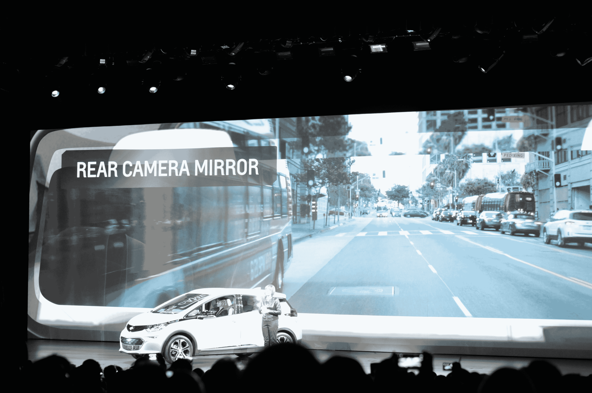
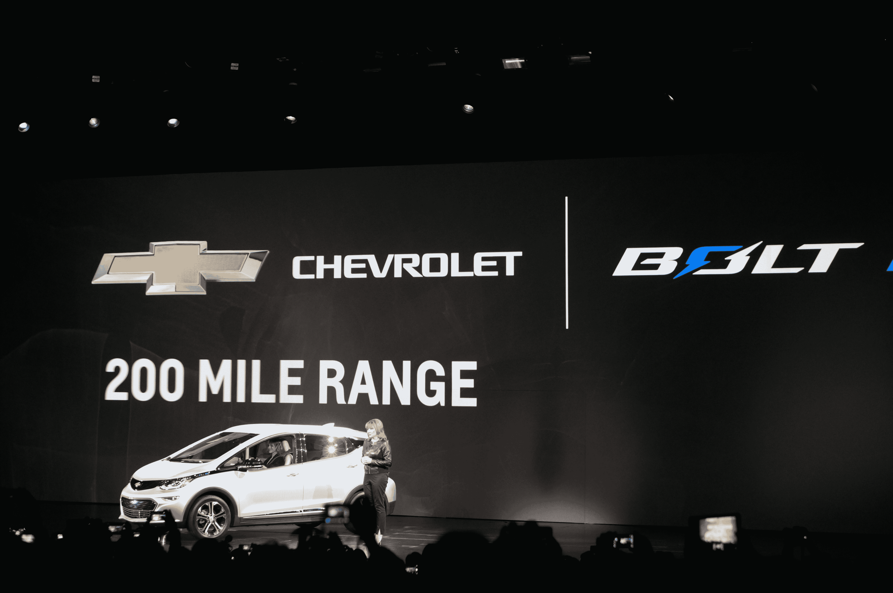

# 雪佛兰在 CES 上首次推出 Bolt 电动汽车，承诺行驶 200 英里 

> 原文：<https://web.archive.org/web/https://techcrunch.com/2016/01/06/chevy-debuts-its-bolt-electric-car-at-ces-promises-200-mile-range/>

# 雪佛兰在 CES 上首次亮相其 Bolt 电动车，承诺 200 英里的里程

正如所料，[雪佛兰](https://web.archive.org/web/20221205122220/http://www.chevrolet.com/)今天在 CES 上的主题演讲中正式推出了它的新电动汽车——雪佛兰 Bolt。这款新车的零售价格在联邦税收抵免后不到 3 万美元，续航里程约为 200 英里。

它将与日产 Leaf 竞争，后者的续航里程约为前者的一半，宝马 i3 也不到 200 英里，未来还将与特斯拉的低价车竞争。雪佛兰自己的 Spark EV 已经比 Bolt 便宜了，但是只能行驶 80 英里。

该公司大约在一年前预展了这款新车。它将采用雪佛兰的 MyLink 信息娱乐系统，配有 10.2 英寸的彩色触摸屏。除了范围之外，其他字幕功能包括后置摄像头镜和环绕视觉，它使用四个摄像头为驾驶员提供汽车周围发生的 360 度视图。不过，这种模式只有在停车时才有效(这可能是一件好事，因为开车时这会分散注意力)。后摄像头意味着您的视野不会被乘客或后排座椅挡住。

【T2

Bolt 将与你的智能手机深度集成(例如，当它识别出你的手机时，就会个性化到你的主屏幕上)。它还提供快速充电模式。

Bolt 将同时支持 Android Auto 和 Apple Car Play。此外，雪佛兰也为 Bolt 司机推出了一款新的手机应用程序，可以在手机上提供他们汽车的所有信息。

Chevy 也利用今天的主题演讲给特斯拉蒙上了一层阴影。该公司指出，它仍然相信经销商模式，其客户将永远不必开车到另一个州去维修他们的汽车。

雪佛兰仍然保留了一些关于汽车的细节，所以它有一些东西要宣布，下周在底特律举行的北美国际汽车展。

