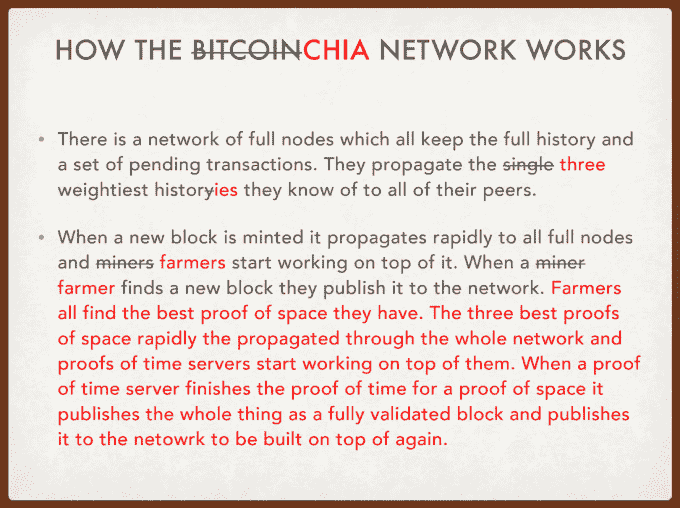

# BitTorrent 发明者宣布生态友好的比特币竞争对手 Chia 

> 原文：<https://web.archive.org/web/https://techcrunch.com/2017/11/08/chia-network-cryptocurrency/>

一次比特币交易浪费的电力相当于一个美国家庭一周(T1)的用电量，传奇编码师布拉姆·科恩想要解决这个问题。考虑到他发明了无处不在的点对点文件传输协议 BitTorrent，你应该认真对待他。

科恩刚刚创办了一家名为 [Chia Network](https://web.archive.org/web/20230324030224/https://chia.network/) 的新公司，该公司将推出一种基于时间和存储证明的加密货币，而不是比特币的[耗电证明](https://web.archive.org/web/20230324030224/https://digiconomist.net/bitcoin-energy-consumption)。实质上，Chia 将利用硬盘上廉价且丰富的未使用存储空间来验证其区块链。

“我们的想法是制造更好的比特币，解决集中化问题，”科恩告诉我。他认为比特币的两个主要问题是对环境的影响和不稳定性，这种不稳定性是由少数几个以最廉价的方式获得电力的比特币矿商产生的，他们施加了巨大的影响。

Chia 旨在解决这两个问题。

比特币使用工作证明来验证区块链。这是因为制造一个假区块链的成本高得惊人，因为它没有真的那么多工作要做。但随着时间的推移，这在收集开采比特币的激励方面给了那些接近低成本电力运营并自然冷却空气以冷却采矿钻机的人巨大的优势。

相反，Chia 依赖于文件存储空间的证明，人们通常已经有了这些证明，并且可以免费使用。它将这一点与时间证据相结合，解除了空间证据易受的各种攻击。

“我不是第一个提出这个想法的人，”科恩说，但实际实施需要他所擅长的那种先进的计算机科学。

在 21 世纪初发明了 torrenting 并短暂地为 Valve 开发了 Steam 之后，科恩一直在 BitTorrent 建立一个新的点对点直播视频传输协议。但是业务方面的管理不善导致了公司的内爆(T2)。现在它一瘸一拐地走着，科恩说“它每天都不需要我。”因此，虽然他仍在董事会，但他在 8 月初离开，创办了 Chia Network。

奇亚网络联合创始人布拉姆·科恩

科恩已经与早期比特币交易所 Tradehill 的首席运营官瑞安辛格合作，他们已经为 Chia 筹集了一轮种子资金，以增加招聘。科恩没有说它筹集了多少资金，笑着说，“我不确定我们现在想宣布多少，但这是一个非常热门的回合。”我们的目标是在 2018 年 Q2 进行 Chia 的早期销售，并在 2018 年底全面推出其加密货币，尽管科恩表示这是一个不切实际的目标。

科恩是一位才华横溢的技术专家，但要说服人们从比特币转向中国比特币还需要更多的东西。他告诉我，Chia 的计划是“对其法律地位做一些更聪明的事情，并做一些你可以从头开始做的技术修复。”

现在猜测这一切将如何发展还为时过早，但至少有人在试图解决加密货币的生态影响，而不是仅仅抱怨它。科恩似乎很兴奋。“这在技术上要求很高，而且有大量实质性的工作要做。我已经做了足够多的筹款和招募工作。现在开始真正的工作。”

*【特色图片致谢:[迈克尔安东内尔](https://web.archive.org/web/20230324030224/http://www.shinyredphoto.com/)*