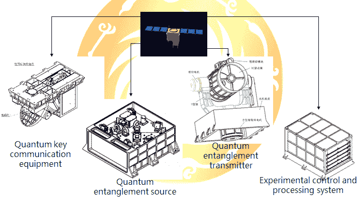

# 中国发射第一颗量子通信卫星——那到底是什么？

> 原文：<https://web.archive.org/web/https://techcrunch.com/2016/08/16/china-launches-the-first-quantum-communications-satellite-and-what-is-that-exactly/>

恭喜中国:通过发射世界上第一颗量子通信卫星，这个国家在太空和密码学领域取得了一个有趣的——尽管有些难以解释——的里程碑。

空间尺度量子实验(QUESS)，以哲学家的名字命名为 Micius，于当地时间凌晨 1 点 40 分(美国时间昨天晚些时候)从酒泉卫星发射中心发射升空，目前正在机动进入 500 公里的太阳同步轨道。

那么包裹里到底有什么这么让人激动呢？

QUESS 是量子密码术部署中的一项实验——具体来说，是一个原型，将测试是否有可能从太空中执行这项微妙的科学。我会尝试解释，但请记住，这个星球上几乎没有人真正理解量子物理学，他们中的一些人可能是在虚张声势。所以这只是基础知识——如果我错了，请随时纠正我，教授。

QUESS 内部是一种晶体，可以被激发产生两个光子，这两个光子在亚原子量子级别上“纠缠”。纠缠光子具有某些方面，例如偏振，无论距离远近，两者都是一样的。事实上，卫星将在 1200 公里处测试这一点，这将创造新的记录。在这里，如何和为什么超出了我们的支付等级，所以只要把纠缠当作一个给定的。我们甚至不要在这里讨论超光速通信。

这项技术的问题在于，光子是相当挑剔的东西，当通过光纤、空气等传播时，往往会被反弹、吸收或受到干扰。QUESS 将测试将它们发送到太空是否更容易，以及一对纠缠光子中的一个是否可以成功发送到表面，而另一个留在卫星上。

 如果这被证明是可能的，卫星将尝试通过这些纠缠光子进行量子密钥分发。当被测量时，一个光子将向它的观察者显示随机偏振状态——但关键的是，纠缠意味着另一个光子将总是显示相同的*T4 随机状态。这些相关极化可以是只有观察者知道的密钥的基础。(注意:之前在这里的解释是不正确的，已经更改。)*

最棒的是，除了光子的原始分布之外，没有涉及到传输，或者至少没有我们理解和能够拦截的传输。无论两个光子之间的联系是什么，都是无形的，无法检测的——你无法纠缠第三个光子来监听，即使你设法干扰了这个过程，它也会立即被最初纠缠光子的观察者注意到，这将不再是完美的关联。

正如你所想象的，一个不可探测的、完全安全的数字通信信道有着巨大的潜在价值，原因不胜枚举。中国很早就开始了与魁地奇的游戏，但他们不是唯一的玩家。其他量子卫星，尽管没有一个如此先进，现在还在太空中，而且肯定会有更多。整套实验肯定会很有趣——如果有人能找到解释其中发生了什么的方法。