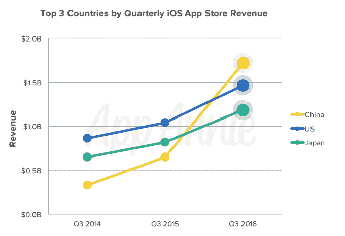
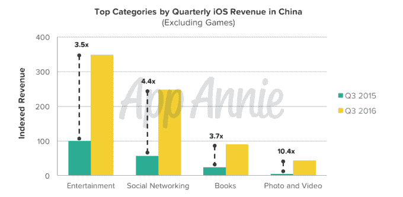
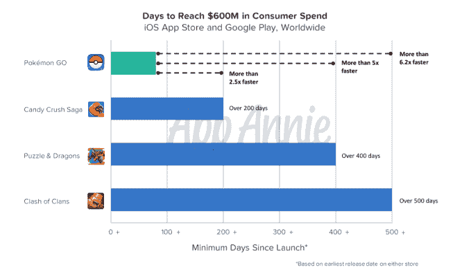
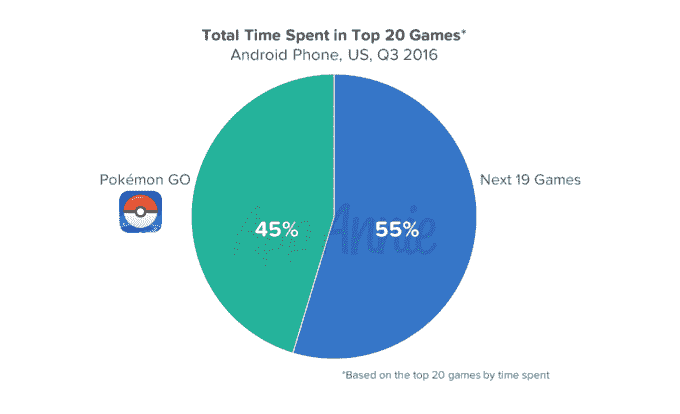
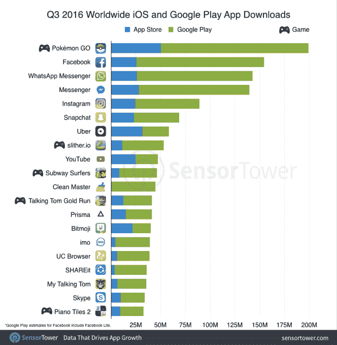

# 中国 iOS 应用商店收入超过美国

> 原文：<https://web.archive.org/web/https://techcrunch.com/2016/10/20/china-overtakes-the-u-s-in-ios-app-store-revenue/>

根据应用智能公司 App Annie 今天早上发布的一份新报告，中国已经超过美国成为世界上应用商店收入最大的市场。2016 年第三季度，该国收入超过 17 亿美元，领先美国 15%以上。报告指出，自 2010 年以来，美国一直是最大的 iOS 市场。

如今，中国消费者的支出是两年前的 5 倍多。

此外，该报告预测，到 2020 年，中国将成为任何国家中绝对收入增长最快的国家。

这些估计可能是准确的—[App Annie 在年初](https://web.archive.org/web/20230324095638/https://techcrunch.com/2016/01/20/china-poised-to-overtake-u-s-japan-in-ios-revenue-within-the-next-year/)表示，如果中国应用商店的收入继续以同样的速度快速增长，它将在今年年底超过美国。现在这已经发生了。

这种增长主要是由游戏推动的，在这方面，中国在过去一个季度对美国的领先优势也有所扩大。游戏贡献了 75%的 App Store 收入，尽管非游戏应用占据了苹果移动市场的大部分(75%)。

然而，在未来几年，由于应用程序内订阅等新的收入来源，非游戏收入也将开始增长。这种增长目前正在中国进行，在中国，娱乐、社交网络、图书和照片及视频应用是除游戏之外收入最高的类别，其收入同比增长超过三倍。

特别是，得益于爱奇艺、腾讯视频和优酷等视频流媒体应用，游戏是中国增长第二快的类别。视频流也开始在 QQ、陌陌和 Inke 等中国通讯应用中发挥作用。

**Pokémon Go 下载量最大的应用，耗时排名前 5**

这份新报告还调查了持续流行的年度游戏《精灵宝可梦 Go》。这款应用的收入达到 6 亿美元，比迄今为止任何其他应用都要快。它实现这一里程碑比《糖果粉碎传奇》快 2.5 倍；比 Puzzle & Dragons 快 5 倍；比大获成功的《部落冲突》快了 6.2 倍。

最初的受欢迎程度有所下降，但与排名前 20 的其他游戏相比，Pokémon Go 仍占应用内总时间的 45%。剩下的 19 款热门游戏加在一起，占据了安卓游戏总时长的 55%。

这款游戏在安卓系统的前五大应用中也占有一席之地，在巨人、脸书、Chrome 和 YouTube 之后排名第四。

这款游戏也继续在跨平台领域取得成功。在本周发布的一份来自传感器塔的相关报告中，该公司发现 Pokémon Go 是第三季度在全球和美国 App Store 和 Google Play 上下载量最多的应用程序，其发行商 Niantic Labs 在第三季度成为 iOS 下载量排名第五的发行商，而在此之前它还没有排名。

继 Pokémon Go 之后，iOS 应用商店中其他下载量最高的应用包括优步、Messenger、WhatsApp、脸书、英雄 MOBA(中国)、YouTube、Instagram、Snapchat，然后是谷歌地图。其余名单中的大部分包括中国顶级应用，如优酷、蛇战、爱奇艺、腾讯视频、滴滴出行、全民 k 歌和美团。(见下图)

Android 上的前 20 名列表以类似的方式开始，但没有包括中国应用程序填充其图表的其余部分，而是看到美国的游戏、实用程序和其他应用程序，如 Prisma 和优步，占据了这些位置。

[gallery ids="1404442，1404443"]

在本季度，Pokémon Go 的 Snapchat 或 Instagram 安装量增加了一倍多，让你了解一下这段时间它的采用速度有多快。

两家应用商店的其他重大变化包括 Bitmoji 由于 Snapchat 的整合而在排行榜上攀升，以及 YouTube 超越 Spotify。报告指出，YouTube 在第三季度从第 16 名升至第 10 名。

这两份报告提供了本季度的更多细节，可通过 [Sensor Tower](https://web.archive.org/web/20230324095638/https://sensortower.com/blog/q3-2016-data-digest) 和 [App Annie 网站](https://web.archive.org/web/20230324095638/https://www.appannie.com/insights/market-data/q3-2016-index-china-hits-ios-app-store-milestone/)获得。