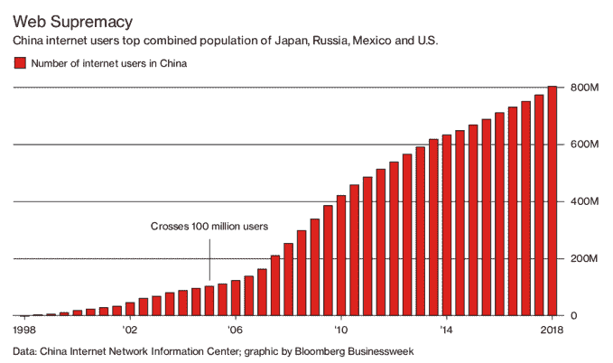

# 中国互联网用户达到 8 亿 

> 原文：<https://web.archive.org/web/https://techcrunch.com/2018/08/21/china-reaches-800-million-internet-users/>

# 中国互联网用户达到 8 亿

根据中国政府的最新数据，中国的互联网人口现已超过 8 亿。

中国互联网络信息中心(CNNIC)发布的一份新报告称，中国上网人数为 8.02 亿。该机构是工业和信息化部的一个分支机构，负责控制。cn 国家代码-估计 2018 年下半年中国有 2968 万人首次上网。

在某种背景下，美国估计有大约 3 亿互联网用户。彭博指出，中国互联网用户的数量现在已经超过了日、俄、墨、美、[四国人口的总和。](https://web.archive.org/web/20221025222242/https://www.bloomberg.com/news/articles/2018-08-21/chinese-internet-users-cross-800-million-mark)

新的统计数据显示，中国的互联网普及率达到 57.7%，据报道有 7.88 亿人是移动互联网用户。这是一个惊人的 98 %,它强调了移动在这个国家是多么重要。

报告中其他值得注意的数据包括:

*   21%的中国互联网用户也是网上银行用户
*   71%的人使用在线支付或电子商务服务
*   74.1%的人使用短视频应用，包括字节跳动的斗印应用(在中国以外被称为抖音)
*   30.6%的人使用自行车共享应用
*   43.2%的人使用打车应用
*   37.3%的人使用互联网预订公共汽车和火车

中国互联网的发展也给政府带来压力，要求其维持对网上信息的控制政策。

众所周知，Twitter 和脸书等西方服务在 Mainland China 无法访问，但政府也打击了包括今日头条在内的本地服务，今日头条由新媒体公司字节跳动运营，该公司目前正在与投资者谈判，以筹集 25-35 亿美元。字节跳动[被勒令关闭其在中国运营的一款恶搞应用](https://web.archive.org/web/20221025222242/https://www.nytimes.com/2018/04/11/technology/china-toutiao-bytedance-censor.html)，同时[四款新闻和内容应用因冒犯当局而被 App Store 和 Google Play 暂停](https://web.archive.org/web/20221025222242/https://variety.com/2018/digital/asia/china-shuts-down-bytedance-parody-site-1202751287/)。作为回应，字节跳动将其内容审核团队增加了一倍，并开发了更强大的内容检查系统。

苹果也成了众矢之的。该公司报告称，最近从中国的应用商店中清除了数千款应用。去年，它移除了 50 多个 VPN 应用程序，这些应用程序可以用来绕过中国的互联网审查系统，因为它们在中国被认为是非法的。