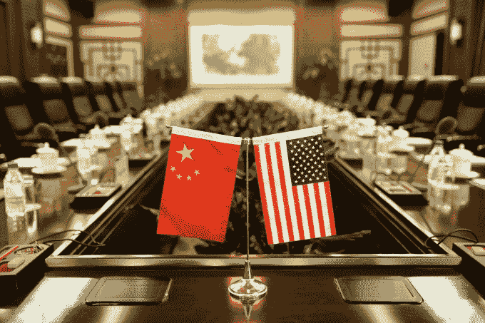

# 中国分裂互联网，而美国犹豫不决 

> 原文：<https://web.archive.org/web/https://techcrunch.com/2018/09/24/china-splits-the-internet-while-the-u-s-dithers/>

眼下，没有什么事情比互联网被中美之间日益加剧的敌意撕裂更重要了。Alphabet 前董事长埃里克·施密特(Eric Schmidt)上周在旧金山的一次私人活动中表示，“我认为现在最有可能的情况不是分裂，而是分裂成一个由中国领导的互联网和一个由美国领导的非中国互联网。”

他应该知道:Alphabet 和它的谷歌子公司处于这种分裂的前沿，经历了该公司的项目蜻蜓到 T2 在中央王国推出审查的搜索引擎的巨大愤怒。然而，这并不是唯一的例子，[苹果公司因其 iPhone 展示而面临中国网民的激烈批评](https://web.archive.org/web/20221209204915/https://www.theinformation.com/briefings/c61c93)而[脸书发现其在中国大陆的公司实体申请被退回并被拒绝](https://web.archive.org/web/20221209204915/https://www.nytimes.com/2018/07/25/business/facebook-china.html)。

这种分裂的核心是我们曾经熟知的互联网的死亡:人类知识传递的统一层。随着互联网在社会和我们的日常生活中获得越来越多的权力，世界各国政府为了政治和道德目的驯服其工程的需求急剧增加。

大约四年前，我写了一篇名为“[从互联网到互联网](https://web.archive.org/web/20221209204915/https://techcrunch.com/2014/12/29/from-internet-to-internets/)”的文章，在其中我认为这种分裂是显而易见的。我当时写道:“在全世界范围内，越来越明显的是，互联网不再像过去那样独立自主，不受各个国家及其法律的影响。相反，互联网同时被每个政府牢牢控制着。”

然而，西班牙等国家围绕媒体和新闻制定的规则并没有像我预测的那样分裂互联网。美国和中国的经济实力做到了。阿里巴巴、腾讯和百度今年的市值可能有所下降，但它们的总市值仍高达数万亿美元。腾讯[旗下的微信拥有超过 10 亿用户](https://web.archive.org/web/20221209204915/https://www.ft.com/content/8940f2d0-2059-11e8-a895-1ba1f72c2c11)，虽然估计只有 10%的用户群在中国以外，但随着越来越多的国家与中国大陆建立经济桥梁，这种联系正在增长。

有时候，那些桥段挺字面的。通过[一带一路](https://web.archive.org/web/20221209204915/https://www.theguardian.com/cities/ng-interactive/2018/jul/30/what-china-belt-road-initiative-silk-road-explainer)和[亚洲基础设施投资银行](https://web.archive.org/web/20221209204915/https://www.bloomberg.com/quicktake/chinas-world-bank)等新兴机构，中国向其他国家提供了大量资金，主要用于基础设施、建立伙伴关系和深化经济联系。

中国和美国正越来越多地打一场技术合法性的全球战争(杰森·李/法新社/盖蒂图片社)

基础设施有时是道路，但也可能是电信等领域。华为已经在智能手机和核心基础设施领域大举进军非洲。大多数西方人可能从未听说过的中国公司 Transsion 是非洲大陆上占主导地位的智能手机制造商。

中国制造的电信基础设施。中国手机。越来越多的中国应用。尽管国会和国家安全官员担心华为和中兴的设备进入美国或 T2 和澳大利亚的市场，但争夺互联网未来的真正战斗将会在这些没有现有技术的发展中地区展开。

这就是特朗普政府对华贸易谈判战略如此不堪的原因。焦点集中在[一轮又一轮的关税](https://web.archive.org/web/20221209204915/https://techcrunch.com/2018/09/07/trump-wants-to-just-tariff-the-hell-out-of-china/)上，这将确保中国商品——尤其是高科技产业——对美国消费者来说更贵，从而让国内制造商更有竞争力。然而，这些政策并没有确保美国在互联网方面的价值观被输出到非洲或南美等大陆，或者思科的设备会被选择而不是华为的。

这种情况最终可能会改变。英国《金融时报》昨日报道称，特朗普政府准备加倍投资海外私人投资公司，该公司向发展中国家提供商业贷款便利。它将被并入另一个机构，并获得更丰厚的预算(高达 600 亿美元),在全球范围内与中国融资竞争。

也许那项措施会成功地拉近两国之间的战略距离。也许关于政府将在贸易战上加倍努力的传言会导致一系列更全面的政策出台。

但是沿着这条路，不管发生什么，这些小冲突将导致互联网的分裂，随之而来的是互联网作为自由和知识的堡垒和声音的死亡。