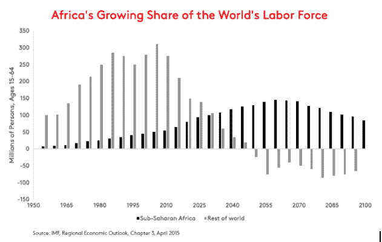
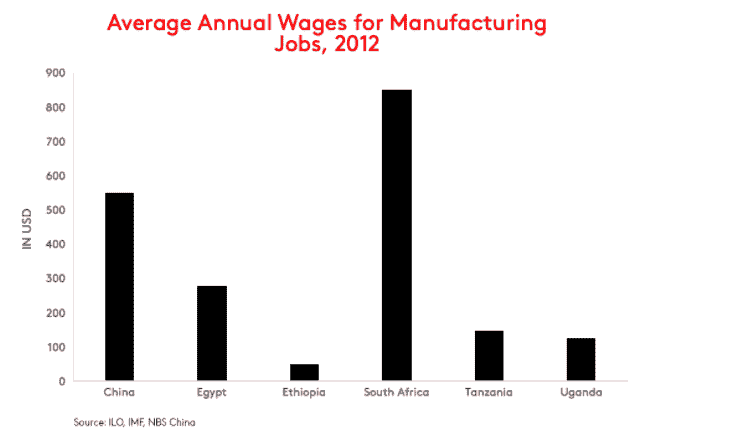
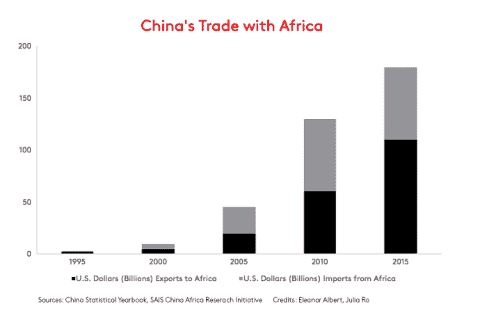

# “中国非洲”是一个宏观大趋势，将影响从硅谷到华尔街的一切

> 原文：<https://web.archive.org/web/https://techcrunch.com/2017/07/07/chinafrica-is-a-macro-megatrend-set-to-impact-everything-from-silicon-valley-to-wall-street/>

[Josh Wolfe](https://web.archive.org/web/20221205184816/http://www.luxcapital.com/team/josh-wolfe/)

是的管理合伙人和联合创始人

[Lux Capital](https://web.archive.org/web/20221205184816/http://www.luxcapital.com/)

这是一家多阶段风险投资公司，他投资于从太空和先进制造到生物技术和国防的深度技术公司。

More posts by this contributor

风投和初创公司创始人很少关注进展缓慢但影响力巨大的宏观全球事件，尤其是在微观层面需要关注这么多快速发展的事物，比如技术、团队和趋势。

尽管风投和初创公司创始人往往是最早知道自下而上涌现的前沿技术进步的人(而公开市场对冲基金和全球宏观投资者只是后来才知道)，但他们往往是最后知道可能影响他们的全球宏观力量的人。

十年前金融危机爆发时，以选股闻名的对冲基金经理遭受了巨大损失。因此，他们竞相炫耀自己的全球“宏观”诚意，并努力保护自己免受未来可能冲击其投资组合的巨大力量的影响。

作为一家风险投资公司，我们与许多全球宏观投资者朋友一起度过了一段时间，了解了未被认可的宏观发展中的风险和机遇。当你试图挑选最好的创始团队、技术突破或初创企业时，忽视宏观不是美德。想象一下:在最好的城市最好的城镇最好的社区，最好的餐馆中，有技巧地选择菜单上最好的一道菜，然后让哥斯拉不知从哪里冒出来，跺着脚把它咬碎。

最重要的宏观趋势往往不是资产价格已经上涨的头版新闻，而是被人们忽略的鲜为人知的大趋势。其中最大的我们称之为:“Chinafrica”，中国在整个非洲大陆不断增长的准入和影响力。对中国来说，非洲有东西(铁、铜、钴、石油)，有中国制造商和建筑公司的市场，还有一个投射影响力的平台。对非洲来说，中国在基础设施、制造业、劳动力管理、技术培训以及更重要的不断增长的贸易和现代化方面提供了快速的建设、最佳和最差的实践。

这将如何影响科技、风险投资和硅谷？先考虑一些趋势。

## 人口统计:非洲的劳动人口正在增长

资本去受欢迎的地方，留在待遇好的地方。人力资本、人才、劳动力也是如此。中国经历了人力资本从农村到城市的大规模流动，劳动力达到峰值(可能会下降)，劳动力成本上升，中产阶级不断壮大，对低成本劳动力的需求流入越南、老挝和柬埔寨等邻国。

随着中国经济的某些部分强调技术和服务，无论好坏，它都将向其他低工资发展中国家输出其在制造、劳动力管理和大规模基础设施建设方面的最佳和最差做法和专业知识。中国将帮助建立，并在许多情况下，共同拥有或经营制造设施，基础设施(铁路，水，采矿，电力)以及运输和航运中心。

这是典型的重商主义:中国通过贸易获得地缘政治影响力。它将发展其经济并将其力量投射到亚太地区以外，利用非洲大陆将贸易和力量投射到非洲西海岸的大西洋和印度洋、阿拉伯海以及更远的非洲东海岸。

在下一代，也就是未来 35 年内，世界上每 4 个人中就有一个是非洲人。现在，与中国形成鲜明对比的是，一半的非洲人口不到 20 岁，工作年龄人口将在下一代每年增加 2000—3000 万，从 2015 年的 5 . 3 亿增加到 2035 年的 9 . 2 亿，到 2055 年将达到 14 亿。与此同时，联合国预计，到 2055 年，中国的劳动年龄人口将从 2015 年的约 9.2 亿减少到 6.67 亿。到这个时候，世界劳动力的大部分净增长将发生在非洲，到 2050 年，非洲将占世界劳动力的 25%。

中国已经在非洲投资培训。中国科技巨头华为全球收入的 15%来自非洲，但它也在肯尼亚、刚果、安哥拉和尼日利亚培训了 1.2 万名电信和技术专业的学生。

中国不仅仅在尼日利亚和南非等国家获取大宗商品。中国在肯尼亚、埃塞俄比亚和乌干达等大宗商品资源不太丰富的国家也很活跃，部分原因是这些国家正在发展经济，具有地缘政治战略意义。作为中国经济的劳动力来源，中国在与这些非洲国家的关系上进行了大量投资。中国公司在非洲获得了不成比例的基础设施开发项目，超过 100 万中国公民移居非洲，为中国公司的卫星办公室工作(最显著的是建筑业)。

## 贸易:一直在增长，但不平衡

美国贸易在过去十年中有所下降(从每年近 1500 亿美元下降到不到 500 亿美元——其中一部分是因为美国自 2011 年以来的水力压裂革命)。但是在过去的二十年里，非洲和中国之间的贸易迅速增长。2000 年，中非贸易额约为 100 亿美元。到 2014 年，这个数字达到了 2200 亿美元。

美国在非洲大陆有 49 个贸易代表团，而中国有 52 个，在刚果、利比里亚、苏丹、南苏丹和马里有 2000 多名维和人员和军队。虽然中非之间的这种关系多年来一直很平衡，但自 2015 年以来，出现了令人担忧的贸易不平衡，许多非洲领导人现在正在采取这种做法。2015 年，中国从非洲的进口下降了近 40%，至 670 亿美元，而出口却在增长。从 2006 年到 2014 年，中国进口的年平均增长率为 13%，但预计在未来几年将降至 3%。总体而言，中国的进出口仍然只占非洲贸易总额的一小部分。

## 投资和贷款

中国的投资一直在增长，贷款也在增长(如果贷款不能偿还，还有对资产的隐性要求)。中国对非洲贷款的三分之一由大宗商品担保。

【2006 年至 2010 年，中国每年向非洲国家提供 50 亿美元贷款，2011 年至 2012 年每年 100 亿美元，2013 年至 2014 年每年 150 亿美元。有人估计，中国占整个非洲贷款总额的六分之一。值得注意的是，来自中国的贷款占非洲 2014 年获得的贷款总额的 13%，但与基于市场的利率挂钩，而不是像西方那样几乎没有利率。

## 心灵与思想

尽管非洲领导人可能开始改变论调，煽动民粹主义的反华情绪，但目前中国正在赢得非洲大部分地区的支持。在塞内加尔，86%的人认为中国在他们国家的作用有助于事情变得更好，而 56%的人认为美国人也是如此。肯尼亚的这个数字是 91%。

## 技术含义

随着物理基础设施基础层的建立，我们 Lux 正在关注软件、服务、电信、数据中心、技术基础设施和应用层的巨大增长市场。中国科技公司将在这方面发挥重要作用。与中国重量级企业合作的美国初创公司可能会比 IBM 等动作迟缓的美国公司更快。

中国移动公司或社交网络实施、投资或直接收购当地国家级或洲际网络的可能性很大，这些网络可以产生信用、影响人口，当然还有销售产品和服务。所有这一切在过去 15 年里一直在发生，却很少受到关注。活动正在加速，科技投资者和企业家的宏观机会正变得日益真实。