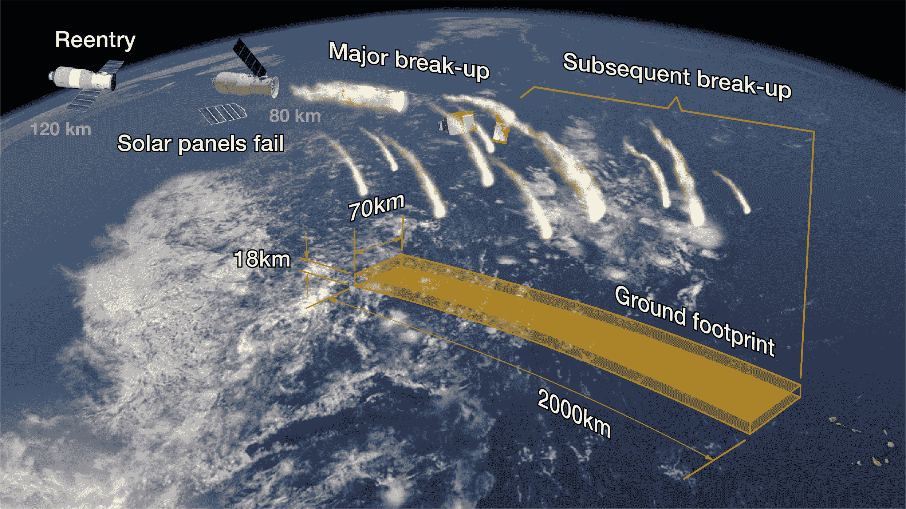

# 中国 9 吨重的天宫一号空间站将于今晚焚毁，但没人知道具体位置

> 原文：<https://web.archive.org/web/https://techcrunch.com/2018/04/01/chinas-9-ton-tiangong-1-space-station-will-burn-up-tonight-but-no-one-knows-quite-where/>

世事有起终有落。这是一般的规则，无论如何，肯定是对于已经完成了他们的目的，没有办法留在轨道上的航天器。天宫一号就是这种情况，它是中国的第一个空间站，在太空中呆了近 7 年后，正在不受控制地下降，应该会在某个地方的天空中提供一场漂亮的火焰秀。

**更新**:天宫一号没了；太平洋时间下午 5 点 16 分，飞机在南太平洋上空坠落。

因为有太多关于天宫一号轨道的未知，观察者只能给出一个有根据的猜测。他们唯一可以肯定的是，气温将在未来 24 小时内下降——可能是今晚的某个时候，在北纬 43 度和南纬 43 度之间。

但是由于所涉及的速度和一个大天体如何在大气层中翻滚的内在不可预测性，确切的时间和位置基本上要到事件发生后才能知道。欧洲航天局的重返大气层专家 T2 解释说:“欧空局精确预测时间/位置是不可能的。”。

这听起来很可怕，但事实并非如此。

[https://web.archive.org/web/20221208041752if_/https://www.youtube.com/embed/C0GBlCJCkr0?feature=oembed](https://web.archive.org/web/20221208041752if_/https://www.youtube.com/embed/C0GBlCJCkr0?feature=oembed)

视频

当然，天宫一号大约有一辆校车那么大，重 9.4 吨，但与那种大小的陨石不同，天宫一号是中空而脆弱的，应该会在降落过程中完全解体。专家坚持认为没有危险。空间站上没有人，也没有与任何载人飞船发生碰撞。

这似乎有点疯狂，但在大气层中燃烧只是大型航天器自然生命周期的一部分。这个甚至没有那个大。

天宫一号(这个名字大致翻译为“天宫”)于 2011 年底发射，由两部分组成，在太空中相连——这是中国太空计划首次完成这样的壮举。在接下来的两年里，三艘飞船与新成立的空间站对接:一艘机器人飞船神舟八号，以及两艘载人飞船神舟九号和神舟十号，每艘飞船上有三名宇航员。

这些任务证明了中国空间站技术的可行性(另一个测试平台天宫二号于 2016 年发射)，2013 年，天宫一号在完成其创造者设定的任务后，被停用。它的创造者计划让它在某个时候执行受控下降，使用它的推进器将它送上一条在海洋上空解体的道路。

尽管碎片击中某人的风险很小，但如果没有必要，最好不要冒这个风险，不要在别人的国家处理你的太空垃圾也是一种礼貌。

来自航天公司的天宫一号预期碎片足迹的有用可视化。

不幸的是，大约两年前，飞船停止对中国的操作人员做出反应，这意味着控制降落不再可能。因此，天宫一号的轨道已经自然衰减，直到最近几个月，它何时坠落才变得明朗。

因为我们没有来自空间站的遥测数据，我们只知道我们可以从空间站外面观察到什么(就像上面显示的[弗劳恩霍夫的雷达图像](https://web.archive.org/web/20221208041752/https://www.fhr.fraunhofer.de/en/press-media/press-releases/reentry_tiangong-1.html))，大量的变量使得我们很难确定地说任何事情。直到本周，它的脱轨路径变得足够清晰，太空当局才有信心给它 24 小时的时间着陆。

那些在地面上的人可能会看到一场“精彩”的灯光秀，正如中国航天局所说，就像一颗大流星在高层大气中碎裂。当空间站翻滚、解体，其组成部分燃烧时，它应该在一分钟左右的时间内可见。

根据观察结果，预测可能会稍微好一点，所以如果窗口有显著变化，我会更新这篇文章。