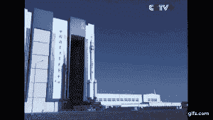
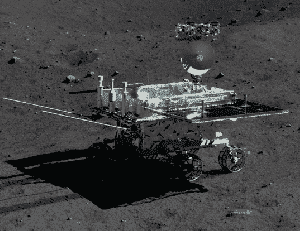

# 中国最长的载人航天飞行任务在中国空间站开始

> 原文：<https://web.archive.org/web/https://techcrunch.com/2016/10/18/chinas-longest-human-spaceflight-mission-begins-on-the-chinese-space-station/>

两名中国宇航员与中国空间站天宫二号对接，开始了中国迄今为止最长的载人航天飞行任务。

在 30 天的过程中，这是中国下一次最长的太空飞行任务时间的两倍，这对宇航员将进行各种科学实验以及在轨维修任务。

通过共同努力扩大载人航天能力，中国正迅速成为世界上领先的航天国家之一。

东部时间周日晚些时候，两名男性宇航员景海鹏和陈东乘坐中国长征-2F 火箭搭载的神舟 11 号太空舱从戈壁沙漠发射升空。两天后，神舟十一号抵达天宫二号空间站。

中国长征-2F 火箭/中央电视台提供

天宫二号是中国天宫系列的第二个空间站，一个月前刚刚被送入轨道。首个空间实验室天宫一号于 2011 年发射，用于两次载人飞行任务，包括中国第二长的神舟十号载人飞行 15 天。

天宫一号现在被认为已经退役，并有望在不久的将来脱离轨道。第三个更大的空间站，天宫三号，预计在 2020 年[将](https://web.archive.org/web/20220930100006/http://www.spaceflightinsider.com/missions/human-spaceflight/china-reveals-design-planned-tiangong-3-space-station/)送入太空。

所有的天宫实验室都是独立的空间站，被认为是中国将于 2020 年晚些时候发射的更大空间站的前身。努力创造人类在太空的永久存在只是中国国家航天局的最新里程碑。

中国在 2003 年发射了他们的第一个太空人。从那以后，这个国家稳步发展，用自己的火箭发射三人组，同时掌握太空行走和轨道对接。除了在载人航天方面的巨大进步，中国[已经在月球](https://web.archive.org/web/20220930100006/https://beta.techcrunch.com/2016/01/30/china-just-released-true-color-hd-photos-of-the-moon/)软着陆了一辆漫游车，并计划向火星发送一辆漫游车。

中国玉兔号火星车/图片由中国科学院/中国国家航天局/月球与深空探测科学与应用中心/ Emily Lakdawalla 提供

但公平地说，这些天宫空间实验室与国际空间站相比实在是太小了。天宫一号和天宫二号各重约 8 公吨，而国际空间站重达 400 公吨。中国计划在 2020 年发射的更大的空间站预计约为 60 公吨。

那么，为什么中国不在这方面与国际社会合作，而是单干呢？

事实上，NASA 被法律禁止与中国合作，这当然是一个促成因素。2011 年，国会通过了一项法案，禁止美国宇航局与中国协调任何联合科学活动。这包括国际空间站上的任何活动，这就是为什么中国宇航员不允许在空间站上。

然而，这些法律并没有扼杀中国在发展载人航天所需的关键技术方面的进步，包括载人发射和着陆能力，舱外活动(EVA)和在轨对接机动。

现在，当然如果我们必须比较的话:美国已经举行了[为期一年的](https://web.archive.org/web/20220930100006/https://beta.techcrunch.com/2016/03/01/nasa-astronaut-scott-kelly-breaks-american-spaceflight-record/)载人飞行任务，已经将人送上月球，并且已经成功地在月球和火星表面着陆了多辆漫游车。因此，在载人和机器人航天能力方面，美国宇航局仍然领先中国很多年。但是，中国并没有落后太多，他们肯定没有表现出任何放缓的迹象，或者在短期内削减他们太空计划的资金。

今天，50 岁的宇航员景海鹏将第三次飞向太空，而 38 岁的宇航员陈东将开始他的首次太空任务。这两者将共同完成中国努力研究长期载人航天的重要一步。

虽然中国国家航天局对他们即将到来的任务没有其他航天局那么直言不讳，但一些[报道](https://web.archive.org/web/20220930100006/https://www.nasaspaceflight.com/2016/09/china-launch-tiangong-2-orbital-module/)指出，至少还有一次飞往天宫二号的载人飞行正在进行中。2017 年，另一项载人任务，这次有三名宇航员，预计将发射到空间站。这项任务可能不到 30 天，但可能包括太空行走。