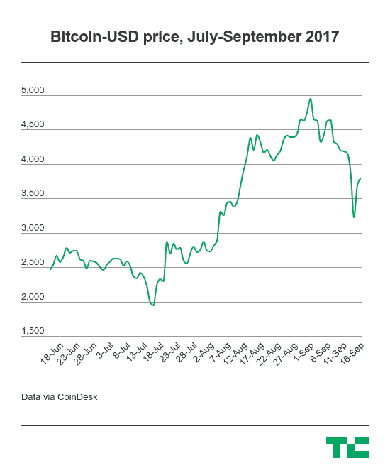

# 中国三大比特币交易所将全部停止提供本地交易

> 原文：<https://web.archive.org/web/https://techcrunch.com/2017/09/15/chinas-three-largest-bitcoin-exchanges-will-all-stop-offering-local-trading/>

# 中国三大比特币交易所将全部停止提供本地交易

嗯，没多久。昨天，中国运营时间最长的比特币交易所 BTC China 宣布[将于本月底](https://web.archive.org/web/20230402004523/https://techcrunch.com/2017/09/14/china-bitcoin-exchange-suspended-bttc-china/)暂停其本地交易服务，今天，中国另外两家主要交易所——火币和 ok coin——也紧随其后，宣布将于 10 月底停止服务。

当[华尔街日报在周一](https://web.archive.org/web/20230402004523/https://www.wsj.com/articles/china-to-shut-bitcoin-exchanges-sources-1505100862)报道称，在[于上周](https://web.archive.org/web/20230402004523/https://techcrunch.com/2017/09/04/chinas-central-bank-has-banned-icos/)禁止 ICOs 后，中国政府打算关闭比特币交易所时，事情就已经明朗化了。知情人士告诉 TechCrunch，政府官员本周开始与交易所会面，以促成交易暂停。

虽然这些交易所将不再被允许使用人民币购买加密硬币和进行硬币交易，但它们将继续经营面向国际的交易所和其他相关服务。然而，规模较小的交易所将永远关闭。其中包括云币，该公司用中文[宣布将于 9 月 20 日关闭店铺。](https://web.archive.org/web/20230402004523/https://yunbi.zendesk.com/hc/zh-cn/articles/115000152622-%E4%BA%91%E5%B8%81%E7%BD%91%E5%85%B3%E9%97%AD%E4%BA%A4%E6%98%93%E4%B8%9A%E5%8A%A1%E7%9A%84%E5%85%AC%E5%91%8A?utm_content=bufferd22e4&utm_medium=social&utm_source=twitter.com&utm_campaign=buffer)

打击行动的影响导致比特币价格下跌——这种加密货币一个月来首次在一些交易所跌破 3000 美元[——但它很快反弹，在撰写本文时，它几乎弥补了损失。](https://web.archive.org/web/20230402004523/https://techcrunch.com/2017/08/04/bitcoin-3000/)

与比特币的所有事情一样，很难确定确切的原因，但有很多原因。

最重要的是，中国不再像过去那样是比特币交易的主导者。政府的一系列禁令——最近一次是出于安全考虑的四个月交易冻结——导致其在全球交易中的份额从前几年的 90%下降到今天的 10%多一点。日本、韩国和美国等市场已经占据了全球交易量的最大份额，因此中国禁令的影响没有最初看起来那么严重。