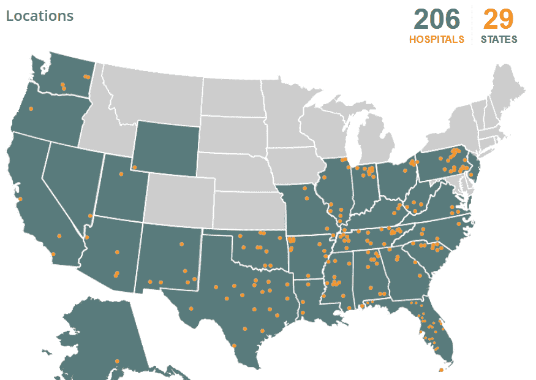

# 中国黑客窃取 450 万社区卫生系统患者的个人数据

> 原文：<https://web.archive.org/web/https://techcrunch.com/2014/08/18/chinese-hackers-steal-personal-data-from-4-5m-community-health-systems-patients/>

# 中国黑客窃取 450 万社区卫生系统患者的个人数据

[美国最大的医院运营商之一社区卫生系统](https://web.archive.org/web/20230331183156/http://www.chs.net/)今天[宣布](https://web.archive.org/web/20230331183156/http://phx.corporate-ir.net/phoenix.zhtml?c=120730&p=irol-SECText&TEXT=aHR0cDovL2FwaS50ZW5rd2l6YXJkLmNvbS9maWxpbmcueG1sP2lwYWdlPTk3NjE4NTImRFNFUT0wJlNFUT0wJlNRREVTQz1TRUNUSU9OX0VOVElSRSZzdWJzaWQ9NTc%3d)黑客窃取了大约 450 万份记录，包括患者姓名、地址、出生数据、电话号码和社会保险号。该公司表示，这些数据是在 2014 年 4 月至 6 月期间发生的攻击中被盗的，黑客获得了任何人的数据，这些人被社区卫生系统的任何医生转诊或接受服务。唯一的好消息是，黑客没有获得任何医疗记录。

在 29 个州运营的社区健康系统与网络安全公司 [Mandiant](https://web.archive.org/web/20230331183156/https://www.mandiant.com/) 合作调查这一违规事件。根据 Mandiant 的调查，Community Health Systems 认为攻击源自中国，黑客使用了“高度复杂的恶意软件和技术来攻击该公司的系统。该公司指出，这些攻击通常针对医疗设备和设备开发数据等知识产权。然而，这一次，黑客们盯上了个人记录。

社区卫生系统将为所有数据被盗的患者提供身份盗窃保护。

当然，今天的声明只是让美国消费者容易遭受身份盗窃和/或信用卡欺诈的[长](https://web.archive.org/web/20230331183156/http://arstechnica.com/security/2014/08/grocery-shoppers-nationwide-probably-had-credit-card-data-stolen/) [线](https://web.archive.org/web/20230331183156/http://www.nytimes.com/2014/08/06/technology/russian-gang-said-to-amass-more-than-a-billion-stolen-internet-credentials.html?_r=0)[类似](https://web.archive.org/web/20230331183156/http://www.businessweek.com/articles/2014-03-13/target-missed-alarms-in-epic-hack-of-credit-card-data) [漏洞](https://web.archive.org/web/20230331183156/http://www.latimes.com/nation/nationnow/la-na-nn-university-of-maryland-hacked-309000-records-compromised-20140219-story.html)中的一个。如今，似乎很少有数据能真正免受黑客攻击。如果你的 SSN 没有在某个黑客论坛上出售，那你应该感到幸运。

*(via: [路透社](https://web.archive.org/web/20230331183156/http://www.reuters.com/article/2014/08/18/us-community-health-cybersecurity-idUSKBN0GI16N20140818) )*