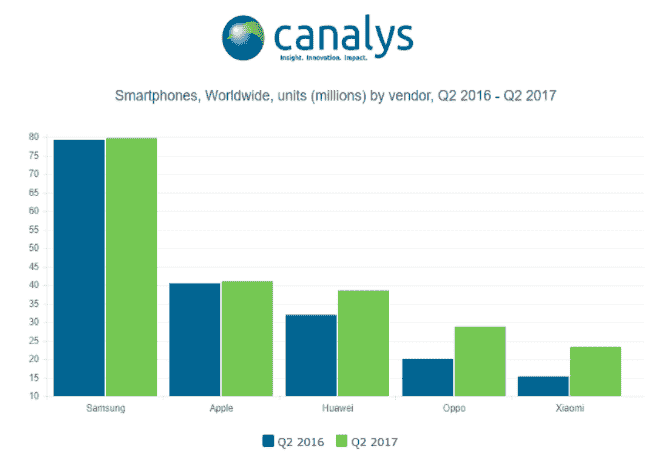

# 中国智能手机制造商缩小与 iPhone、三星 TechCrunch 的差距

> 原文：<https://web.archive.org/web/https://techcrunch.com/2017/08/02/chinese-smartphone-makers-closing-the-gap-on-iphone-samsung/>

尽管三星和苹果在今年第二季度继续长期占据全球智能手机市场的第一和第二名，但中国安卓原始设备制造商华为、Oppo 和小米正在继续缩小差距。

分析师科纳仕公司的最新智能手机市场数据显示，排名第三的华为现在紧追苹果。它表示，华为在本季度的出货量为 3800 万部，而苹果为 4100 万部，同比增长率分别为 20%和 2%——尽管预计今年晚些时候 iPhone 将大幅更新。

苹果公司[昨天报告了自己强劲的收益，投资者对即将到来的](https://web.archive.org/web/20221209134220/https://beta.techcrunch.com/2017/08/01/apple-hits-an-all-time-high-and-is-seemingly-in-striking-distance-of-being-a-1-trillion-company/?ncid=mobilenavtrend)[第四季度的信号特别兴奋。然而，Q2 的消费者显然没有完全停止购买 iPhones。](https://web.archive.org/web/20221209134220/https://beta.techcrunch.com/2017/08/01/apple-is-signaling-a-huge-fourth-quarter-and-wall-street-is-loving-it/)

就增长而言，科纳仕公司表示，Oppo 和小米是本季度表现最好的，分别排名第四和第五，出货量分别增长 44%和 52%。(上个月末，该分析师还报告了小米在其本土的显著销售激增，估计其在中国 Q2 的智能手机出货量为 1500 万部，排名第四——尽管华为以 2300 万部的出货量保持第一。)

全球智能手机市场领导者三星在本季度的出货量超过 7900 万部，尽管其同比增长“相对平缓”，其领先优势也正在被增长更快的 Android OEM 竞争对手侵蚀。

这位分析师认为，由于多个竞争对手反对安卓领域的溢价定价，其 Galaxy 品牌因此触及了定价上限——这一竞争因素甚至可能限制苹果在更新 iPhone 时提高价格的空间。

“[三星 Galaxy] S8 在一些地区的出货量一直很强劲，但有迹象表明需求被高估了，”科纳仕公司高级分析师蒂姆·考林在一份声明中指出。“科纳仕公司的渠道研究显示，欧洲的库存正在增加，结合美国的折扣，这表明三星可能正在测试 Android 智能手机定价的极限。"

“随着苹果寻求更新 iPhone，即使它有独特的用户体验，它也必须通过对功能集和设计的切实改进来证明任何重大的价格上涨，”他补充说。

总体而言，Q2 智能手机出货量超过 3.4 亿部，同比增长近 4%。尽管该分析师指出，印度和中国的智能手机市场在本季度均出现下滑。

在北美，该公司表示，第二季度智能手机出货量同比增长约 7%，而苹果公司的 iPhone 销量增长了 10%——尽管消费者预计秋季将推出旗舰产品(以及三星 Galaxy S8 旗舰产品的发布)。