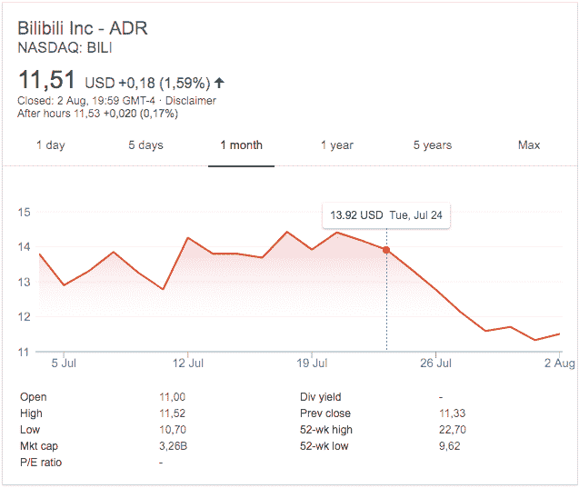

# 中国科技股暴跌不仅仅是因为贸易紧张

> 原文：<https://web.archive.org/web/https://techcrunch.com/2018/08/03/chinese-tech-stocks-tumble-from-more-than-just-trade-tensions/>

编者按:[这篇文章最初发表在 TechCrunch 在中国的编辑合作伙伴 TechNode](https://web.archive.org/web/20221025222651/https://technode.com/2018/08/03/china-tech-stocks/) 上。

过去几个月有关中美贸易紧张的报道很难被忽视。7 月初，美国对中国商品征收 340 亿美元关税，导致以科技和消费品股为主的深证成指跌至 2014 年以来的最低点，引发投资者担忧。

中国招商银行证券分析师张夏告诉[南华早报](https://web.archive.org/web/20221025222651/https://www.scmp.com/business/companies/article/2153955/chinese-technology-stocks-fall-lowest-43-months-ahead-deadline-us)“美国的关税，加上人民币的贬值，将大大增加许多依赖进口原材料的中国科技公司的成本，如半导体、集成电路和电子元件。”。

此外，美国商务部昨天宣布将对 44 家中国公司实施禁运，其中包括全球最大的监控设备制造商海康威视，理由是“其行为违背了美国的国家利益或外交政策。”此举导致这些公司的股价下跌了近 6%。

然而，焦点已经转移到不仅仅是贸易战。由于其他原因，许多大型中国科技公司的股价暴跌。

中国最新在纳斯达克上市的电子商务巨头拼多多发现，首次公开募股(IPO)并不是万能的。相反，它的上市引起了人们对该公司假冒产品的关注。投资者并不高兴。

自 1 月份达到峰值以来，腾讯的股价暴跌了 25%以上，在过去的七个月里市值蒸发了 1430 亿美元。

搜索巨头百度也未能幸免。在谷歌计划重新进入中国市场的消息传出后，该公司的股价本周下跌了近 8%。

## 政府的镇压行动

虽然首次公开募股通常是值得庆祝的事情，但拼多多在过去一周证明了它们也可能不利于业务。该公司整合了电子商务和社交媒体，面向生活在一二线城市以外的低收入消费者。它一直被指责为销售假冒劣质商品提供便利。

上市几天后，其股价下跌了 16 %,跌破了 19 美元的发行价。下降的部分原因是电视制造商创维要求[从电子商务公司的市场上移除假冒产品。](https://web.archive.org/web/20221025222651/https://technode.com/2018/07/30/skyworth-demands-pinduoduo-remove-fake-listings/)

该公司本周宣布，[已经下架了 1070 万件问题商品](https://web.archive.org/web/20221025222651/http://tech.qq.com/a/20180731/038686.htm)。然而，这并没有减轻投资者和监管者的担忧，因为后者对拼多多的产品清单进行了调查。它的股票价格在交易的第一天就下跌到比收盘价低 30 %,市值蒸发了 90 多亿美元。

七家美国律师事务所已经代表其投资者对该公司展开调查，这一事实不太可能对此有所帮助。这两家公司发布的声明显示，在中国监管机构开始调查该公司的交易后，投资者遭受了财务损失。该公司今天会见了监管者，并同意改善其产品的审查程序。

然而，受到影响的不仅仅是电商平台。自 7 月 20 日以来，视频流媒体服务哔哩哔哩的股价下跌了近 21%。这一下降正值中国网络空间管理局(CAC)重新努力打击其认为的“低俗”或“不适当”的内容。

该公司随后将其应用程序从该国的应用程序商店下架一个月。在纳斯达克上市的哔哩哔哩回应称，它“正在进行深刻的自我检讨和反思”

*哔哩哔哩股价下跌截图。2018 年 8 月 3 日访问*

## **传闻中的比赛**

运营中国最大搜索引擎的百度发现，即使是未经证实的竞争也会导致股票暴跌。本周有消息称，谷歌计划在[推出一款安卓应用](https://web.archive.org/web/20221025222651/https://technode.com/2018/08/01/google-search-engine-china/)，为中国用户提供过滤结果，此举可能标志着谷歌重返中国市场。

百度目前占据了中国搜索市场近 70%的份额。2010 年，出于对审查的担忧，谷歌关闭了其在中国的搜索引擎，放弃了进入一个巨大市场的机会。中国的网民人数现已超过 7.7 亿，是美国总人口的两倍，也超过了欧洲。

百度的收入仍然高度依赖广告收入，[第二季度增长了 25%](https://web.archive.org/web/20221025222651/https://technode.com/2018/08/01/baidus-ad-sales-boosts-revenue/)。谷歌的回归显然被视为威胁，导致百度股价从 7 月 31 日的 247.18 美元跌至 8 月 2 日的 226.83 美元。这标志着自五月份公司宣布首席运营官齐鲁离职以来最显著的下跌。

## **稳步下降**

尽管如此，与腾讯相比，所有这些损失都显得微不足道。该公司的股价在 2017 年上涨了 114%，并在 2018 年 1 月创下历史新高。然而，自那以来，每股价格下跌了近 130 美元，掏空了相当一部分市值。仅在 7 月份，其股价就下跌了 9.9%。该公司的贬值超过了脸书上个月收益电话会议后 1300 亿美元的损失。

4 月，在南非投资公司和媒体公司 Naspers——一个早期的忠实支持者——宣布削减其 2%的股份后，该公司损失了超过 200 亿美元的价值。此外，公司总裁刘炽平出售了 100 万股公司股票。这一点，加上 Naspers 的出售和保证金压力的警告，导致市值损失 510 亿美元。

“投资者越来越多地将对腾讯中期业绩的较低预期纳入价格之中，”第一上海证券(First Shanghai Securities)策略师 Linus Yip[告诉彭博](https://web.archive.org/web/20221025222651/https://www.bloomberg.com/news/articles/2018-07-31/think-u-s-tech-is-bad-check-out-tencent-s-140-billion-selloff)。

叶预计，这种下降趋势将持续下去，不仅仅是腾讯。“总体而言，科技公司面临着类似的问题。过去几年，他们的利润一直在快速增长，因此随着竞争加剧和一些细分市场饱和，他们很难在未来保持类似的增长，”他表示。