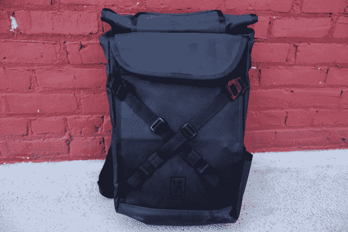
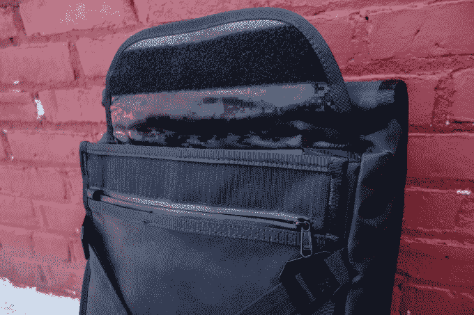
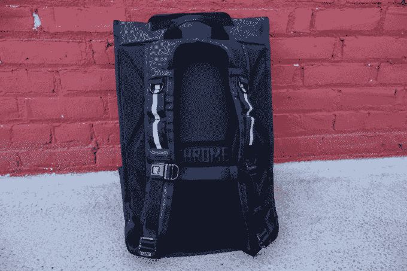
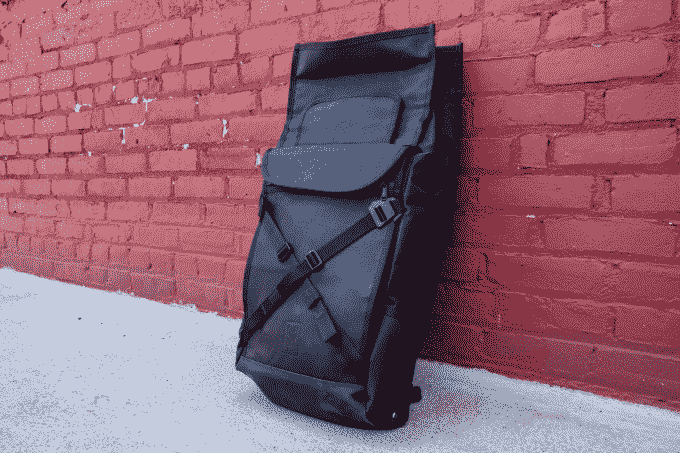
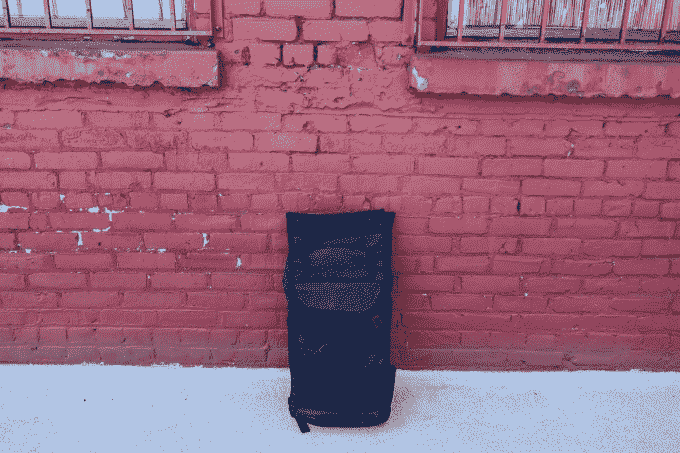

# 2018 年包包周:Chrome 的 BLCKCHRM Bravo 2.0 背包是一个身材魁梧、时尚的野兽 

> 原文：<https://web.archive.org/web/https://techcrunch.com/2018/06/19/chrome-bravo-backpack-review/>

如果你需要选择一个包来支持你的街头战斗，你可能应该选择 Chrome 的 Bravo 2.0。

我测试了该公司高端 BLCKCHRM 系列产品的一个版本。Bravo 2.0 的 [BLCKCHRM 版本用一种名为 Hypalon 的略具弹性的海军级材料、全粒面皮革背板和光滑的全黑色外观取代了普通包装的 1050 旦尼尔尼龙外观。其结果是视觉上令人印象深刻，因为它是粗壮的。](https://web.archive.org/web/20221207082808/https://www.chromeindustries.com/product/bravo-2.0-backpack/BG-190-BKBK-NA.html?gclid=CjwKCAjw06LZBRBNEiwA2vgMVWUOUSNbLUpLE9cE4nCUOS7-nC5xb_iY_nwXgP7sJHPCtV9lu0jToxoCBpEQAvD_BwE)

泰勒帽匠/

为了测试 Bravo 2.0，我带着它去了一趟洛杉矶，在那次旅行中，我需要在每一立方英寸的行李中装满必要的装备。对于 Bravo 2.0 来说，这意味着不适合我的托运包的衣服，一台 13 英寸的 MacBook，一台索尼 RX-100，一些中型笔记本电脑，我的索尼 A7S II 的两个镜头，以及所有其他通常会放在随身行李中的奇怪的零碎东西。

在打包的过程中，我发现了一些事情。首先，由于 Bravo 2.0 的主隔间缺乏条理，打开时有点难以看到里面，所以如果你把你不需要在旅途中使用的东西塞进去，效果最好。我注意到的另一件事是，除了黑洞般的内部，Bravo 2.0 的口袋没有太多深度，所以它们更适合扁平和矩形的东西(移动电池组、薄书、杂志、Kindle 或 iPad)，并且不能扩展到容纳不太标准形状的物体。这种材料没有任何弹性，但话说回来，它基本上是坚不可摧的——所以不，你不能拥有一切。

泰勒帽匠/

Bravo 2.0 还包括一个外部侧袋，似乎是为了装水瓶，但我的口袋不够细长，因此几乎没有用处。对于笔记本电脑存储，Chrome 用这个包做了一个有趣的选择。这种设计要求你把电脑放在包外面一个细长的有护盖的槽里，而不是放在你背后最里面的防水布内衬的隔间里。我有 TSA Pre，所以我不必在机场排队时拿出笔记本电脑，但其他时候我需要我的笔记本电脑，外部口袋意味着这不是一个麻烦。尽管如此，它还是没有侧拉链专用笔记本电脑口袋方便，这仍然是我存放笔记本电脑的首选方式。

虽然超过三磅的包本身比我习惯携带的东西要重得多(BLCKCHRM 版本增加了一些额外的重量，但我不确定有多少)，但我随身携带的电子产品和其他贵重物品感觉比我旅行过的几乎任何其他包都更舒适和安全。令人印象深刻的是，Bravo 的重量一定通过其相当宽和扁平的设计得到了很好的分布，因为尽管我的包装工作很繁重，但我的背部从未受伤。一个搞砸了背部是一个即时包取消资格，但布拉沃 2.0 进行了令人钦佩的沉重负担。

泰勒帽匠/

在我的旅行中，我从来没有使用任何外部交叉扣，但它们看起来很酷，所以就这样了。如果你骑自行车，如果你愿意摆弄小金属钩，你可能会得到一个头盔或任何你需要的东西(夹克或其他可压缩的物品)绑在那里，但我不愿意。

我不是一个球迷 velcro 安全的主要部分包，但布拉沃的 velcro 卷顶没有让我疯狂，虽然这一壮举确实需要周到的包装。包的 velcro 关闭将是好的，除非你真的突破了主隔间的东西的数量，在这种情况下，你不太能密封 velcro，除非你想摇滚开放的敞篷自行车信使外观。最后，你可以更仔细地重新包装你的处境，继续你的生活。

泰勒帽匠/

我承认，5 英尺 4 英寸的 Chrome BLCKCHRM Bravo 2.0 对我来说太大了，尽管高个子可能不会因为它的宽度和整体轮廓而感到矮小。尽管如此，背包很好地分配了全部重量，保证了安全，最终让我看起来像个坏蛋，像个战术忍者神龟或者城市预科生什么的。

这个包包有多好看怎么说都不为过。就像优质皮革一样，Hypalon 会随着磨损而断裂，拾取表面痕迹，随着时间的推移，这些痕迹会褪色成一种风化的铜绿。在材质、全黑迷你铬扣胸带和中央黑色皮革面板之间，这是一款非常时尚、性感的包包。尽管如此，对于那些喜欢 Bravo 2.0 的氛围但对其沉重的结构感到担忧的人来说，普通版 Bravo 2.0 可能是一个更好的选择。但是，如果你喜欢你的包花哨，严重和黑色的黑色，那么，你知道该怎么做。

泰勒帽匠/

Bravo 2.0 的普通版零售价为 160 美元，有黑色、红色、海军色和绿色。全黑的 [BLCKCHRM Bravo 2.0](https://web.archive.org/web/20221207082808/https://www.chromeindustries.com/product/bravo-2.0-backpack/BG-190-BKBK-NA.html?gclid=CjwKCAjw06LZBRBNEiwA2vgMVWUOUSNbLUpLE9cE4nCUOS7-nC5xb_iY_nwXgP7sJHPCtV9lu0jToxoCBpEQAvD_BwE) 通常售价高达 200 美元，但现在它的售价是 160 美元。

**这是什么:**一个时尚、重型、防风雨的可折叠背包，带有一个易于使用的笔记本电脑套。

**不是什么:**轻便或者休闲。

