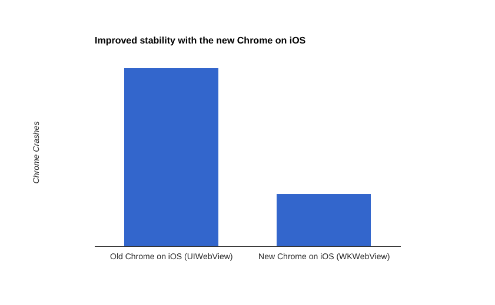
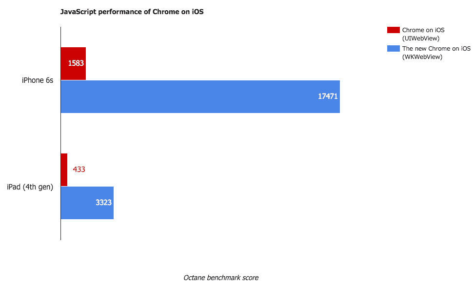

# iOS 版 Chrome 现在速度更快，崩溃频率降低了 70% 

> 原文：<https://web.archive.org/web/https://techcrunch.com/2016/01/27/chrome-for-ios-now-faster-and-crashes-70-less-often/>

# iOS 版 Chrome 现在速度更快，崩溃频率降低了 70%

今天，谷歌[发布了](https://web.archive.org/web/20230130231209/http://chrome.blogspot.com/2016/01/new-year-new-chrome.html)新版 iOS 版 [Chrome，该版本有望比之前的版本更快更稳定。](https://web.archive.org/web/20230130231209/https://goo.gl/a0K8IR)

根据谷歌的说法，iOS 版 Chrome 48 现在崩溃的频率减少了 70 %,浏览器应该感觉更灵敏了。JavaScript 的执行速度现在也明显加快了。

直到今天，谷歌仍然使用苹果的 UIWebKit 框架。虽然这允许应用程序呈现网页(这基本上是谷歌所做的)，但它是沙箱化的(出于安全原因)，JavaScript 性能在这种模式下尤其受到影响。

现在，谷歌改用了苹果随 iOS 8 推出的 [WKWebView](https://web.archive.org/web/20230130231209/https://developer.apple.com/library/ios/documentation/WebKit/Reference/WKWebView_Ref/) 。离 iOS 8 达到最先进水平已经有一段时间了，但谷歌指出，迁移到 WKWebView“带来了重大挑战。”具体来说，谷歌[指出](https://web.archive.org/web/20230130231209/https://code.google.com/p/chromium/issues/detail?id=423444)新框架没有一个明显的方式来管理 cookies 和表单，SSL 处理也有问题。iOS 9 修复了其中的一些问题，现在该团队准备正式进行切换。

由于迁移到新的框架，浏览器不仅更快，而且更稳定——即使当页面崩溃时，应用程序本身现在也不会再崩溃了。相反，它只会显示一个错误页面，就像在桌面上一样。

虽然浏览器崩溃的频率降低很好，但它现在也具有更快的 JavaScript 速度。在页面之间切换现在也导致更少的重新加载。谷歌还表示，现在滚动应该更快、反应更灵敏。

