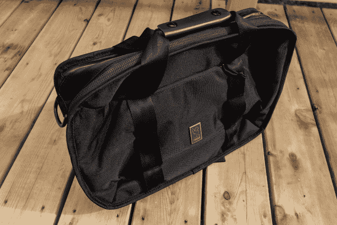
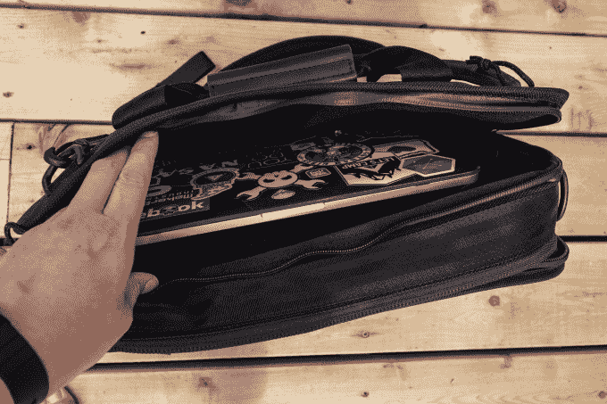
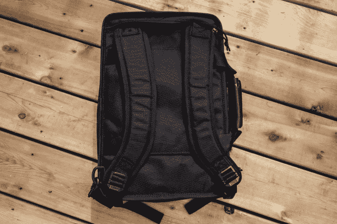

# 2018 年包包周:Chrome 的 Vega Transit Brief 让你的工作变得更酷

> 原文：<https://web.archive.org/web/https://techcrunch.com/2018/06/19/chrome-vega-transit-brief-review/>

你要么是铬包的人，要么不是。如果你不是 Chrome 包包爱好者，也许是时候给这家新成立的波特兰包包制造商另一个选择了。

我很久以来一直是 Chrome Industries 包包的粉丝，但多年来我只拥有两个:停产的 [Mini Buran](https://web.archive.org/web/20221207191732/https://www.rei.com/product/876797/chrome-mini-buran-night-messenger-bag) ，一个 15L 的 Chrome 标准的超小型 messenger，以及 [Niko 相机包](https://web.archive.org/web/20221207191732/https://www.chromeindustries.com/product/niko-pack-backpack/BG-153.html)。我仍然定期使用后者，但我很早就把 messenger 交易走了，因为尽管它是 Chrome 最小的包，也是唯一一个在我 5 英尺 4 英寸的框架上看起来不那么卡通的大的包，但我从来没有完全正确地称重。有两个原因:1)铬包很大，是为大块头设计的，2)我不是一个斜挎包爱好者。

泰勒帽匠/

Chrome 的工业级斜挎包系列通常吸引铁杆自行车爱好者和足以举起其著名的魁梧包的大块头，但该公司正在拓展一些新产品，这些新产品应该会让像我这样渴望设计和制造质量但无法让大部分东西工作的人兴奋。

Chrome Vega Transit Brief 是 Chrome 新的[以工作为中心的 Treadwell 系列](https://web.archive.org/web/20221207191732/https://www.chromeindustries.com/blog-treadwell-collection.html)的一部分，是这些新包中的一个。Vega 旨在吸引那些可能需要让自己的外观远离“我是住在朋克屋的自行车信使”这种氛围的专业人士，但它仍然由几乎坚不可摧的弹道尼龙制成，这种尼龙赋予了镀铬包标志性的外观和感觉。

乍一看，织女星看起来像任何通用的笔记本电脑信使，但不像那些(无聊)你可以携带织女星三种不同的方式。第一种模式可以让你携带 Vega 公文包风格的包，配有皮革手带。第二种模式是将包变成一个带有可拆卸肩带的斜挎包。第三种模式(我最喜欢的)是当你从包的背面弹出两条隐藏的带子，将它旋转 90 度，像背包一样携带织女星。出于我的目的，我在手提袋子和背上袋子之间转换，以携带 13 英寸的 MacBook 和其他零碎物品。

图片来自 Chrome 工业

“织女星”只有 15 升重，可以装载小而长方形的东西——你不会在下班回家的路上用它来扔东西。它有两个主要的拉链隔层，一个柔软的填充笔记本电脑套，可以容纳一台 15 英寸的 MacBook，一个多用途口袋衬着它自己的袖子，两个内部拉链口袋实际上足够大，可以放手机或钱包和钥匙。有一个小小的外部口袋，也可以容纳手机或其他小东西，但那个更难进入，所以我基本上没有使用它。

泰勒帽匠/

泰勒帽匠/

我已经提到过了，但是值得重复的是织女星是非常非常矩形的。它的主隔间最适合放 iPad、书籍或纸质文件等物品，但如果你有任何深度的东西，它就不太适合这个包。另一件值得注意的事情是，当它像背包一样被携带时，织女星看起来像一个大的长方形。你要么会喜欢这个造型，像我一样觉得它很独特很酷，要么你会讨厌它。一个批评是:让你通过手柄拿着 Vega 的皮革带不能收起，所以当你像背包一样戴着它时，它只是挂在那里。这不是非常明显，但它让我有点困扰，因为这些按扣很难打开和关闭——我想如果他们更新这个设计，可能会修改这个小缺陷。

织女星不是 Chrome 有史以来最有灵感的设计，但也不应该是。如果你想在会议上看起来很专业，但仍然很酷，就像你看了电话会议的幻灯片，但你下班后喝劣质啤酒，因为你是合法的，而不是因为你买不起三级跳的狗屎，维加可能是你的选择。对于任何想找一个做工精良的包的人来说，这款包不会太花哨，不便于在工作会议上携带，恰好可以变成一个该死的背包，Chrome 的 Vega Transit Brief 非常合适。

泰勒帽匠/

**它是什么:**一个看起来既低调又专业的包，同时还能保存基本的工作物品(笔记本电脑、文件等)。非常适合作为一款简单的旅行随身包，或者是一款可以放在办公室和办公室后面的包。

**它不是什么:**一只老黄牛。它有 15 升的容积，你不会用它来拖着大货物到处走，或者把产品从合作社带回家。

