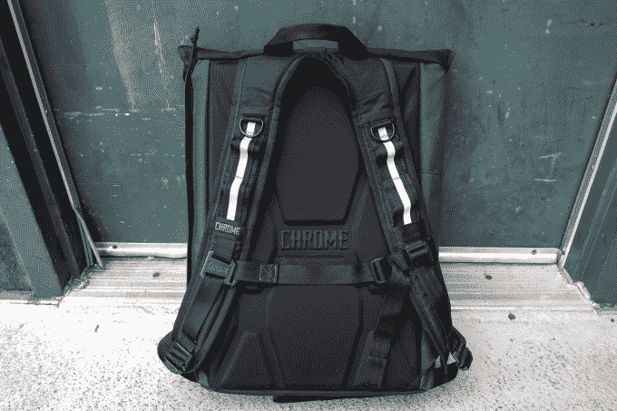
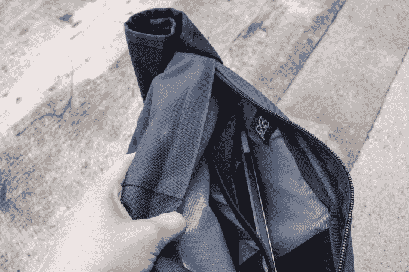
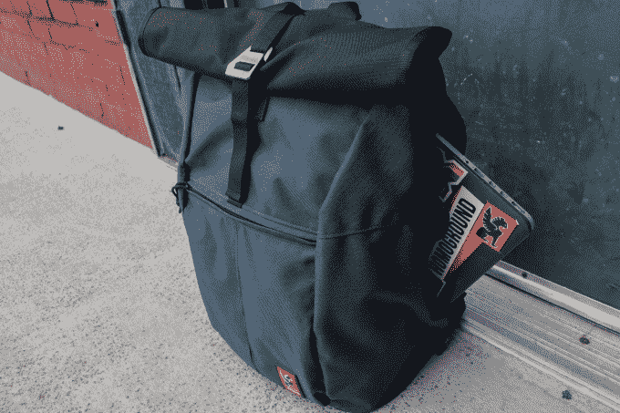
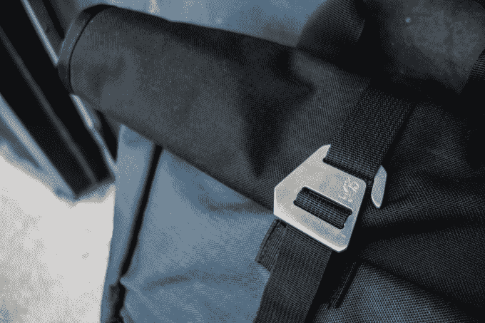
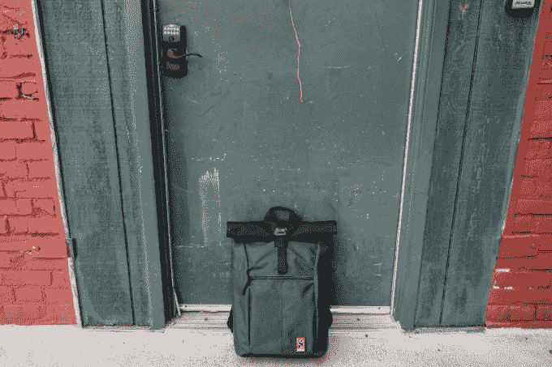

# 2018 年包包周:Chrome 的雅尔塔 2.0 是一个宽敞的翻盖包，可以跟上 

> 原文：<https://web.archive.org/web/https://techcrunch.com/2018/06/21/chrome-yalta-2-0-backpack-review/>

起初，我不知道雅尔塔在哪里。

容量为 30 升的雅尔塔 2.0 ( [铬业](https://web.archive.org/web/20221209003517/https://www.chromeindustries.com/product/yalta-2.0-nylon-backpack/BG-194.html)、T2，$96 )不是一个小包，但也不笨重。底部比顶部有点大，这是大多数自行车友好型包的倒置，通常将你的大部分重量压在肩膀上。作为一个经典的镀铬包，我一直很欣赏雅尔塔包独特的外形，全侧拉链，以及它选择张力钩扣而不是 Velcro 或镀铬搭扣的决定(很酷但很重)。雅尔塔的可调闭合钩使用起来感觉很好，这意味着你不必处理 Velcro 制造的噪音，如果你是我，肯定不是你的主要 ASMR 触发器。

TechCrunch /泰勒制帽公司

我在两种情况下测试了雅尔塔:一周中的正常行程和一次低调的周末露营。在我日常测试的过程中，雅尔塔被证明是一个令人惊讶的娴熟的健身房加笔记本电脑包，这要归功于它最奇怪的设计:一个大开口，让你可以进入防水主卷顶隔层所在的空间。一旦你拉开全长的侧拉链，你会觉得有点奇怪，就像你在一个你不应该在的地方，但是挺过去。这个口袋有点像真正的内部可折叠隔层周围的内部气囊，如果你知道它的用途，它会很方便。

TechCrunch /泰勒制帽公司

首先，你可以把你奇怪的脏东西放在里面，这样它就不会碰到你干净正常的东西，这很酷。在我的情况下，这意味着一个全尺寸的巴西柔术 gi——一个巨大的[长袍般的训练制服](https://web.archive.org/web/20221209003517/http://www.fujisports.com/bjj/gis.html)——和我其余的运动服，加上各种各样的书呆子东西，比如我的吸入器和 10 微米的笔，从精细的尖端到非常非常精细的尖端。你还可以非常容易地拿到侧拉链区的任何东西(同样，这是包的整个内部，不包括顶部的部分)，所以有两个不同层次的大部分，而不是只有一个巨大的主隔层和一个侧口袋或其他东西，这很好。笔记本电脑套位于包的最后面，可以在这个全侧拉链中找到。虽然侧拉链笔记本电脑插槽很棒，但雅尔塔确实感觉太大了，我的 13 英寸 MacBook 很安全，但位置不太合适。

TechCrunch /泰勒制帽公司

在我的第二次试验中，我把雅尔塔装了起来，和朋友们去当地的攀岩点进行了一天的徒步旅行(注意:这东西不能带绳子)。这不是雅尔塔的设计目的，但这正是我想做的，所以我想我应该试一试。这个包在徒步旅行中表现很好，装满了午餐、小吃、许多层、一件雨衣、一个小急救箱、一部索尼 RX100 II、一本很重的该地区指南和一个两升的水囊，我把它塞到奇怪的侧拉链区，通过拉链顶部蜿蜒出软管。我设法忘记了我的头盔，当附近的一名登山者从离地面 60 英尺的地方扔下一个金属钩环时，我希望我后来有了它，但如果我记得它会很好地夹在背包前面的闭合环上。

TechCrunch /泰勒制帽公司

令人惊讶的是，雅尔塔包——更像是一个自行车包，而不是岩石包——一整天都做得很好，足够舒适地分配我的重量，以至于我根本没有注意到它。前面的口袋方便拿取必需品，卷式防水区域让我安心，如果下雨，我的东西会保持干燥，通常情况下都会下雨。一个抱怨是:胸骨绑带很难钩住，有时会松开，但这没什么大不了的。同样值得记住的是，任何没有全侧面入口的卷顶都很难整理，这里的情况就是如此。

TechCrunch /泰勒制帽公司

与 Chrome 的一些更重的包和其他技术含量较低的包相比，雅尔塔是一个可爱的中间地带。这种包不像用完全防水材料制成的包那样防雨，笔记本电脑套可以使用一些结构，但它携带量相当大，而且它有一个漂亮的细长轮廓，看起来和感觉都很好。除了奇怪的侧拉链隔层，雅尔塔没有什么特别之处，这使得它非常适合任何需要一个好看、耐风雨的中型翻盖式背包来工作或前后的人。

**它是什么:**一个很棒的多用途可折叠背包，不太科技化。

**不是什么:**终极装备包。满口袋。

**阅读更多来自 [TechCrunch 包包周 2018 的评论。](https://web.archive.org/web/20221209003517/https://techcrunch.com/tag/bag-week-2018/)**

