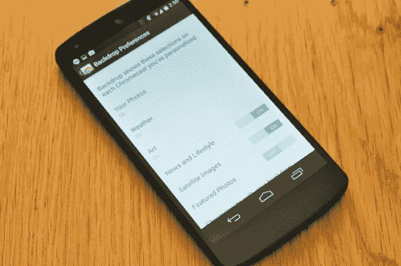

# Chromecast 现在允许你使用自己的照片作为壁纸

> 原文：<https://web.archive.org/web/http://techcrunch.com/2014/10/08/chromecast-now-lets-you-use-your-own-photos-as-its-wallpaper/>

# Chromecast 现在允许你使用自己的照片作为壁纸

还记得 4 月份 Chromecast 中发现的[隐藏代码](https://web.archive.org/web/20230327054002/https://techcrunch.com/2014/04/08/google-seems-to-be-considering-doing-more-with-chromecasts-home-screen/)暗示定制壁纸和天气预报之类的东西即将推出吗？

果不其然，谷歌刚刚推送了其 iOS 和 Android Chromecast 应用的更新，这些东西(以及更多！)现已上线。

虽然这里没有什么太惊天动地的事情发生，但这次更新让你可以为 Chromecast 的空闲屏幕添加一点味道——如果当前没有任何内容传输到设备，它就会显示在电视上。

以前仅限于显示当前时间和从谷歌相对较小的收藏中随机选择的照片，**现在你可以做的是**:

*   用自己的照片当壁纸。照片必须从你的 Google+账户中调出，但你可以挑选想要在屏幕上弹出的相册。
*   显示您的 Chromecast 所在位置的天气。
*   显示科技/政治/商业/世界新闻标题(尽管你不能选择显示哪个主题)。如果你在标题切换之前进入 Chromecast 应用程序，你可以点击查看故事。
*   在壁纸轮换中添加更多谷歌精选的照片，包括一堆艺术作品和有趣地方的卫星照片。

iOS 版本是现在 App Store 上的。Android 版本正在一波一波地向用户推出——尽管如果你觉得没什么用，总有办法让[跳过队列](https://web.archive.org/web/20230327054002/http://www.androidpolice.com/2014/10/08/chromecast-update-finally-enables-custom-backdrop-support-apk-download/)。