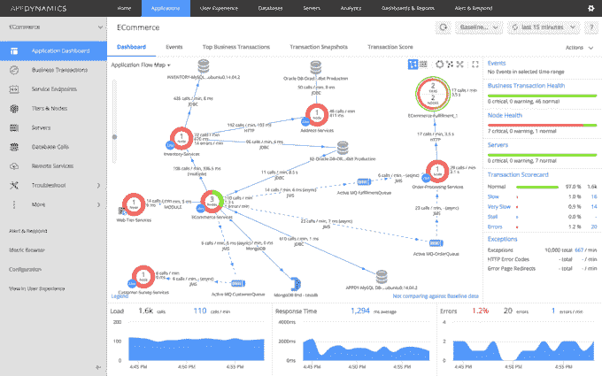

# Cisco-app dynamics 37 亿美元的交易完全是为了数据 

> 原文：<https://web.archive.org/web/https://techcrunch.com/2017/01/25/cisco-appdynamics-3-7-billion-deal-all-about-the-data/>

当思科昨晚以 37 亿美元收购 AppDynamics 时，最初有点令人震惊，部分原因是时机问题，就在这家初创公司计划 IPO 的前几天[。尽管此次收购显然是思科将重心从硬件业务转移到更多基于云软件业务的长期战略的一部分，但从本质上讲，这笔交易是一场纯粹的数据游戏。](https://web.archive.org/web/20221206061435/https://beta.techcrunch.com/2017/01/24/why-the-3-7-billion-appdynamics-acquisition-happened-right-before-ipo/)

数据已经成为当今企业的核心。“数据是新的石油”已经成为老生常谈，但就像所有的陈词滥调一样，它的发展是因为它有一个真理的光环。随着公司转向人工智能和机器学习，这些技术的生死取决于大量的高质量数据。

为什么[微软要花 260 亿美元收购 LinkedIn](https://web.archive.org/web/20221206061435/https://beta.techcrunch.com/2016/06/13/microsoft-to-buy-linkedin-for-26b-in-cash-makes-big-move-into-enterprise-social-media/) ？为什么 [Salesforce 愿意在去年](https://web.archive.org/web/20221206061435/https://beta.techcrunch.com/2016/09/24/why-salesforce-might-be-interested-in-twitter/)收购 Twitter[失败之前](https://web.archive.org/web/20221206061435/http://www.wsj.com/articles/salesforce-won-t-pursue-bid-for-twitter-1476468050)冒险一试？一切都是为了数据——出于同样的原因，思科昨天斥资 37 亿美元收购了 AppDynamics。

AppDynamics 给思科的是一个监控应用性能的工具，不管应用交付平台是什么。我们的想法是在问题成为最终用户的大问题之前发现并处理它们。最糟糕的情况是完全中断，但还有无数其他问题会导致速度变慢和其他令人头疼的问题，每个用户都非常清楚这一点。在监控这些应用程序时，AppDynamics 会收集大量关于应用程序、与其他系统的连接、用于连接应用程序的设备等的数据。所有这些数据都是监控过程的自然副产品，当与其他网络信息结合在一起时，可能具有巨大的价值。

AppDynamics 统一监控仪表板。图片: [AppDynamics](https://web.archive.org/web/20221206061435/https://www.appdynamics.com/solutions/unified-monitoring/)

在宣布该交易的博客文章中，思科公司业务发展副总裁 Rob Salvagno 引用 AppDynamics 的数据作为收购的一大原因。“随着各行各业的公司都在扩展他们的数字基础设施，IT 部门面临着大量复杂的孤立数据。AppDynamics 帮助许多世界上最大的企业将这些数据转化为商业见解，并使他们能够在当今的数字世界中为客户创造价值，”Salvagno 写道。

Constellation Research 创始人兼首席分析师王雷(Ray Wang)表示，对思科而言，找到一位能够应对网络应用未来的 M&A 候选人至关重要，但他表示，这笔交易不仅仅是单纯的应用性能管理。

“从长远来看，当你将这种类型的软件添加到网络上时，你会获得网络智能，更重要的是，对 IOT 来说是一个关键的部分，以及建立一个长期的神经网络和机器学习故事，”他说。

Jasper Technologies 的收购给了他们物联网部分。AppDynamics 为他们提供了在此基础上运行的应用程序的视图，尽管所有这些在短期内都是有用的，但王认为，在数据量不断增长以及管理所有这些数据的内在复杂性的推动下，这最终将成为未来更加自动化的方法的一部分。

“公司最终不想以手动方式监控应用程序和网络，而是预测、预防和提供情景意识，”他说。

在今天的新闻和分析师活动上，AppDynamics 首席执行官 David Wadhwani 承认这实际上是该平台的长期愿景。“我们正在从记录系统转向参与系统——这是短期和中期目标。他说，当你依靠自动化和机器实时决策时，我们正在向智能系统转移，“这是他们最终看到的发展方向。

如果他是对的，你可以期待更多的 M&A 从思科前进，收购其目前缺乏的人工智能基础。“此次收购让思科在这个市场占据了一席之地，并带来了更好的软件故事，”王说，但这只是一个基础部分，而不是整个解决方案。

凭借 Jasper 和 AppDynamics(以及它自己对底层网络基础设施的理解)，思科拥有大量数据。现在，它需要填充一些其他部分，并开始以更加自动化的方式将这些数据投入使用。虽然现在在某种程度上有可能做到这一点，但如果他们加入缺失的人工智能技术，真正的力量可能会到来。