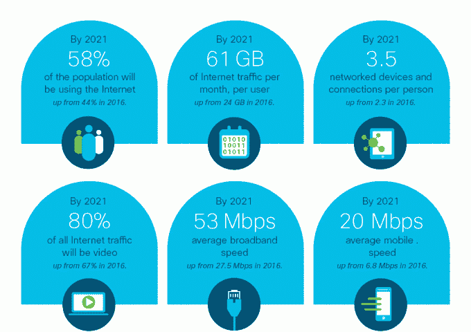

# 思科:到 2021 年，IP 流量将猛增至 3zb，视频流量将占 80%

> 原文：<https://web.archive.org/web/https://techcrunch.com/2017/06/08/cisco-ip-traffic-shoots-up-to-3-zettabytes-by-2021-video-will-be-80-of-it/>

这场革命将会通过互联网进行电视转播。到 2021 年，82%的消费者 IP 流量将是视频，这一增长将受到直播的推动，这要归功于脸书、YouTube 和 Twitter 等服务。与此同时，互联网将成为我们做任何事情的结构中更大的一部分，到 2021 年，每年的流量将增长到 3.3 千兆字节，是今天互联网流量的三倍(每月 278 千兆字节)。

这些数字来自网络巨头思科，思科刚刚发布了互联网趋势的年度预测，[视觉网络指数](https://web.archive.org/web/20230405232207/http://www.cisco.com/c/en/us/solutions/service-provider/visual-networking-index-vni/index.html?CAMPAIGN=VNI+2017&COUNTRY_SITE=us&POSITION=Press+Release&REFERRING_SITE=Cisco+page&CREATIVE=PR+to+VNI+web+page&_ga=2.149284926.962335940.1496926151-1964232792.1496926151)，这是一个为期 12 年的项目，汇集了几个独立分析师的预测和思科从其客户和自己的服务器收集的网络使用数据。

从这份报告中，你可以看到一个更大的图景，尤其是当你阅读它时，结合其他一些引人注目的水晶球研究，如[玛丽·米克尔的互联网趋势](https://web.archive.org/web/20230405232207/https://techcrunch.com/2017/05/31/mary-meeker-internet-trends-2017/)，这是一个日益互联的世界，越来越多的活动正在进入数字以太网。

根据思科的计算，到 2021 年，全球将有 270 亿台设备和连接，到 2021 年人均 3.5 台联网设备——而去年(2016 年)人均 2.3 台联网设备。随着连接性的增加，以及网络速度和网络上运行的服务的相应增长，我们还将看到 IP 流量的增长，2016 年达到人均 35 GB，而 2012 年为 13 GB。

你可以在这里浏览更大的报道[。以下是更多亮点:](https://web.archive.org/web/20230405232207/http://www.cisco.com/c/en/us/solutions/service-provider/visual-networking-index-vni/index.html?CAMPAIGN=VNI+2017&COUNTRY_SITE=us&POSITION=Press+Release&REFERRING_SITE=Cisco+page&CREATIVE=PR+to+VNI+web+page&_ga=2.149284926.962335940.1496926151-1964232792.1496926151)

**物联网:**物联网的趋势——以前“哑”的、不相连的物理事物现在可以与我们、网络以及彼此交流——继续保持安静但不断增长的存在。2021 年，270 亿联网设备中有一半将是物联网对象，即 137 亿个连接。思科表示，医疗保健将在物联网领域处于领先地位，年增长率为 30%。

**视频:**视频的流行已经成为当今世界的一股主要力量，在 2016 年，它占了所有消费者互联网流量的 73%。这一数字将继续上升，到 2021 年，将占所有消费者互联网流量的 82%，增长 31%。其中一个更大的驱动力将是视频直播。到 2021 年，这将占互联网视频流量的 13%，仍低于其他类型的流媒体视频，但这里的关键是它是如何增长的，在 2016 年至 2021 年间增长了 15 倍，与录制和现有内容的长尾相比，这是新进入者和创作者最大的增长机会。

这一趋势的一个组成部分是从传统广播网络向通过 IP 传输的电视的转变，以及对传统付费电视服务提供商的后续连锁效应。

思科表示，平均每个“断网”家庭每月产生 117 GB 的互联网流量，而有互联网和付费电视服务的家庭每月产生 63 GB 的流量。

**Wi-Fi 是这场游戏的名字:**思科预测，Wi-Fi 将继续占互联网流量的大部分，占所有接入的 53%，相比之下，移动接入占 20%，固定接入占 27%。有趣的是，Wi-Fi 的增长与今天相比基本没有变化:去年它占所有流量的 52%，大交换机进入固定状态，下降了 11 个百分点，蜂窝增长了 10 个百分点。

然而，Wi-Fi 热点和家庭接入点将继续扩大，到 2021 年将达到 5.416 亿(高于去年的 9400 万)。家庭 Wi-Fi 将是这个数字的绝大部分。中国将以 1.7 亿个接入点引领全球 Wi-Fi 使用，美国以 8600 万个紧随其后。

**DDoS 攻击将继续上升:**思科还在其指数中跟踪一些安全指标，并表示 DDoS 攻击的规模将“稳步增长”，到 2012 年将接近 1.2 Gpbs，“足以使大多数组织完全离线”，因为恶意黑客用流量淹没服务器和网络。DDoS 攻击在高峰时可能占一个国家互联网流量的 18%。

目前，DDoS 的增长速度似乎与互联网流量本身大致相同，其规模分别增长了 22%和 29%。去年，DDoS 攻击的数量增加了 172%，到 2021 年，全球每年将会发生 310 万次攻击。