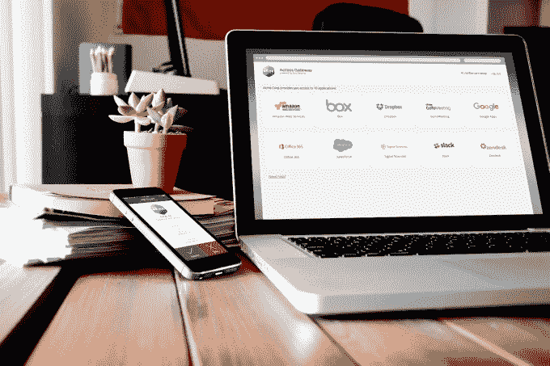

# 思科 23.5 亿美元收购 Duo 成为财报电话会议的焦点

> 原文：<https://web.archive.org/web/https://techcrunch.com/2018/08/16/ciscos-2-35-billion-duo-acquisition-front-and-center-at-earnings-call/>

# 思科 23.5 亿美元收购 Duo 成为收益电话会议的焦点

本月早些时候，当思科以 23.5 亿美元的天价收购密歇根州安阿伯市的安全公司 [Duo](https://web.archive.org/web/20230306150620/http://duo.com/) 和[时，这表明了在思科等传统科技公司看来，安全和安全初创公司的价值越来越大。](https://web.archive.org/web/20230306150620/https://techcrunch.com/2018/08/02/cisco-is-buying-duo-security-for-2-35b-in-cash/)

在昨天的收益报告中，甚至在收购合同墨迹未干之前，思科报告其安全业务同比增长 12 %,达到 6 . 27 亿美元。鉴于这些数字，在首席执行官罗卓克对分析师的评论中，收购是最重要的。

“我们最近宣布有意收购 Duo Security，以将我们基于意向的网络产品组合扩展到多云环境中。Duo 的 SaaS 交付解决方案将扩展我们的云安全能力，帮助任何设备上的任何用户安全地连接到任何网络上的任何应用程序，”他告诉分析师。

事实上，安全性将继续占据中心位置。“安全性仍然是我们客户最关心的问题，也是我们的头等大事。罗宾斯说:“我们的战略是通过一种架构方法来简化和提高安全效力，该方法使用的产品可以协同工作，并共享分析和可操作的威胁情报。

这与 Duo 收购案非常契合，Duo 收购案的指导思想是简化安全性。它最出名的可能是它的双因素认证工具。通常，在你更改密码后，公司会向你的手机发送一条带有代码的短信来证明这是你的，但即使是这种方法[也被证明容易受到攻击](https://web.archive.org/web/20230306150620/https://techcrunch.com/2016/07/25/nist-declares-the-age-of-sms-based-2-factor-authentication-over/)。

Duo 所做的是通过其应用程序向你的手机发送一条信息，询问你是否正在尝试登录。如果是你，你可以批准，如果不是你，你可以拒绝，如果你因为某种原因不能得到消息，你可以打电话获得批准。它还可以在授予用户访问权限之前验证应用程序的健康状况。这是实现双因素身份认证的一种相当简单且安全的方式，同时确保员工保持软件最新。

智能手机上的 Duo 批准/拒绝工具。

虽然思科的安全收入只占该公司本季度 128 亿美元总收入的一小部分，但该公司显然认为安全是一个可以继续增长的领域。

思科毫不避讳地利用其持有的大量现金，在纯网络硬件之外的安全领域进行扩张，以提供更加多样化的经常性收入流。根据 Y Charts 的数据，该公司目前手头有超过 540 亿美元的现金。

思科在 Duo 上花了不少钱，据报道，[Duo 的年经常性收入为](https://web.archive.org/web/20230306150620/http://www.theopenforce.com/2018/08/congrats-duo.html)1 亿美元，这个数字有望继续大幅增长。自成立以来，它已经筹集了超过 1.21 亿美元的风险投资。在 2017 年 9 月的最后一轮融资中，[公司以 11.9 亿美元的估值筹集了 7000 万美元](https://web.archive.org/web/20230306150620/https://techcrunch.com/2017/10/18/duo-security-raises-70-million-at-a-valuation-north-of-1-billion/)。

收购价格最终比估价翻了一倍多。这可能是因为它是一家拥有经常性收入的安全公司，而思科显然非常希望它成为其安全解决方案组合中的另一部分，它希望它能够帮助推动安全收入不断增长。